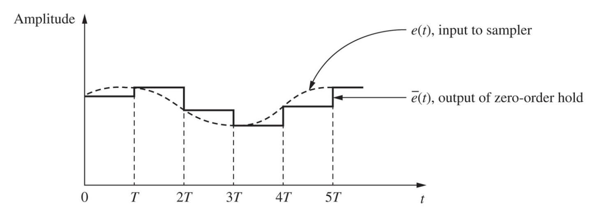

## 1 Introduction

To provide a basis for thoroughly understanding the operation of digital control systems, it is necessary to determine the effects of continuous-time signal.

## 2 Sampled-Data Control Systems

$$
\bar{e}(t) = e(0)[u(t) - u(t - T)] + e(T)[u(t-T)-u(t-2T)] + e(2T)[u(t-2T)-u(t-3T)] + \dots
$$

Laplace transform

$$
\bar{E}(s) = e(0)\left[\dfrac{1}{s} - \dfrac{\epsilon^{-Ts}}{s}\right]
+ e(T)\left[\dfrac{\epsilon^{-Ts}}{s} - \dfrac{\epsilon^{-2Ts}}{s}\right]
+ e(2T)\left[\dfrac{\epsilon^{-2Ts}}{s} - \dfrac{\epsilon^{-3Ts}}{s}\right] \\
= \left[\dfrac{1-\epsilon^{Ts}}{s} \right]\left[e(0) + e(T)\epsilon^{-Ts} + e(2T)\epsilon^{-2Ts}  + \dots  \right]\\
= \left[\sum_{n=0}^{\infty}e(nT)\epsilon^{-nTs}\right] \left[\dfrac{1-\epsilon^{Ts}}{s} \right]
$$

- First factor : a function of the input $e(t)$ and the sampling period $T$
- Second factor :  a transfer function independent of $e(t)$ (zero-order hold)

The function $E^*(S)$, called the starred transform, is defined as

$$
E^*(S) := \sum_{n=0}^{\infty}e(nT)\epsilon^{-nTs}
$$

$E^*(S)$ does not appear in the physical system but appear as a result factoring.

## 3 The Ideal Sampler

Ideal sampler(임펄스 변조기) : sampler and hold model에 나타난 sampler. 실제로 존재하지 않는 신호인 임펄스 함수가 출력에 나타난다.

Inverse laplace transform

$$
e^*(t) = \mathcal{L}^{-1}[E^*(s)]
= e(0)\delta(t) + e(T)\delta(t-T) + e(2T)\delta(t-2T) + \dots
$$

$e^*(t)$ is not a physical signal

$$
\delta_T(t) := \sum_{n=0}^{\infty}\delta(t-nT)
$$

Then

$$
e^*(t) = e(t)\delta_T(t)
$$

## 4 Evaluation of $E^*(s)$

Definition

$$
E^*(S) := \sum_{n=0}^{\infty}e(nT)\epsilon^{-nTs}
$$

$E^*(S)$에 대한 추가적인 두 개의 표현식

$$
E^*(s) = \sum_{\text{at poles of E}(\lambda)} \left[ \text{residues of} \; E(\lambda) \dfrac{1}{1-\epsilon^{-T(s-\lambda)}}\right]
$$

$$
E^*(s) = \dfrac{1}{T}\sum_{n=-\infty}^{\infty} E(s + jn\omega_s) + \dfrac{e(0)}{2}
$$

## 5 Results from the Fourier Transform

## 6 Properties of $E^*(s)$

$E^*(s)$ have two important properties in the s-domain.

**Property 1**

$E^*(s)$ is periodic in s with the period $j\omega_s$

$$
E^*(s + jn\omega_s) = E^*(s) \;\text{for}\; n \in \Z
$$

**Property 2**

$E(s)$가 $s = s_1$에서 극점을 가지면 $E^*(s)$는 $s = s_1 + jm\omega_s$에서 극점을 갖는다.

## 7 Data Reconstruction

데이터 복원의 일반적인 방법은 다항식 외삽법이다.

Tylor 급수를 이용한다.

$$
e(t) = e(nT) + e'(nT)(t - nT) + \dfrac{e''(nT)}{2!} + \dots
$$

- 0차 홀드
- 1차 홀드
- 분수차 홀드
