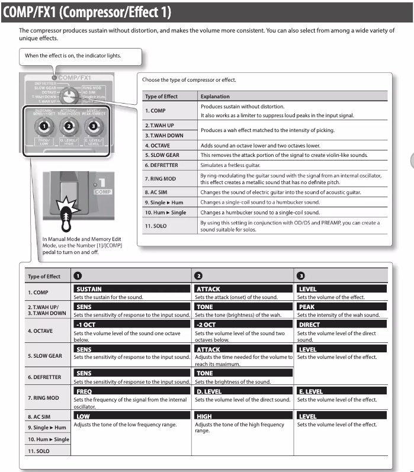

입력 전압 : 12V

- Delay와 reverb가 마지막에 걸린다.

- 많이 사용하는 patch
  - PREAMP
  - OD/DS
  - DELAY
  - REVERB

## COMP/FX

|Number|Type of Effect|Explanation|
|---|---|---|
|1|COMP|Compressor 다이나믹이 줄어드는 특유의 느낌이 있다. John mayer 곡에서 comp를 최대로 한다.|
|2, 3|WATH||
|4|OCTAVE||
|5|SLOW GEAR||
|6|DEFRETTER||
|7|RING MOD||
|8|AC SIM|어쿠스틱 기타 느낌. Preamp에 있는 AC SIM과 어떤 차이가 있을까? 중복으로 사용하면 뭔가 이상하고 이것만 쓸 때가 더 나은 것 같다.|
|9, 10|Single $\rightarrow$ Hum, Hum $\rightarrow$ Single|기타에서 픽업을 선택하고 있다면 사용할 필요 없다.|
|11|SOLO|솔로 할 때 사용해보자. EQ에 있는 Boost와 어떤 차이가 있을까?|

## Preamp

|Number|Type of Preamp|Explanation|
|---|---|---|
|1|Acoustic|어쿠스틱 기타 느낌을 낸다.|
|2|CLEAN|가장 무난하다. 뭘 할지 모르겠거나 다른 preamp에 대한 이해가 없다면 사용하면 된다.|
|3|TWEED|Fender Bassman's VINTAGE sound|
|4|CRUNCH||
|5|COMBD|VOX AC30's VINTAGE crunch sound|
|6|LEAD|Sustaining VINTAGE lead sound of the Boogie Mk series|
|7|DRIVE||
|8|STACK|Hard rock|
|9|METAL|Heavily distodrted sound of a Bogner Uberschall|

지금은 clean만 사용하고 있는데 2~9 simulation에 대한 감을 잡아야 한다.

## Delay

시간으로 조정하거나 텝탬포로 해야 한다.

## Reverb

|Types of Reverb|
|:---:|
|ROOM|
|HALL|
|SPRING|

각각 0~4.9로 총 50가지 경우의 수가 있다.

이 수치가 모든 이펙터에 보편적일까?

Reverb가 3가지밖에 없는 게 아쉽다.
