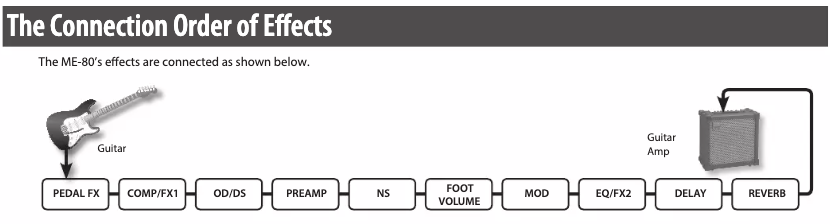
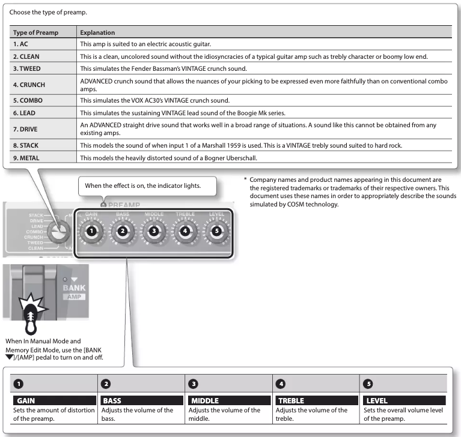
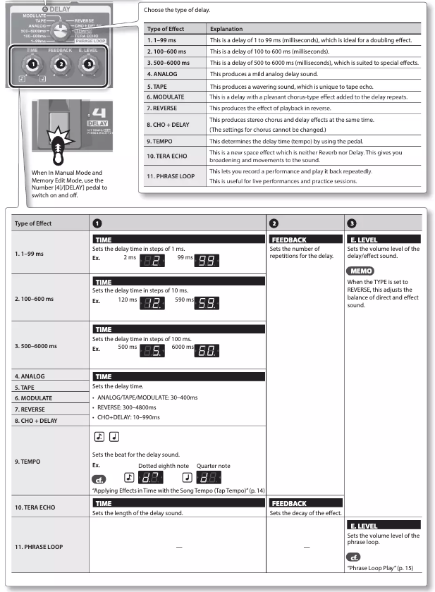

## The Connection Order of Effect

- Delay와 reverb가 마지막에 걸린다.

- 많이 사용하는 patch
  - PREAMP
  - DELAY

## Preamp

## Delay

## Reverb

Types of Reverb

- ROOM
- HALL
- SPRING

각각 0~4.9로 총 50가지 경우의 수가 있다.
