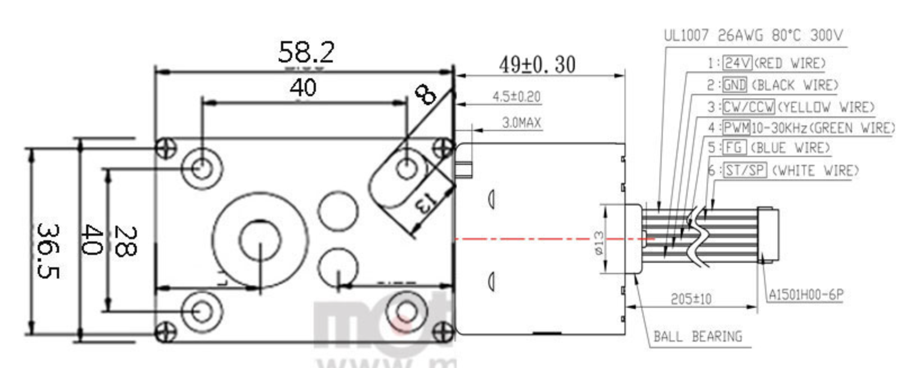
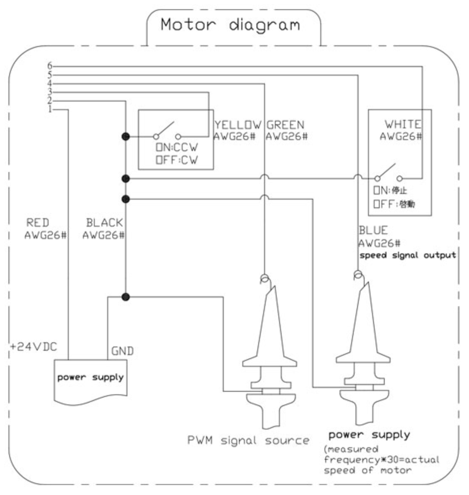

- 구동드라이버내장BLDC모터 웜기어드소형모터 WGM40-BL3649-24V 22W
- 전압 DC24V
- 출력 22W
- 감속비율 1/17~1/670 8종
- 최대토크 32kgf.cm

https://www.motorbank.kr/goods/goods_view.php?goodsNo=1000033917

4번 PWM(Pulse Width Modulation) : 마이크로프로세서의 디지털 출력을 통해 아날로그 회로를 제어하는 ​​방식으로 측정, 통신, 전력 제어 및 여러 분야의 변환에 널리 사용되는 매우 효과적인 기술. 현재 50Hz 아두이노 아날로그 핀을 이용하고 있다. analogwrite(핀 넘버, 0~255). 두 번째 인자를 통해 듀티를 설정한다. 0이면 0, 255면 1, 228이면 듀티가 50인 사각파, 1이면 1/255주기까지 1이고 이후로 0인 신호.

5번 FG 선 : 오실로스코프를 통해 신호를 볼 수 있다.

f x 30 = rpm

회전수를 알기가 어려울 수 있다.

1/36 바퀴 단위에서 제어할 수 없다면 encoder를 쓰는 게 낫다.

## 회전자의 회전각 추정

- Hall sensor or encoder를 사용한다.
- BLDC motor 구동하기 u, v, w 각 단자에 구형파 전압을 가해야 한다.
- 구형파 전압을 가하면 섹터의 경계에서 전압이 순간적으로 변하여 토크 리플이 발생하기 때문에 구형파가 아닌 정현파로 제어하기도 한다.
- 정현파로 제어하기 위해서는 회전자의 정확한 회전 위치를 알아야 한다.
- siz-step(trapezoidal) communication : - BLDC motor를 구동하는 기본적인 방법. Hall sensor 입력으로부터 회전자가 위치한 섹터를 찾고 해당 섹터에 대한 3상(u, v, w) 단자에 전압을 인가하는 것.
- 각 섹터의 전환 시 모터 와인딩에 흐르는 전류를 갑자기 끊기거나 흘러 토크 리플이 나타난다.
- 3상(u, v, w) 단자에 120도 위상차가 있는 정현파 전압을 인가한다.

## Hall sensor로 정현파 제어

- BLDC motor를 정현파로 구동하려면 회전자의 전기각을 알아야 한다.
- BLDC motor에 encoder 없이 hall sensors만 연결된 경우에는 hall sensors의 각속도를 측정하여 이를 적분함으로써 회전자의 각을 추정할 수 있다.

$$
\theta \leftarrow \theta + \omega \Delta t
$$

여기서 회전자의 각

## Hall sensor로 속도 측정