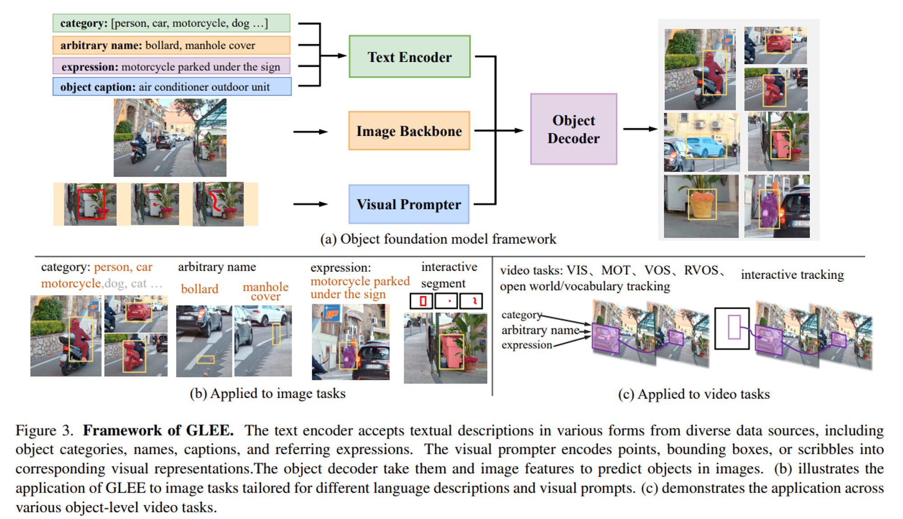

https://www.sktaifellowship.com/d48d779c-f591-437b-856d-b018ef539b43

## 세부 설명

- 연구 내용 : 대규모 AI 모델을 이용하여 영상(비디오) 데이터를 분석하고, 분석 결과를 활용해 검색 시스템을 만듭니다.
- 연구 목적 : 영상 검색 시스템에 AI를 활용할 수 있는 획기적인 방안을 찾아내고, 실제 서비스에 활용할 수 있는 가능성을 발굴합니다.
- 활용 계획 : 실시간 관제 시스템의 검색 기능으로 추가하여 사용자들에게 편의성을 제공합니다.
- 관련 경험 / 역량 : 컴퓨터 비전, 자연어 처리, 멀티모달 AI 알고리즘 연구 및 기타 개발 경험

## 프로젝트 소개

저희가 개발하는 실시간 관제 시스템은 우리의 일상에서 발생하는 영상(비디오)을 기록하고, 사람이나 차량과 같은 객체들의 다양한 속성을 제공합니다. 이러한 정보들은 매일 같이 쌓이게 되는데요, 저희는 LLM, Multimodal AI 기술의 발전이 현실에서 어떻게 활용할 수 있을지 고민하고, 이를 통해 데이터의 새로운 가치를 발굴하고자 합니다.

## 제안 배경

- LLM의 발전
  - 작년 그리고 올해 LLM은 눈부신 발전을 이루었습니다. 또한 on-device형 LLM 모델이 계속 오픈소스로 공개되고 있고, 많은 기업들은 기존 초고성능의 인프라 대신 소형 기기나 적절한 성능과 가격을 가진 서버에 이를 탑재하려 하고 있습니다.
  - LLM은 학습된 방대한 지식을 바탕으로 다양한 문제에 대해 꽤 높은 수준의 답을 도출해내고 있으며 많은 기업들이 이를 기존의 서비스와 엮어 사용자에게 제공하고자 노력 중입니다.
- 우리가 하고 있는 영상 분석 서비스
  - 우리 팀은 AI Camera, 분석 서버 등을 이용하여 실시간으로 들어오는 영상을 AI 모델을 통해 분석하고, 다양한 객체의 속성이나 이벤트를 사용자에게 제공하는 분석 모듈을 개발하고 있습니다.
  - 실시간 비디오 분석을 통해 사람, 차량 등 기본적인 속성부터 성별, 연령, 차종 등의 세부적인 속성 및 행동 인식, 화재, 추락과 같은 분석을 제공하고 있습니다. 또한 침입, 배회, 쓰레기 투기 등 다양한 이벤트를 분석하고 제공합니다.
  - 현재 한국 내 공공 부분에만 수백만 대 이상의 카메라가 동작하고 있고, 이러한 카메라들에 적용되는 AI 분석 모듈도 날로 발전을 거듭하고 있습니다. 카메라가 많아질수록 이를 관리하는 관제사도 많이 필요하게 되며, 관제를 도와줄 수 있는 AI 분석 모듈에 대한 기대 성능은 매 해마다 새로운 챌린지를 받고 있습니다.
- 데이터를 이용해 만드는 데이터의 중요성
  - 영상 분석 모듈을 통해 얻을 수 있는 정보는 사용되는 모델에 따라 제한됩니다. 또한 추론의 결과를 통해 각종 이벤트나 통계 분석을 하는 경우도 개발자가 요구사항에 따라 미리 정해놓은 API를 통해서만 가능합니다. 예를 들어 우리가 시간별로 지나가는 사람들의 Track ID를 가지고 있다고 하더라도 가장 통행량이 많은 시간 혹은 일정 시간 내 통행량을 보고싶다면 이를 클라이언트 UI와 API에 반영해야만 볼 수 있습니다.
  - Raw data가 아무리 많다고 하더라도 사용자는 미리 정의해놓은 형식에 따라 검색을 해서 결과를 볼 수밖에 없습니다. 하지만 데이터를 실시간으로 직접 분석하여 결과를 도출하는 AI가 있다면 이를 가능케 할 수 있습니다. 물론 이러한 데이터 분석 AI가 활용되기 위해서는 box, class와 같은 전통적인 속성 외에 Scene에 대한 분석이나 video 자체에 대한 분석 등 좋은 raw data를 뽑는 모델도 함께 연구가 되어야 한다고 생각합니다.

## 이런 목표를 이루고 싶어요

1. 영상으로부터 유용하고 다양한 데이터 저장 및 추출
2. LLM이 잘 이해할 수 있도록 취득한 데이터 가공
3. 질문과 가공된 데이터를 입력하여 영상으로부터 원하는 정보를 취득

## 다음과 같은 프로젝트를 진행합니다

저희는 현실에서 AI 기술의 활용성을 파악하기 위해, 비디오로부터 추출해야 하는 데이터가 무엇인지 정의하고, Database(DB)에 이를 저장하여 활용할 예정입니다. 하지만 DB, Backend, Frontend 등은 멘토가 도움을 줄 수 있습니다. 또한 작성된 진행 항식은 저희가 가정한 하나의 예시이며, 더 좋은 방법, 더 좋은 아이디어가 있다면 언제든지 환영입니다. 꼭! 제안해주세요.

1 비디오 검색에 필요한 작업과 데이터가 무엇일지 분석 및 연구를 진행합니다.

- Scene 분리
  - Classification, Segmentation, Detection, Scene graph
- VQA, Caption, OCR, GPT-4
- Representation feature vector 등 정보 추출
- 예시
  

  https://arxiv.org/pdf/2312.09158.pdf

2 데이터를 추출하고 이를 DB에 적재합니다.

3 DB로부터 데이터 추출 및 LLM에 활용할 수 있게 가공합니다.

- LLM의 prompt로 사용하기 위해 연구가 필요합니다.
- 예시
  

  https://arxiv.org/pdf/2403.07508.pdf

4 질문, 가공된 데이터를 LLM에 입력하고 원하는 정보를 제공받습니다.

- 추론 모델을 선택하고
- 전체 영상 프레임을 추론하는 것은 불가능하기 때문에 이 과정도 연구가 필요합니다.
- 영상을 Scene별 또는 시간대별로 분석하여 하나의 긴 텍스트로 저장해 놓을 수도 있습니다.
- 텍스트가 아닌 vector feature로 저장해놓거나 이를 텍스트와 함께 활용할 수도 있습니다.

결국 AI 모델과 기존 정보를 조합하여 비디오를 잘 표현하고 이를 prompt로 활용해 LLM으로부터 비디오 검색/분석 결과를 얻어내는 것이 이 프로젝트의 방향성입니다. 저희가 작성한 내용과 무관하게 더 좋은 방법과 아이디어가 있다면 언제든지 환영입니다.

## 이런 fellows를 찾아요

- 알고리즘 성능의 단순 개선보다 AI를 현실에 어떻게 녹여낼지 고민하시는 분
- 끊임 없는 고민과 새롭고 창의적인 방향성을 찾아가고자 하는 의지가 있으신 분
- 저희가 함께 고민하고 서로의 의견을 자유롭게 공유할 수 있으신 분

우대 경험

- 컴퓨터 비전, 자연어 처리, 멀티 모달 등 AI 기술에 대한 이해와 경험
- AI 알고리즘 이외의 개발 경험 (Backend, Frontend 등)

[FAQ]

이미지 분석이 아닌 비디오 분석을 하고자 합니다.

예시)

1. 비가 오는 밤에 촬영된 영상을 찾아줘 (영상 간 검색)
2. 이 영상에서 주황색 상의를 입은 남성이 지나간 장면을 추적해줘 (영상 내 검색)
3. 이 영상에서 3:00 ~ 5:00 분 사이에 지나간 사람들의 성비 분포는 어떻게 돼?

## SKT 관제 시스템 사업

엘리오스2 LTE/5G 실시간 관제 시스템(SK텔레콤 T live caster)



[고객사례] 대우건설 : 국내 건설사 최초 드론 관제 시스템 도입



최근에는 naver cloud platform에서 제공하는 AI 서비스와 지도 API를 활용하고 있다. 지도 API를 활용해 건설 현장 및 주변 정보를 쉽게 볼 수 있는 앱을 개발하였고 Machine Learning 서비스를 통해 드론 영상 분석 시스템을 연구 중에 있다.

DW 드론 관제 시스템은 건설 현장뿐만 아니라 소방, 인명 수색, 화재 감시, 해안 정찰 등 다양한 곳에 확대 적용이 가능하다.

향후에는 AI 이미지 분석 기술을 접목하여 드론이 촬영한 영상에서 중요한 정보를 자동으로 사용자에게 제공할 수 있는 서비스가 될 수 있도록 기술 개발 중에 있다. 예를 들어 건설 현장의 위험 요소, 이상 징후를 드론이 실시간 영상 분석을 통해 자동으로 감지하여 사용자에게 알림을 주거나 이후 조치를 취할 수 이도록 하는 등 여러 방면으로 활용할 수 있을 것이다.

[SK Telecom] KOSECO에서 소개하는 T Live Caster Plan 차세대 영상관제솔루션

