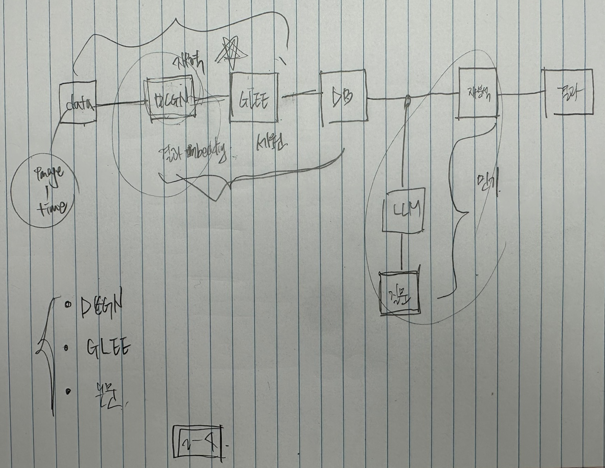
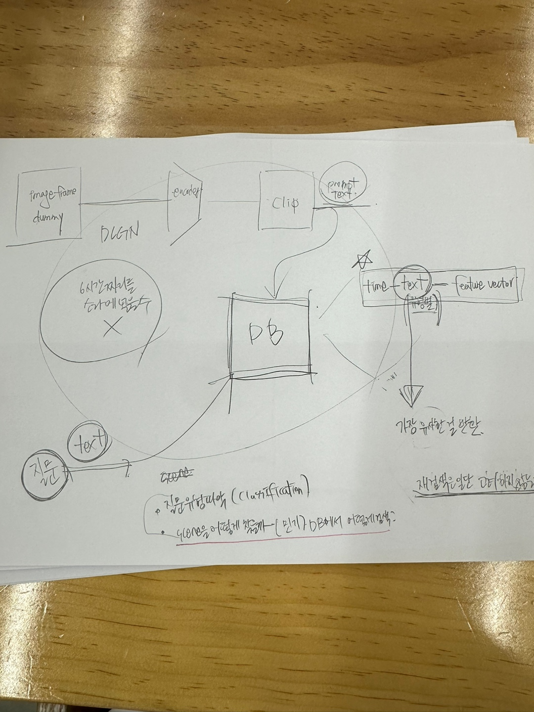

## 최종 제안서

## 제안서 시행 착오

|Process|Description|
|---|---|
|1-1|이미지에서 [Yolo 9000 Classes](https://github.com/pjreddie/darknet/blob/1e729804f61c8627eb257fba8b83f74e04945db7/data/9k.names)에 해당하는 객체를 추출한다.|
|1-2|이미지에서 모든 객체와 객체의 속성, 배경에 대한 정보를 text로 저장한다.|
|2-1|각 Scene을 구분한다.|
|2-2|각 Scene에서 동작을 text로 변환한다.|
|3-1|사용자가 질문을 한다.|
|3-2|질문의 문장에서 '탐색의 단서 정보'와 요구 사항'을 각각 추출한다.|
|3-3|'탐색의 단서 정보'에서 배경, 객체, 객체의 속성, 동작을 각각 추출한다.|
|4-1|추출된 정보를 바탕으로 관련이 있는 scene을 탐색한다.|
|4-2|scene에서 요구사항에 대한 결과를 도출한다.|
|4-3|결과를 사용자에게 제공한다.|

### Description

- Image frame에 있는 모든 정보 : 객체, 객체의 속성, 배경(객체 이외의 것)
- Scene(관련이 있는 Image들의 집합)의 모든 정보 : 동작
- 호환성을 위해 기본적으로 정보를 text 단위로 적재하고 호출한다.
- 배경-객체-동작 구분 이유
  1. Computer Vision Task가 기본적으로 객체를 중심으로 되어 있다.
  2. 언어 문법적인 관점에서 문장의 주성분(주어, 목적어, 보어)는 객체이다.

### 해결해야 할 문제

- 사용자 입력한 질문의 문장에서 "탐색의 단서 정보"와 "요구 사항"을 어떻게 추출할까?
- "탐색의 단서 정보"에서 "배경", "객체", "객체의 속성", "동작"을 어떻게 추출할까?
- "배경", "객체", "객체의 속성", "동작"에 대한 정보를 바탕으로 관련이 있는 scene을 어떻게 탐색할까?
  어휘간의 유사도를 가지고 해야 할까?

## 드는 생각

- 새로운 기술을 찾기보다 상황을 정확하게 이해하고 주어진 기술을 적절하고 정확하게 사용하는 것이 중요한 것 같다.
