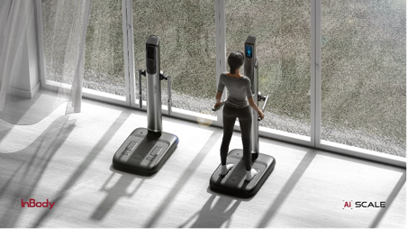

{: .align-center width="300" height="150"}

Hi, This is Anthony Garcia.

I am a software and robotics engineer with a passion for developing AGI with robotics.

I am especially interested in robotics control and computer vision AI.

# Education

B.S.

- Mar. 2022 - Feb. 2026
- Universify of Seoul
- Major : Electrical and Computer Engineering
- Minor : Mathematics

Control and Dynamic System Laboratory (CDSL)

- Mar. 2023 - Dec. 2024
- Undergraduate Researcher

# Experience

InBody Scale AI

{: .align-center}

- Jan. 2024 - Jan. 2025
- Object : Consumer Electroinics Show 2025, Best Innovation Award
- InBody Scale AI Department, SW & Vision AI Team Lead

As the SW & Vision AI Team Leader, I have developed a computer vision AI solution for the new InBody Scale AI product. This involved researching and enhancing the performance of height estimation algorithms using a low-performance monocular camera and limited computing resources. Additionally, I developed a face verification solution, along with the necessary pipeline and database for it.

Existing height estimation algorithms and papers using vision assume that the user's entire body is within the camera's field of view. However, due to the mechanical characteristics of the InBody device, the user's full body does not fit within the camera's field of view. Our attempt to estimate height under these conditions is unprecedented. In our first experiment, we achieved an average error of 0.6% and a maximum error of 1%. We tackled the ultimate problem of height estimation by breaking it down into sub-problems where computer vision AI can excel: Object Detection and Semantic Segmentation. To achieve this, we designed and utilized a structure that allows the camera to move via motors and rails.

F1Tenth

- Jan. 2024 - Dec. 2024
- Object : 22nd F1tenth Autonomous Grand Prix, 2024 IEEE Conference Decision and Contrl (CDC 2024)
- Team Lead

I am researching and developing an integrated F1TENTH autonomous driving system that encompasses perception, decision-making, and control.

Cart Pole Design and Control - MPC vs RL

- Jul. 25 2024 - Sep. 27 2024
- Object : UOS ECE IF (Innovation Fair) Competition
- Team Member : Sewon Kim (only me)

I am independently developing all aspects of the Linear Inverted Pendulum, including kinematics (mathematical modeling), mechanical design, electronics, hardware fabrication, simulation environment setup, and control(MPC, RL).

Cardiovascular diagnosing device and personalized management solution using InBody data - Excellence Prize

{: .align-center width="300" height="150"}

- Jul. 1 2024 - Jul. 31 2024
- 2023 Inbody Makerthon held by Inbody Co., Ltd

Our team developed cardiovascular diagnosing device and personalized management solution using InBody data at the 2023 Makerton, organized by Inbody. As a result, we was awarded the Excellence Prize and a prize of 2 million KRW. I developed a CNN model for ECG sensor data collection, noise reduction, and normalization. This model was then integrated with InBody data to create a machine learning algorithm for diagnosing cardiovascular diseases.

AI Object recognition-based Solar Tracking Robot Challenge - Excellence Prize

{: .align-center width="300" height="150"}

- Jul. 24 2024 - Jul. 31 2024
- held by Engineering Education Innovation Center of KOREA University
- [[로봇 신문] 고려대 공학교육혁신센터-로봇SC-신재생에너지SC, 'AI 물체 인식 기반 태양광 트래킹 로봇 챌린지' 개최](https://www.irobotnews.com/news/articleView.html?idxno=32285)

I achieved a record time of 80 seconds and received an Excellence Award at an AI object recognition-based solar tracking robot competition. The goal of the competition was to complete the given task as quickly as possible without crossing the boundary lines while following a designated path. I focused on the efficient integration of hardware and software, developing a driving algorithm based on the amount of light. This approach allowed me to solve the problem of the robot occasionally crossing the boundary lines.
