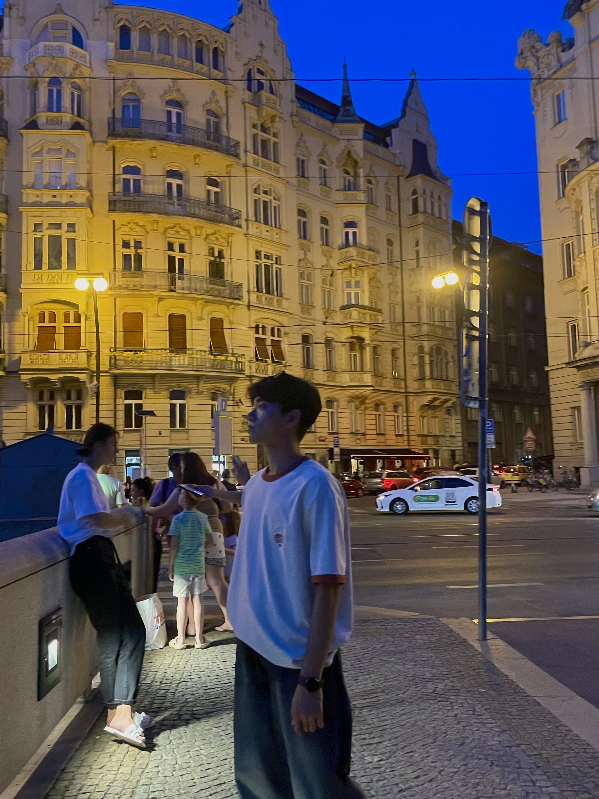
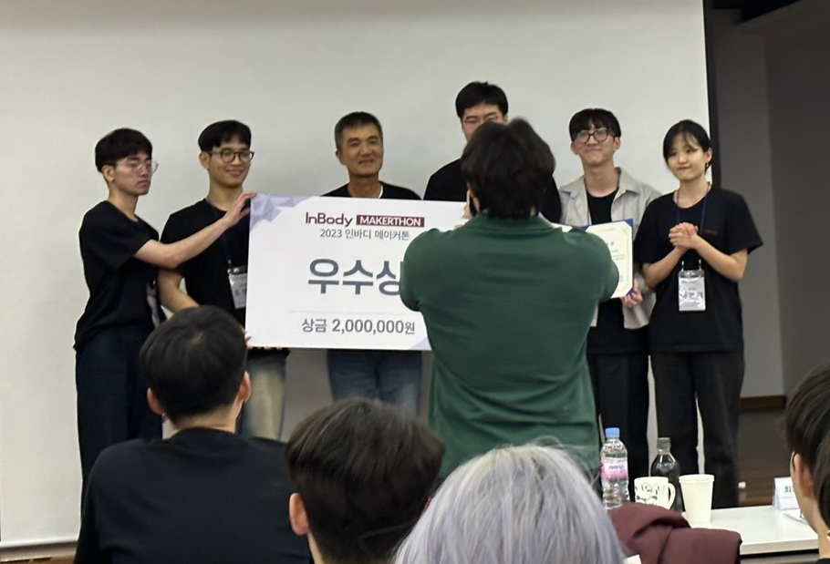

{: .align-center width="300" height="150"}

Hi, This is Anthony Garcia.

I am a software and robotics engineer with a passion for developing AGI with robotics.

I am especially interested in robotics control and computer vision AI.

## Education

B.S.

- Mar. 2022 - Feb. 2026
- Universify of Seoul
- Major : Electrical and Computer Engineering
- Minor : Mathematics

Control and Dynamics Laboratory (CDSL)

- Mar. 2023 - Dec. 2024
- Undergraduate Researcher

## Experience

New 'InBody Scale AI'

- Jan. 2024 - Jan. 2025
- Object : Consumer Electroinics Show 2025, Best Innovation Award
- InBody Scale AI Department, SW & Vision AI Team Lead

As the SW & Vision AI Team Leader, I have developed a computer vision AI solution for the new InBody Scale AI product. This involved researching and enhancing the performance of height estimation algorithms using a low-performance monocular camera and limited computing resources. Additionally, I developed a face verification solution, along with the necessary pipeline and database for it.

Existing algorithms and papers that estimate height using vision assume that the user's entire body is within the camera's field of view. However, due to the mechanical characteristics of the InBody device, the user's full body does not fit within the camera's field of view. Our attempt to estimate height under these conditions is unprecedented. In our first experiment, we achieved an average error of 0.6% and a maximum error of 1%. We tackled the ultimate problem of height estimation by breaking it down into sub-problems where computer vision AI can excel: Object Detection and Semantic Segmentation. To achieve this, we designed and utilized a structure that allows the camera to move via motors and rails.

F1Tenth

- Jan. 2024 - Dec. 2024
- Object : 22nd F1tenth Autonomous Grand Prix, 2024 IEEE Conference Decision and Contrl (CDC 2024)
- Team Lead

인지, 판단, 제어에 해당하는 f1tenth 자율주행 통합 시스템을 연구 개발합니다.

{: .align-center width="300" height="150"}

2023 Inbody Makerthon

- Jul. 1 2024 - Jul. 31 2024
- Excellence Prize
- held by Inbody Co., Ltd

AI Object recognition-based Solar Tracking Robot Challenge

{: .align-center width="300" height="150"}

- Jul. 24 2024 - Jul. 31 2024
- Excellence Prize
- held by Engineering Education Innovation Center of KOREA University
- [[로봇 신문] 고려대 공학교육혁신센터-로봇SC-신재생에너지SC, 'AI 물체 인식 기반 태양광 트래킹 로봇 챌린지' 개최](https://www.irobotnews.com/news/articleView.html?idxno=32285)
