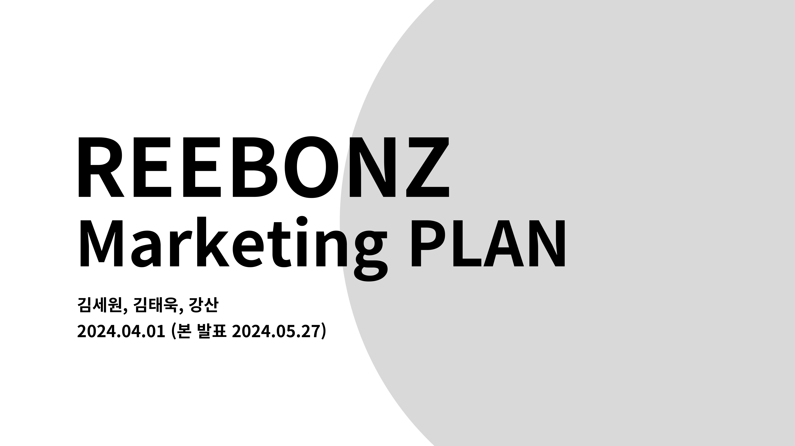
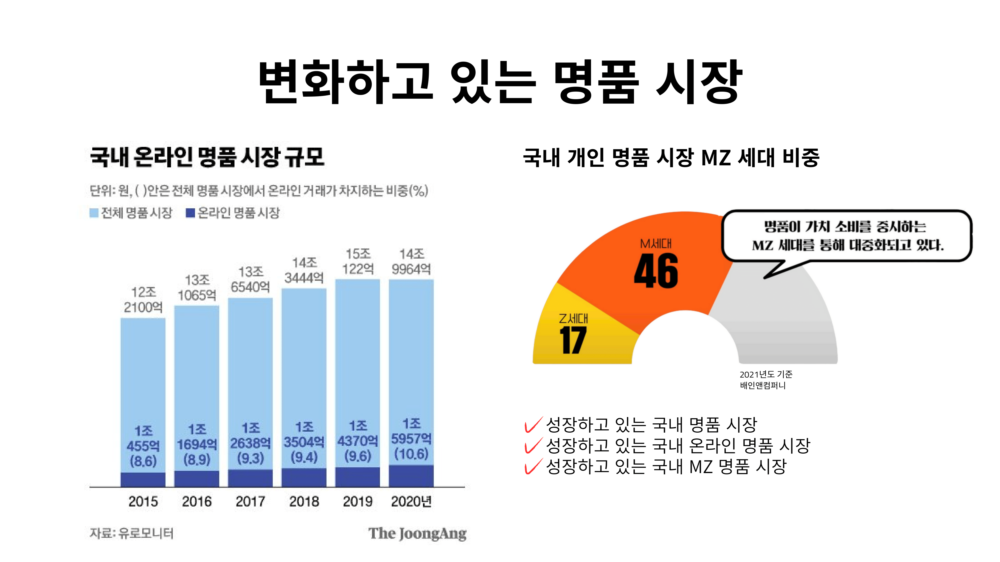
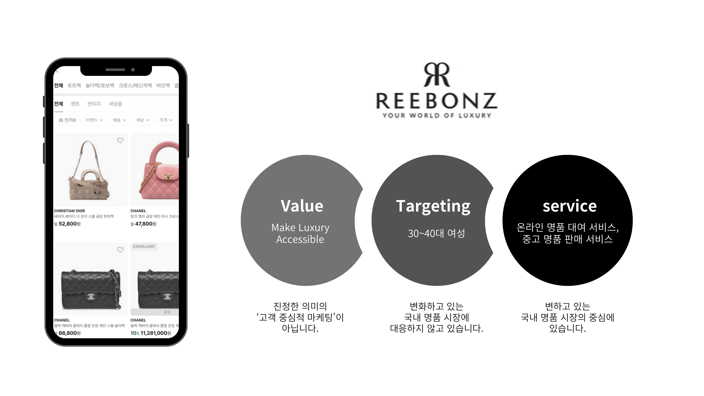
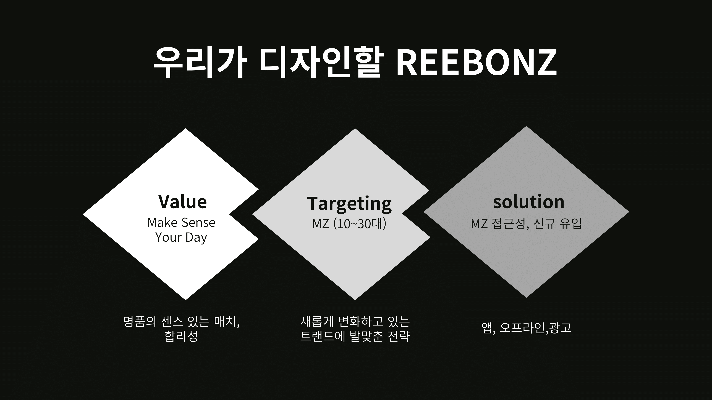

- 안녕하세요. 김세원, 김태욱, 강산입니다.
- 저희는 온라인 명품 대여 서비스를 제공하고 있는 REEBONZ라는 기업의 마케팅 전략과 리브랜딩 전략을 제안하겠습니다.
- [역할 분배] 저희는 모든 팀원이 기획, 자료조사, 발표 등 모든 프로세스에 참여하기로 했습니다.
- [발표 일자] 본 발표는 5/27에 진행할 예정입니다.

- 저희는 변화하고 있는 명품 시장에 주목했습니다. 국내 명품 시장에서 3가지 변화를 감지할 수 있었습니다.
- [성장하고 있는 국내 명품 시장] 첫 번째는 국내 명품 시장이 빠르게 성장하고 있다는 것입니다. 유로모니터에 따르면 한국의 명품 시장 규모는 2015년부터 꾸준히 성장하고 있으며, 2022년 9조 6000억원, 2023년 21억 9000억원 규모로 최근 들어 더 큰 폭으로 성장했습니다.
- [성장하고 있는 국내 온라인 명품 시장] 두 번째는 온라인 명품 시장도 함께 성장하고 있다는 것입니다. 온라인 명품 시장 또한 2015년부터 꾸준히 증가하였으며, 2023년에는 전체의 12%를 차지했습니다.
- [성장하고 있는 국내 MZ 명품 시장] 세 번째 변화는 이 흐름에서 MZ의 비중이 커지고 있으며 MZ가 명품시장을 견인하고 있는 것입니다. 특히 온라인 부분에서 두드러지게 나타납니다. 저희는 이 부분에 주목했습니다.
- [MZ 세대의 특성] 명품 시장에서 MZ는 다음의 특성을 갖고 있습니다.
    1. 남에게 보이는 것이 중요시하며 과시 욕구가 크다.
    2. SNS에 민감하다.
    3. 속한 집단의 소비 패턴을 쉽게 따라간다.
    4. 상품보다 경험을 중시한다.
    5. 예산이 부족하다.

- [SERVICE] 저희는 이러한 변화의 중심에 있는 REEBONZ를 주제로 선정하였습니다. REEBONZ는 온라인 명품 대여 서비스, 중고 명품 판매 서비스를 제공하고 있습니다. 왼쪽 가방이 원래는 1000만원이 넘지만 이를 저렴한 가격에 일 단위로 빌릴 수 있습니다. 외에도 월 8만원으로 모든 명품을 자유롭게 대여할 수 있는 명품 구독 서비스와 중고 명품 판매 서비스가 있습니다.
- [VALUE] 리본즈는 “Make Luxury Accessible”이라는 가치를 가지고 있습니다.
- [TARGETING] 대표자 인터뷰에 따르면 리본즈는 30~40대 여성을 타겟팅하고 있습니다.

저희는 기존의 REEBONZ에서 두 가지 문제 의식을 가졌습니다.

- [VALUE] 첫 번째는 “Make Luxury Accessible”라는 가치는 회사 목표일뿐, 소비자들에게 소비해야 할 이유를 제공하고 있지 못하다고 생각했습니다. 즉, 진정한 의미의 ‘고객 중심적 마케팅’이 아니라고 생각했습니다. 코카콜라가 행복이라는 가치를 통해 설탕물을 마셔야 할 직접적인 이유를 주는 것처럼 소비자 입장에서 가치를 전달해야 한다고 생각했습니다.
- [TARGETING] 두 번째는 변화하고 있는 국내 명품 시장의 트랜드에 대한 대응을 하지 않고 있다는 것입니다.

저희가 집중할 3가지 부분에 대해서 말씀드리겠습니다.

- [VALUE] 저희는 합리성과 명품의 센스 있는 매치를 강조하는 “Make Sense Your Day”라는 가치를 제시합니다. 지금의 서비스와 앱에서는 명품이 멋있다는 것을 충분히 인지시켜주지 못하고 있었습니다. 명품을 센스 있게 매치하자는 가치를 가지고 REEBONZ를 리브랜딩할 것입니다.
- [TARGETING] 저희는 10~30대 MZ 세대를 타겟으로 선정합니다. 앞서 제시했던 국내 명품 시장의 세 가지 트랜드를 반영하여 MZ 명품 시장에 주목했습니다. 세대가 선도하고 중심이 되는 국내 명품 시장의 흐름에 맞춰 REEBONZ를 디자인하고 리브랜딩할 것입니다. 이것이 저희가 이 주제를 선정한 첫 번째 이유입니다. 또한 저희가 MZ 세대이기 때문에 MZ는 가장 잘 알고 있는 대상입니다. 이런 점에서 이 마케팅 전략에 대해 30~40대 기획자들보다 더 좋은 대안을 제시할 가능성이 있다고 생각했습니다. 이것이 이 주제를 선정한 두 번째 이유입니다.
- [SOLUTION] MZ 접근성을 높이고 신규 유입을 늘리는 방향 고민할 것입니다. 앱, 오프라인, 광고에서 이러한 가치관과 세계관을 어떻게 녹여낼 것인지를 고민할 것입니다. 앱과 오프라인 매장으로 인지도를 높이고,  앱의 개편으로 mz가 앱을 찾을 수 있는 이유를 만들 것입니다. 앞서 말씀드렸던 명품 시장에서 MZ 세대의 특성에 기반하여 적절한 솔루션을 고안할 계획입니다.

이상입니다.
