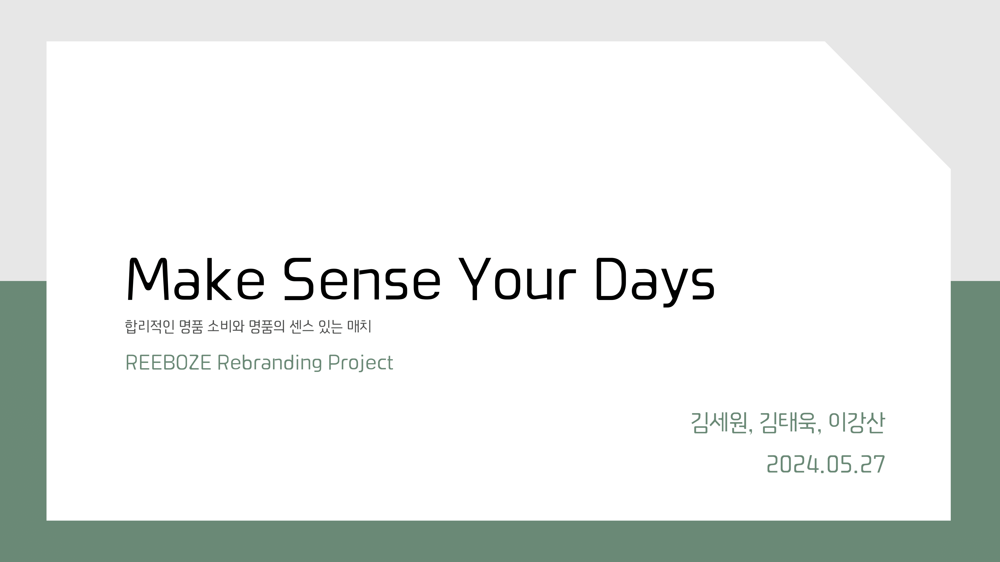
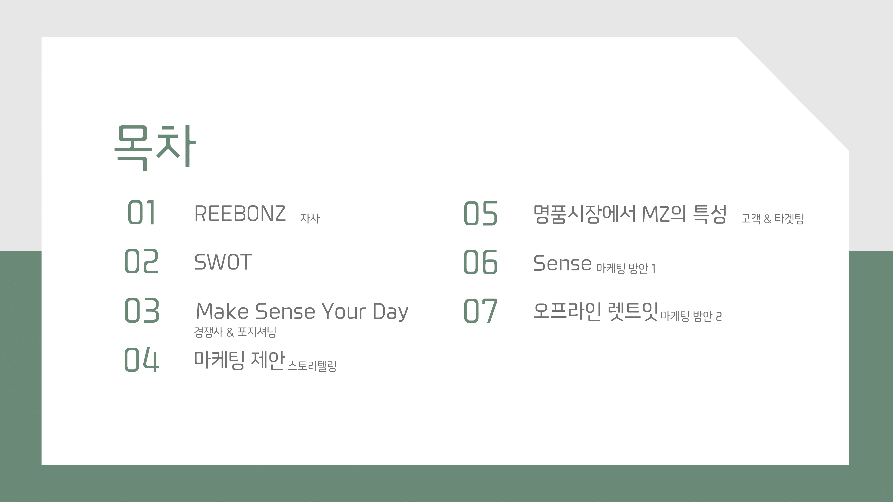
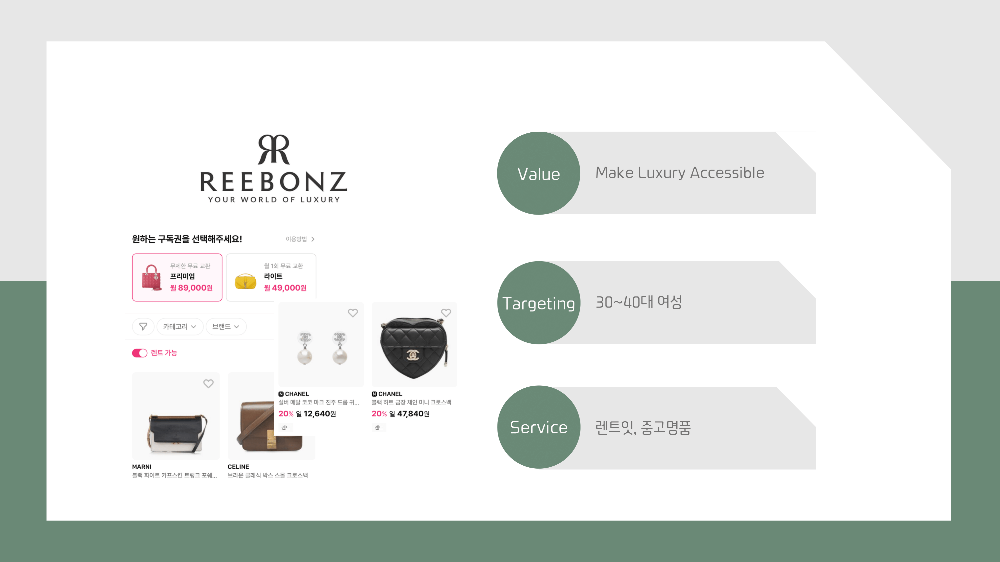
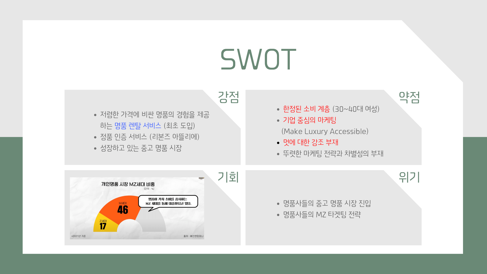
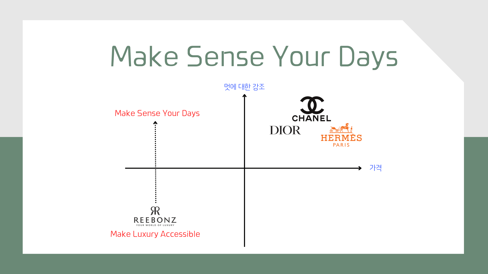
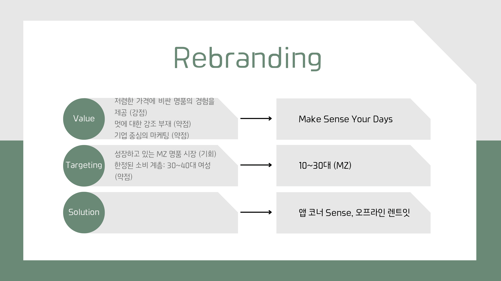
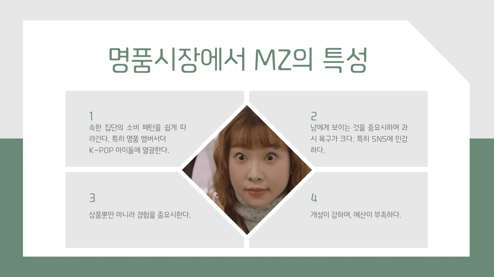
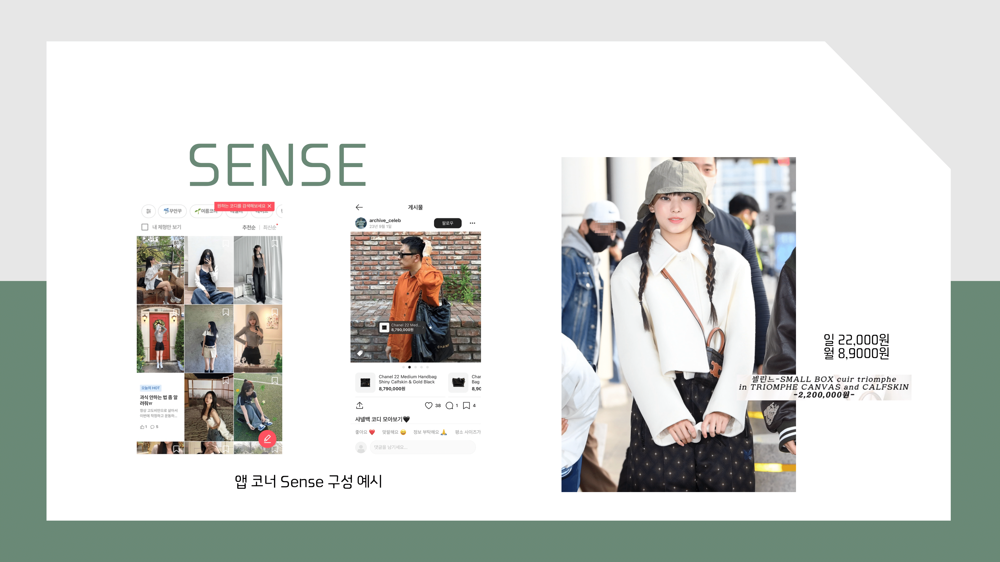
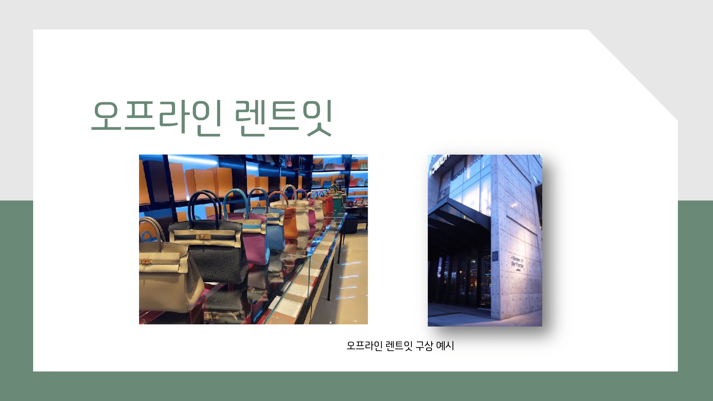

- 안녕하세요. 김세원, 김태욱, 이강산입니다. 저희 팀이 선정한 회사는 온라인 명품 대여 서비스를 제공하고 있는 리본즈입니다.
- 저희는 기존 리본드의 핵심 가치인 “Make Luxury Accessible”이 진정한 의미의 고객 중심 마케팅이 아님을 지적합니다. 저희는 리본즈가 “Make Sense Your Day”로 나아가야 함을 제안합니다.
- Make Sense Your Day는 합리적인 명품 가격과 명품의 센스 있는 코디를 추구하는 새로운 명품 소비 문화입니다.Make Sense에서 합리적인 명품 소비의 의미하며 Sense에서 명품의 센스 있는 코디를 의미합니다.

- 먼저 발표의 큰 흐름에 대해 설명드리겠습니다.
- 마케팅 기획 시 3C 분석, SWOT 분석, STP, 4P의 순서로 진행됩니다. 하지만 저희는 기존의 REEBONZ를 리브랜딩하는 입장이기 때문에 다른 접근을 취했습니다. 마케팅 프로세스에서 필요한 부분을 채택하여 재구성하였으며 큰 흐름에서 벗어나는 내용은 주어진 시간을 고려하여 과감히 배제했습니다.
  - 첫 번째로 리본즈에 대한 소개와 자사에 대한 분석을 말씀드리겠습니다.
  - 두 번째로 시장조사와 경쟁사 조사를 바탕으로 도출한 SWOT 분석에 대해 말씀드립니다. 이를 통해 현 시점에서 리본즈가 처한 위기 상황 속에서 약점을 어떻게 보안하여 기회를 잡을 수 있을 것인지에 대한 인사이트를 도출합니다.
  - 세 번째로 포지셔닝 맵상에서 현재 리본즈의 상황을 경쟁사와 비교하여 확인합니다. 또한 이러한 실정 속에서 리본즈가 어떤 방향으로 변모해야 할지 제안합니다.
  - 다섯 번째로 구체적인 마케팅 실행 반안을 도출하기 위해 실행했던 MZ에 대한 고객 조사를 제시합니다.
  - 여섯 번째와 일곱 번째는 저희가 말씀드린 리브랜딩 전략을 실행하기 위해 리본즈에게 가장 필요한 두 가지 마케팅 실행 방안에 대해 말씀드립니다. 리본즈 앱 코너 “센스”와 오프라인 렌트잇이 그것입니다.
- 저희는 새로운 명품 소비 문화가 진짜 리본즈가 추구할 만한 가치인지, 그리고 그렇다면 어떻게 이 사상을 만들어갈 수 있을지에 집중하여 발표를 준비했습니다. 그럼 본격적인 발표를 시작하겠습니다.

- 리본즈는 “Make Luxury Accessible”이라는 핵심 가치 아래 온라인 명품 대여 서비스 렌트잇과 중고 명품 판매 서비스를 제공하고 있습니다.
- 원가가 1000만원이 넘는 여성 백을 저렴한 가격에 일 단위 혹은 월단위로 빌릴 수 있습니다. 또한 월 8만 9천원으로 모든 명품을 자유롭게 대여할 수 있는 명품 구독 서비스와 중고 명품 판매 서비스가 있습니다.
- 대표자 인터뷰에 따르면 리본즈는 30~40대 여성이 주고객층입니다.

- 리본즈에 대한 분석과 시장에 대한 분석을 바탕으로 리본즈의 SWOT 분석을 진행했습니다.
- 먼저 리본즈의 강점입니다.
  - 저희가 아는 한 리본즈는 국내에서 유일하게 명품 대여 서비스를 제공하고 있습니다. 이를 통해 저렴한 가격에 비싼 명품에 대한 경험을 제공할 수 있다는 강점을 가지고 있습니다.
  - 리본즈 아뜰리에라는 철저한 정품 인증 서비스와 품질 관리 서비스를 강점으로 가지고 있습니다.
  - 성장하고 있는 중고 명품 시장도 리본즈가 강점입니다.
- 하지만 리본즈는 몇 가지 치명적인 약점을 가지고 있습니다.
  - 리본즈의 약점으로 한정된 소비 계층을 뽑을 수 있습니다. MZ 명품 시장이 급부상하고 있는 현 시점에서 이러한 실정은 치명적인 약점입니다.
  - 다음으로 기업 중심의 마케팅입니다. 리본즈가 추구하는 Make Luxury Accessible은 기업의 목표이지 진정한 의미의 고객 중심 마케팅이 아닙니다. 고객의 관점에서 그들을 설득할 수 있는 전략이 필요합니다.
  - 또한 멋의 극치를 보여주는 명품 시장과 의류 시장에서 리본즈는 다른 경쟁사들과 달리 멋에 대한 강조가 부족합니다.
  - 뚜렷한 마케팅 전략과 차별성의 부재 또한 소비자에게 리본즈를 인식시키는 데 어려움을 야기합니다.
- 기회에 대한 부분입니다. 중년 여성이 명품 시장의 큰 손이었던 과거와 달리 MZ 세대가 명품 시장에서 절반 이상을 차지하고 있습니다. 이러한 시장의 새로운 변화는 리본즈에게 기회가 될 수 있습니다.
  - 2021년에 유로모터스에서 실시간 조사에 따르면 명품 시장에서 MZ 세대가 차지 하는 비중은 50%를 넘어섰습니다.
  - 변화가 늘 그렇듯 이에 대응하지 못한다면 위기가 될 수 있습니다.
- 리본즈의 위기로는 명품사들이 중고 명품 시장에 진입하고 있다는 사실과 MZ 타겟팅 전략을 사용하고 있다는 것입니다.
- 이러한 위기 속에서 리본즈는 어떻게 강점을 강화하고 약점을 보완하여 기회를 잡을 수 있을까요?

- 저희는 Make Luxury Accessible이라는 기업 중심 마케팅에서 Make Sene Your Days라는 고객 중심 마케팅으로의 이동을 제안합니다. 이를 포지셔닝 맵에서 경쟁사와의 비교를 통해 설명드리겠습니다.
- 저희는 리본즈의 경쟁사를 명품사로 설정하였습니다. 명품을 갖고자 하는 본원적 효익을 기준으로 명품 시장만을 다루는 대상으로 한정하였습니다.
- 가로축을 가격, 세로축을 멋에 대한 강조로 두고 포지셔닝 맵을 그렸을 때 명품사들은 1사분면에 위치합니다. 명품사들은 고급화 전략을 사용하기 때문에 이들의 제품들은 높은 가격대를 형성합니다. 또한 최근 명품사들은 MZ 시장을 겨냥하기 위해 K-POP 아이돌을 엠버서더로 세워 자신들의 제품에 대한 멋과 아름다움을 강조합니다. 대표적으로 뉴진스의 민지와 해린을 모델로 사용하는 CHANEL과 DIOR을 예시로 들 수 있습니다.
- 한편 REEBONZ는 위 포지셔닝 맵에서 3사분면에 위치합니다. 렌트잇 서비스를 통해 저렴한 가격에 값비싼 명품의 경험을 제공할 수 있다는 장점이 있지만, REEBONZ가 제공하고 있는 서비스를 이용해야 할 직접적인 이유를 주고 있지 못합니다. 저희는 REEBONZ가 강점은 유지하되 Sense를 강조함으로써 2사분면으로 도약할 것을 제안합니다. Make Sense Your Day라는 표어 아래 일상 속인 패션 속에서 ‘합리적인 가격’으로 패션에 ‘센스’를 더할 수 있다는 메시지를 제공합니다. 이를 통해 소비자들은 REEBONZ를 더 분명하게 인식할 수 있을 것이며 매력을 느낄 수 있을 것입니다.

- 저희는 SWOT 분석을 통해 크게 세 부분에서 리브랜딩을 제안합니다.
  - 첫 번째는 리본즈의 핵심 가치를 Make Luxury Accessible에서 Make Sense Your Day로 바꿀 것을 제안합니다. 이는 소비자 관점의 표어로서 기존의 기업 중심 마케팅에서 벗어나는 계기가 됩니다. 이러한 사상을 바탕으로 기존 리본즈의 모든 사고 방식과 서비스를 재조정할 것을 제안합니다.
  - 두 번째는 타겟을 30~40대 여성에서 10~30대의 MZ 세대를 포함시킬 것을 제안합니다. MZ가 견인하고 있는 명품 시장 트렌드를 적극 반영할 것을 제안합니다.
  - 세 번째는 구체적인 마케팅 방안으로 명품을 센스 있는 매치를 보여줄 수 있는 Sense라는 앱 코너와 고객에게 접근성을 높이고 경험을 제공해줄 수 있는 오프라인 랜트잇을 제안합니다. 이는 뒤편에서 자세하게 다룰 예정입니다.

- 저희는 구체적인 마케팅 제안을 전개하기 위해 저희가 선정한 MZ 세대에 대한 조사를 진행하였습니다. 명품시장에서 MZ는 다음과 같은 특성을 갖는다는 것을 확인했습니다.
  - 첫 번째로 MZ 세대는 속한 집단의 소비 패턴을 쉽게 따라갑니다. 특히 명품 엠버서더 K-POP 아이돌에 열광합니다. 아이돌이 착장한 명품이 금세 완판되는 뉴스를 자주 접합니다.
  - 두번째로 남에게 보이는 것을 중요시하며 과시 욕구가 크다는 특징이 있습니다. 특히 SNS에 민감합니다.
  - 세번째로 상품뿐만 아니라 경험을 중요시합니다.
  - 네번째로 개성이 강하며 예산이 부족하다는 특성이 있습니다.
- 이는 동덕여자대학교 국제경영학과교수가 작성한 명품브랜드가 MZ 세대의 사랑을 받는 이유라는 아티클에서 차용했습니다.
- 이런 특성을 반영하여 현 시점에서 리본즈에게 가장 필요한 2가지 마케팅 방안을 제안합니다.

- 첫 번째 방안은 Sense라는 앱 코너를 만드는 것입니다. Sense는 일상의 패션 속에 명품을 센스 있게 매치하여 코디한 이미지를 공유할 수 있는 채널입니다. 오른쪽 이미지는 뉴진스 해린의 공항 패션입니다. 일상적인 패션에 명품을 매치하여 포인트를 준 모습입니다. 이러한 이미지를 공유할 수 있는 창구가 Sense입니다.
- 제품 옆에 제품의 이름과 실제 가격, 그리고 리본즈에서 이용할 수 있는 가격이 쓰인 태그를 사용합니다. 태그를 클릭하면 바로 구매 혹은 렌트잇으로 이어질 수 있도록 합니다.
- 이를 통해 REEBONZ는 단순히 명품을 서비스하는 것을 넘어 “명품을 통해 일상에 센스를 더한다”는 가치를 고객에게 제공할 수 있습니다. 이를 경험한 고객은 REEBONZ를 더 강력하게 인지할 수 있을 것입니다. 이는 REEBONZ는 뚜렷한 마케팅 전략을 갖게 되며 차별성이 됩니다. 또한 명품을 어떻게 이용해야 할지 모르는 고객에게 가이드 라인을 제시하여 명품의 진입 장벽을 낮출 수 있습니다. 신규 유입 효과까지 누릴 수 있을 것으로 기대됩니다.

- 두 번째 방안은 오프라인 렌트잇입니다. 상품뿐만 아니라 경험을 중요시하는 MZ의 특성을 고려하였으며, 팝업 스토어를 밴치마킹하였습니다. 팝업 스토어와 같이 누구나 들어가서 피팅을 해볼 수 있으며, 구매를 하거나 구독을 결제하고 대여할 수 있습니다.
- 이를 통해 스타트업의 특성상 낮은 인지도를 개선하고 명품 경험을 제공할 수 있습니다. 또한 배송으로 상품을 주고받는 방식에서는 진입 장벽이 존재하였으나 고객에게 더 가까운 place를 제공함으로써 접근성을 크게 개선할 수 있습니다.
- 실제 기획 과정에서와 같이 두 가지 패르소나를 구상했습니다.

- 26세 여성 김OO씨는 친한 언니의 결혼식에 초대를 받았습니다. 결혼식에서 학창 시절 지인들을 만나게 됩니다.김OO씨는 옷을 여러 벌 갈아입으면서 옷을 고르지만 심심한 느낌이 해결되지 않습니다. 김OO씨는 리본즈 앱에서 의상에 적절한 명품백을 고르고, 결혼식에 가는 길에 오프라인 렌트잇에 들려 백을 대여합니다. 김OO씨는 결혼식에서 지인들과 즐거운 시간을 보냈고 오늘 패션에 만족합니다.
- 막 성인이 된 20세 여성 이OO씨는 첫 명품으로 CHANEL 백을 구입했습니다. 한 달 동안 애지중지하며 중요한 날에 착용합니다. 하지만 가지고 있는 백이 자신이 가지고 있는 대부분의 옷에는 어울리지 않는다는 것을 깨닫게 됩니다. 금세 다른 명품을 갖고싶다는 욕구를 느낍니다. 이OO씨는 리본즈에 89,000원을 지불하고 모든 명품을 자유롭게 대여할 수 있는 구독권을 구입합니다. 이OO씨는 이제 어플리케이션을 통해 당일 패션에 맞는 명품을 대여합니다. 이OO씨는 현명한 명품 소비자가 됩니다.

- 마무리를 지어보겠습니다.
- 저희는 합리적인 명품 소비와 명품의 센스 있는 매치를 의미하는 Make Sense Your Days라는 스토리텔링을 제안합니다. 이러한 사상 아래 모든 사고 방식과 서비스를 재조정할 것을 제안합니다.
- 이런 스토리텔링을 구현하기 위해 리본즈에게 가장 필요한 두 가지 방안을 제안했습니다. 앱 코너 Sense와 오프라인 렌트잇을 통해 위 스토리 텔링을 구현하는 과정에 대해 다뤘습니다.
- 3일 전에 리본즈 어플리케이션 업데이트가 있었습니다. 명품 렌트에 대한 후기란이 추가되었으며 대여 과정에 대해 더 직관적으로 이해할 수 있도록 UI가 개선되었습니다. 또한 Let’s play luxury라는 새로운 문구가 등장하였습니다.이를 통해 전체적인 방향이 저희가 제안하는 고객 중심의 방향과 일치하는 것을 확인할 수 있었습니다.
- 저희는 두 가지 방안을 말씀드렸지만 더 나아가 리본즈가 Make Sense Your Day라는 새로운 명품 소비 문화를 통해 고객 중심으로 사고하며, 변화하고 있는 명품 시장에 대응하길 바랍니다.