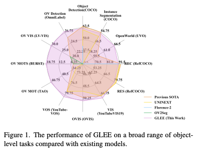

## Abstract

- An object-level foundation model for locating and identifying objects in images and videos.
- [Model and Code](https://glee-vision.github.io/)

## 1. Introduction

>**Foundation model** : an emerging paradigm for building artificial general intelligence (AGI) systems, signifying a model trained on broad data that is capable of being adapted to a wide range of downstream tasks in an general paradigm.

- **NLP foundation models** such as BERT, GPT-3, T5 developed with unified input-output paradigms and large-scale pre-trainning, have achieved remarkable generalization capabilities to address nearly all NLP tasks.
- **Visual foundation models** can only serve specific subdomains, such as CLIP for multi-modal visual model, MAE for visual representations model, SAM for segmetation model.
- We introduce **a general object visual foundation model - GLEE**, which simultaneously solve a wide range of object-centric tasks while ensuring SOTA performance.

- **A general object foundation model framework** : our unified approach to handle multiple modalities enables us to concurrently solve various object-centric tasks, all while maintaining state-of-the-art performance.
  - detection
  - instance segmentation
  - referring expression comprehension
  - interactive segmentation
  - multi-object tracking
  - video object segmentation
  - video instance segmentation
  - video referring segmentation
- **A multi-granularity jooint supervision and scaleable training paradigm**
- **Strong zero-shot transferability to a wide range of object level image and video tasks** :

## 2. Related Work

### 2.1. Visual Foundation Model

- Unlike NLP tasks that are predominantly unified under a text-to- text paradigm, tasks in Computer Vision still exhibit sig- nificant differences in form and definition. This disparity leads to visual foundation models typically being trained in a single-task learning frameworks, limiting their appli- cability to tasks within certain sub-domains.
- For instance, multi-modal visual foundation models like CLIP [77], ALIGN [41], Florence [121], BEIT3 [97], Flamingo[2] make significant advancements in efficient transfer learn- ing and demonstrate impressive zero-shot capabilities on vision-language tasks by employing contrastive learning and masked data modeling on large-scale image-text pairs.
- DALL-E [79, 80] and Stable Diffusion [83] are trained on massive pairs of images and captions, enabling them to gen- erate detailed image content conditioned on textual instruc- tion. DINO [12], MAE [35], EVA [27], ImageGPT [14] obtain strong visual representations through self-supervised training on large-scale image data, which are then employed to transfer to downstream tasks. These foundation models learn image-level features, which are not directly applica- ble to object-level tasks.
- The recently proposed SAM [43], capable of segmenting any object of a given image based on visual prompt such as points and boxes, provides rich object-level information and demonstrates strong general- ization capabilities. However, the object information lacks semantic context, limiting its application in object-level tasks.
- Unlike existing visual foundation models, we aim to develop an object foundation model that directly solve downstream tasks without the need for additional parame- ters or fine-tuning.

### 2.2. Unified and General Model

- Unified models share similarities with foundation models in the aspect of multi-task unification for their ability to handle multiple vision or multi-modal tasks within a single model. MuST [30] and Intern [87] propose to train across multiple vision tasks and solving them simultaneously. In- spired by the success of sequence-to-sequence NLP mod- els [9, 78], models such as Uni-Perceiver [133], OFA [94], Unified-IO [66], Pix2Seq v2 [15], and UniTAB [114] pro- pose modeling various tasks as sequence generation tasks within a unified paradigm. While these approaches have demonstrated promising cross-task generalization capabili- ties, they focus mainly on image-level understanding tasks. In addition, their auto-regressive generation of boxes and masks results in significantly slower inference speeds and the performance still falls short of state-of-the-art task- specific models. Building upon on detectors [50, 132], Uni- Perceiver v2 [51] and UNINEXT [112] utilize unified max- imum likelihood estimation and object retrieval to support various tasks, effectively resolves the challenges of local-
ization. Nonetheless, they are trained on closed-set data, thereby not exhibiting zero-shot generalization capabilities. X-decoder [134] and SEEM [135] construct a generalized decoding model capable of predicting pixel-level segmen- tation and language tokens.
- Diverging from unified models, the proposed GLEE not only directly addresses object-level tasks in a unified manner but also provides universal ob- ject representations, which generalize well to new data and tasks, serving as a cornerstone for a broader range of tasks that require detailed object information.

### 2.3. Vision-Language Understanding

- Open-vocabulary detection (OVD) and Grounding models both necessitate the localization and recognition of as many objects as possible. With the recent advancements in vision- language pre-training [41, 77, 119, 121], a commonly em- ployed strategy for OVD involves transferring the knowl- edge from pre-trained vision-language models (VLMs) to object detectors [31, 45, 71]. Another group of studies leverages extensive image-text pair datasets to broaden the detection vocabulary [28, 52, 57, 116, 122, 128]. However, these language-based detectors are inherently constrained by the capabilities and biases of language models, making it challenging to excel simultaneously in both localization and recognition. 
- Our objective is to optimally utilize exist- ing datasets to construct a general object-level foundation model, aims to not only detect and identify objects effec- tively but also to offer universal object representations for a wide range of downstream tasks

## 3. Method

### 3.1 Formulation

### 3.2 Task Unification

### 3.3 Training Unification

## 5. Conclusion

- We introduce GLEE, a cutting-edge object-level foundation model designed to be directly applicable to a wide range of object-level image and video tasks.
- Crafted with a unified learning paradigm, GLEE learns from diverse data sources with varying levels of supervisions. GLEE achieves state- of-the-art performance on numerous object-level tasks and excels in zero-shot transfer to new data and tasks, showing its exceptional versatility and generalization abilities.
- Additionally, GLEE provides general visual object-level information, which is currently missing in modern LLMs, establishing a robust foundation for object-centric mLLMs.

## Memo

- 객체 수준 모델
