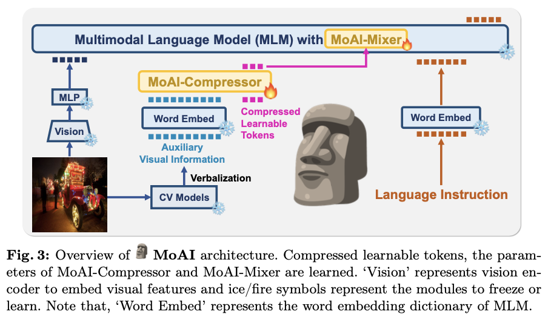
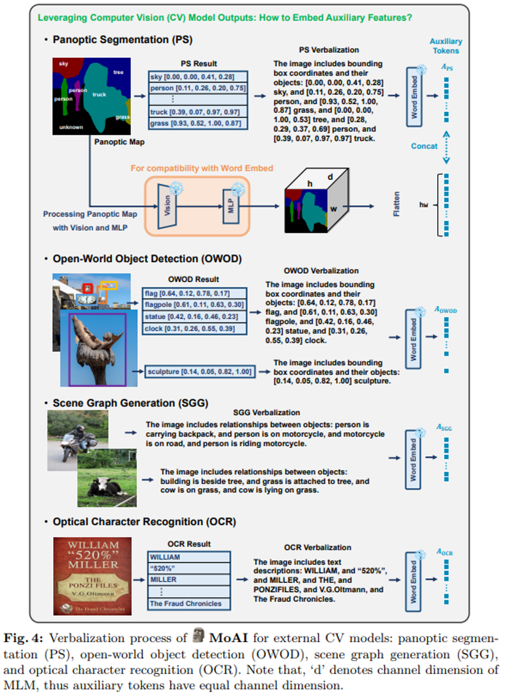

## ABSTRACT

- The rise of large language models (LLMs) and instruction tuning has led to the current trend of instruction-tuned large language and vision models (LLVMs). This trend involves either meticulously cu- rating numerous instruction tuning datasets tailored to specific objec- tives or enlarging LLVMs to manage vast amounts of vision language (VL) data. However, current LLVMs have disregarded the detailed and comprehensive real-world scene understanding available from specialized computer vision (CV) models in visual perception tasks such as segmen- tation, detection, scene graph generation (SGG), and optical character recognition (OCR). Instead, the existing LLVMs rely mainly on the large capacity and emergent capabilities of their LLM backbones.
- Therefore, we present a new LLVM, Mixture of All Intelligence ( MoAI), which leverages auxiliary visual information obtained from the outputs of ex- ternal segmentation, detection, SGG, and OCR models. MoAI operates through two newly introduced modules: MoAI-Compressor and MoAI- Mixer. After verbalizing the outputs of the external CV models, the MoAI-Compressor aligns and condenses them to efficiently use relevant auxiliary visual information for VL tasks.
- MoAI-Mixer then blends three types of intelligence
  - (1) visual features,
  - (2) auxiliary features from the external CV models, and
  - (3) language features—utilizing the concept of Mixture of Experts.
- Through this integration, MoAI significantly outperforms both open-source and closed-source LLVMs in numerous zero-shot VL tasks, particularly those related to real-world scene understanding such as object existence, positions, relations, and OCR without enlarging the model size or curating extra visual instruction tuning datasets.
- https://github.com/ByungKwanLee/MoAI.

## 1. Introduction

- We introduce a new large language and vision model,   MoAI, which handles various auxiliary visual information from external CV models (MoAI- Compressor) and blends three types of intelligence (MoAI-Mixer).
- MoAI stands out for its exceptional visual perception ability in VL tasks, surpassing both open-source and closed-source LLVMs in zero-shot VL performances. This ability is achieved by considering detailed and comprehensive real-world scene understanding without requiring scaling up either the model size or dataset size.

## 2. Related Works

**LLMs and LLVMs.**

- LLMs have emerged alongside their competent generalization capability and the effectiveness of instruction tuning datasets. GPTs [7, 70,71] played a crucial role in paving the way for LLMs by demonstrating strong zero-shot or few-shot performance across various language tasks, including text classification, question answering, machine translation, complex reasoning tasks, and so on. These generalization abilities of LLMs have been achieved by enormously increasing both model capacities and training datasets, as seen in works such as T5 [72], PaLM [13], OPT [88]. The progress in training methods and datasets further enhances the zero-shot generalization of LLMs, transitioning from large-scale pre-training datasets to instruction tuning datasets [15,32,68, 81]. Instruction tuning [81] enables LLMs to follow instructions in human natural language under complex real-world scenarios. Instruction-tuned LLMs, such as Flan-T5, Flan-PaLM [15], OPT-IML [32], and InstructGPT [68], clearly demonstrate the effectiveness of instruction tuning.
- Researchers have taken a step further by applying similar strategies to multimodal counterparts, LLVMs, which consist of a visual encoder and a backbone multimodal language model (MLM). For example, LLaVA [59] and ShareGPT4V [11] utilize GPT-4 [2] and GPT- 4V [66,67], respectively, to create visual instruction tuning datasets, while others [4,17,80] have also developed various visual instruction tuning datasets for their own unique objectives.
- However, the existing LLVMs have overlooked the detailed and comprehensive real-world scene understanding available from CV models with great advancements over the last decades. The CV models have been overshadowed by LLVMs with enlarged capacities and visual instruction tuning datasets in the era of LLVMs.
- From this perspective, MoAI highlights the effectiveness of utilizing auxiliary visual information obtained from external CV models, showing enhanced visual perception capabilities for VL benchmarks.

**Mixture of Experts.** Jacobs et al.

- [34] has first introduced the concept of Mixture of Experts (MoE) to machine learning, where separate networks called ‘experts’ handle different segments of the input space, and each segment is guided to relevant experts by a gating network. This idea is further developed by deep MoE [22] where MoE layers are stacked in depth, and by conditional computation [5] where only a few experts are conditionally activated by a given input. In modern deep learning, Shazeer et al. [74] integrates an MoE layer with LSTMs [30] where a gating network independently routes each token to se- lectively activated experts. This integration enhances performance in language modeling and machine translation tasks. Furthermore, Switch Transformers [24] merge an MoE layer and Transformers [79] by replacing a dense feed forward network (FFN) inside a Transformer layer with multiple experts and a gating network, paving a way to the successful use of MoE in Transformer-based LLVMs such as MoE-LLaVA [53]. The philosophy of MoE in deep learning is to enlarge model capacity without sacrificing computational efficiency [22,24,36,42,53,74, 94].
- On the other hand, we focus on a different yet fundamental aspect of MoE, where we intend that each expert is designed to specialize in a particular segment of input. While previous MoE methods do not explicitly assign roles to individual experts and instead expect specialization to emerge during optimization, MoAI designates cross- and self-attention modules as experts and learns them explic- itly to mix information across modalities (i.e., visual, auxiliary, and language features). Specifically, MoAI facilitates pairs of
  - (1) visual-auxiliary feature,
  - (2) visual-language feature,
  - (3) visual-visual feature,
  - (4) language-auxiliary feature,
  (5) language-visual feature, and
  (6) language-language feature.
- Each pair is con- sidered as a query-key pair for a respective cross- or self-attention module serving as experts, clarifying the fusion of information across diverse modalities.

## 3. MoAI: Mixture of All Intelligence

### Model Architecture

### Vision and Language Backbone

- CLIP-L/14 [69] is selected as the vision encoder, due to its guaranteed proficiency in image understanding aligned with text for vision language tasks [11,57–59].
- The MLM utilized in MoAI is based on InternLM-7B [78], which is a multilingual foundation model instruction-tuned by multilingual datasets with 1.6T tokens through a series of progressive pretraining phases and reinforcement learning from human feedback (RLHF) [14,68,76]. Two linear layers with GELU activation function [29] serve as the bridge connector between vision and language components, denoted by ‘MLP’ in Fig. 3.

### Verbalization

- Since a multimodal language model (MLM) is adopted to construct MoAI, we convert CV model outputs into natural language format in order to make them understandable to the MLM through a process called verbaliza- tion. Fig. 4 illustrates how the four CV model outputs undergo verbalization alongside the creation of auxiliary tokens semantically aligned to the MLM.
- A panoptic segmentation model enables us to distinguish foreground and background objects in an image at once. Furthermore, we can compute bound- ing box coordinates (e.g., [xmin,ymin,xmax,ymax]) from the segmentation map. Consequently, verbalizing the outputs from panoptic segmentation (PS) entails serializing bounding box coordinates and their object names as explained in Fig. 4. These verbalized descriptions are then transformed into auxiliary tokens through the word embeddings of MLM. Additionally, to directly utilize the panoptic segmentation map, we use a vision encoder and an MLP connector in MoAI to generate locality-preserving auxiliary tokens. The generated auxiliary tokens are flattened and concatenated to those from serialized bounding boxes and their object names to form the final PS auxiliary tokens APS. They are concatenated in this manner so that the MLM of MoAI can associate them in a compatible way through contextualization. This procedure ensures the com- prehensive conversion of visual information from PS into language information while preserving the spatial locality inherent in the panoptic segmentation map. Note that if the panoptic segmentation model fails to classify objects within the fixed number of panoptic object categories, for instance, those in MS-COCO 2017 [54] encompassing 133 object categories, the unknown class is assigned.
- An open-world object detection model plays a role in detecting object classes missed by the panoptic segmentation model. This is because the panoptic segmentation model is trained on a specific dataset with a fixed number of object categories. Once the detection results are generated for an image, bounding box coordinates and their object names are verbalized according to the following template format: ‘The image includes bounding boxes and their objects: {verbalized open-world object detection (OWOD) results}’. Then, the results are transformed into OWOD auxiliary tokens AOWOD by the word embeddings of MLM. Similarly, the outputs of SGG and OCR models are verbalized, and corresponding auxiliary tokens ASGG and AOCR are generated, where we use the following verbalization templates: ‘The image includes relationships between objects: {verbalized SGG results}’ and ‘The image includes text descriptions: {verbalized OCR results}’, respectively.

## 5. Conclusion

To achieve real-world scene understanding, we leverage fundamental perception capabilities rooted in cognitive science and machine learning. This involves incor- porating auxiliary visual information from historically rich external CV models, which we seemlessly integrate with visual and language features in MLM using expert modules and gating networks. As a result of these advancements,   MoAI demonstrates improved visual perception capabilities, resulting in significant en- hancements in zero-shot vision language performances. This underscores MoAI’s potential to advance LLVM modeling by effectively leveraging diverse auxiliary visual information and integrating multiple forms of intelligence.
