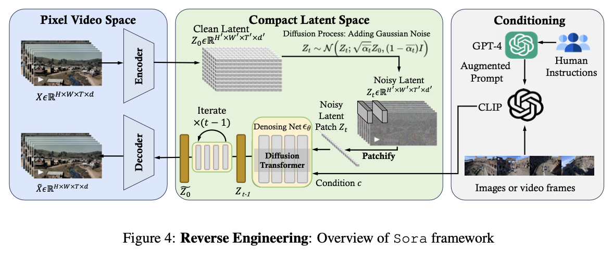
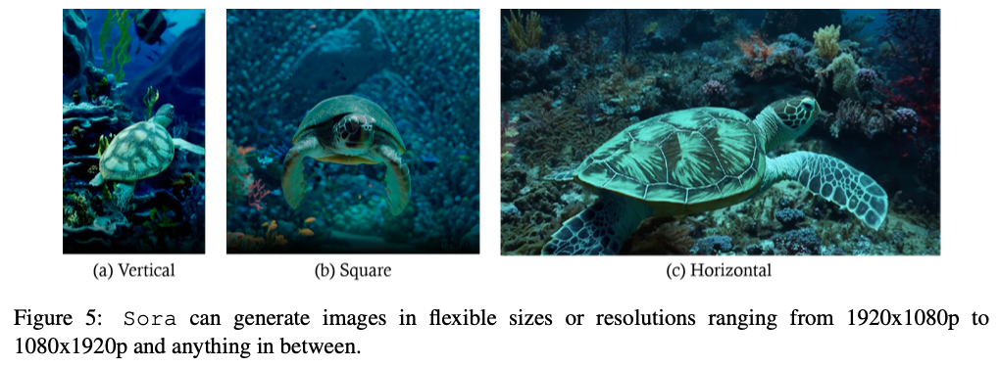
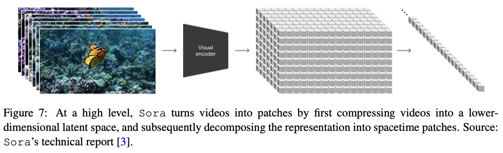
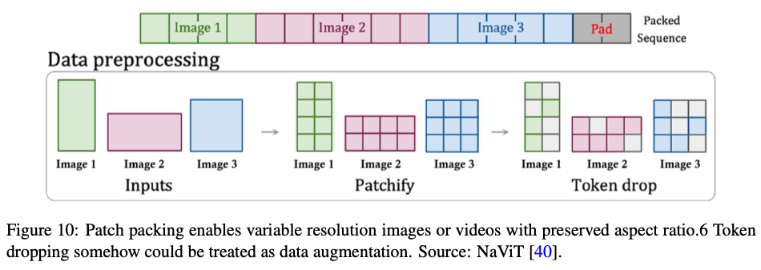
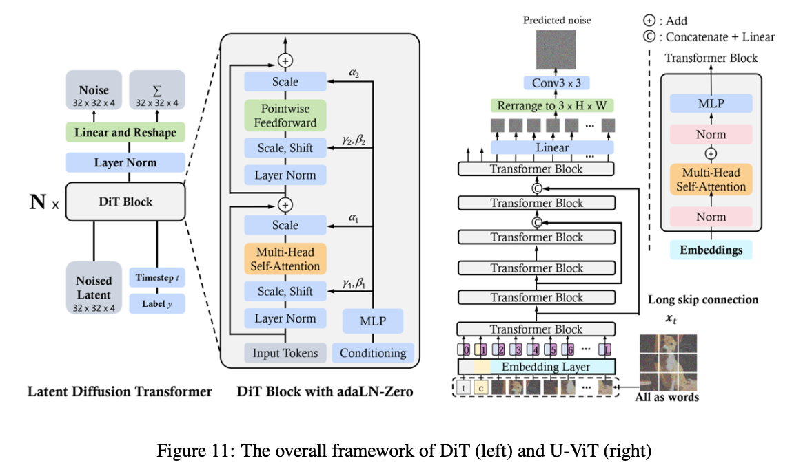
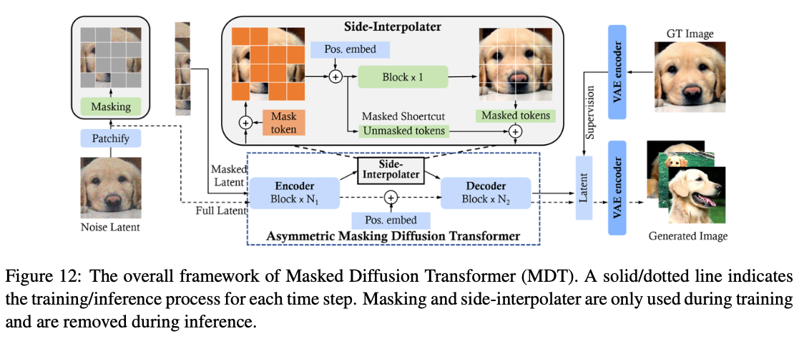
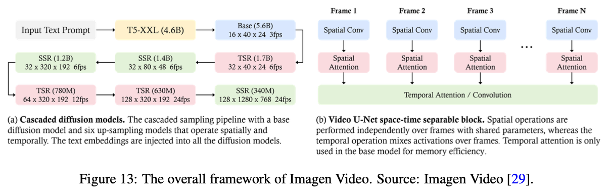

## Abstract

Sora is a text-to-video generative AI model, released by OpenAI in February 2024. The model is trained to generate videos of realistic or imaginative scenes from text instructions and show potential in simulating the physical world. Based on public technical reports and reverse engineering, this paper presents a comprehensive review of the model’s background, related technologies, applications, remain- ing challenges, and future directions of text-to-video AI models. We first trace Sora’s development and investigate the underlying technologies used to build this “world simulator”. Then, we describe in detail the applications and potential impact of Sora in multiple industries ranging from film-making and education to marketing. We discuss the main challenges and limitations that need to be addressed to widely deploy Sora, such as ensuring safe and unbiased video generation. Lastly, we discuss the future development of Sora and video generation models in general, and how advancements in the field could enable new ways of human-AI interaction, boosting productivity and creativity of video generation.

## 3. Technology

### 3.1 Overview of Sora

- In the core essence, Sora is a diffusion transformer [4] with flexible sampling dimensions as shown in Figure 4. It has three parts:
  1. A time-space compressor first maps the original video into latent space.
  2. A ViT then processes the tokenized latent representation and outputs the denoised latent representation.
  3. A CLIP-like [26] conditioning mechanism receives LLM-augmented user instructions and potentially visual prompts to guide the diffusion model to generate styled or themed videos.
  4. After many denoising steps, the latent representation of the generated video is obtained and then mapped back to pixel space with the corresponding decoder.
- In this section, we aim to reverse engineer the technology used by Sora and discuss a wide range of related works.

### 3.2 Data Pre-processing

#### 3.2.1 Variable Durations, Resolutions, Aspect Ratios

- One distinguishing feature of Sora is its ability to train on, understand, and generate videos and images at their native sizes [3] as illustrated in Figure 5.
- Traditional methods often resize, crop, or adjust the aspect ratios of videos to fit a uniform standard—typically short clips with square frames at fixed low resolutions [27][28][29]. Those samples are often generated at a wider temporal stride and rely on separately trained frame-insertion and resolution-rendering models as the final step, creating inconsistency across the video.
- Utilizing the diffusion transformer architecture [4] (see Section 3.2.4), Sora is the first model to embrace the diversity of visual data and can sample in a wide array of video and image formats, ranging from widescreen 1920x1080p videos to vertical 1080x1920p videos and everything in between without compromising their original dimensions.

Training on data in their native sizes significantly improves composition and framing in the generated videos. Empirical findings suggest that by maintaining the original aspect ratios, Sora achieves a more natural and coherent visual narrative. The comparison between Sora and a model trained on uniformly cropped square videos demonstrates a clear advantage as shown in Figure 6. Videos produced by Sora exhibit better framing, ensuring subjects are fully captured in the scene, as opposed to the sometimes truncated views resulting from square cropping.

- This nuanced understanding and preservation of original video and image characteristics mark a significant advancement in the field of generative models. Sora’s approach not only showcases the potential for more authentic and engaging video generation but also highlights the importance of diversity in training data for achieving high-quality results in generative AI.
- The training approach of Sora aligns with the core tenet of Richard Sutton’s THE BITTER LESSON[30], which states that **leveraging computation over human-designed features leads to more effective and flexible AI systems**.
- Just as the original design of diffusion transformers seeks simplicity and scalability [31], Sora’s strategy of training on data at their native sizes eschews traditional AI reliance on human-derived abstractions, favoring instead a generalist method that scales with computational power.
- In the rest of this section, we try to reverse engineer the architecture design of Sora and discuss related technologies to achieve this amazing feature.

#### 3.2.2 Unified Visual Representation

- To effectively process diverse visual inputs including images and videos with varying durations, resolutions, and aspect ratios, a crucial approach involves transforming all forms of visual data into a unified representation, which facilitates the large-scale training of generative models. Specifically, Sora patchifies videos by initially compressing videos into a lower-dimensional latent space, followed by decomposing the representation into spacetime patches.
- However, Sora’s technical report [3] merely presents a high-level idea, making reproduction challenging for the research community. In this section, we try to reverse-engineer the potential ingredients and technical pathways. Additionally, we will discuss viable alternatives that could replicate Sora’s functionalities, drawing upon insights from existing literature.

#### 3.2.3 Video Compression Network

- Sora’s video compression network (or visual encoder) aims to reduce the dimensionality of input data, especially a raw video, and output a latent representation that is compressed both temporally and spatially as shown in Figure 7.
- According to the references in the technical report, the compression network is built upon **VAE** or Vector Quantised-VAE (**VQ-VAE**) [32].
- However, it is challenging for VAE to map visual data of any size to a unified and fixed-sized latent space if resizing and cropping are not used as mentioned in the technical report. We summarize two distinct implementations to address this issue:

**Spatial-patch Compression.**

This involves transforming video frames into fixed-size patches, akin to the methodologies employed in ViT [15] and MAE [33] (see Figure 8), before encoding them into a latent space. This approach is particularly effective for accommodating videos of varying resolutions and aspect ratios, as it encodes entire frames through the processing of individual patches. Subsequently, these spatial tokens are organized in a temporal sequence to create a spatial-temporal latent representation. This technique highlights several critical considerations:

Temporal dimension variability – given the varying durations of training videos, the temporal dimension of the latent space representation cannot be fixed. To address this, one can either sample a specific num- ber of frames (padding or temporal interpolation [34] may be needed for much shorter videos) or define a universally extended (super long) input length for subsequent processing (more details are described in Section 3.2.4); Utilization of pre-trained visual encoders – for processing videos of high resolution, lever- aging existing pre-trained visual encoders, such as the VAE encoder from Stable Diffusion [19], is advis- able for most researchers while Sora’s team is expected to train their own compression network with a decoder (the video generator) from scratch via the manner employed in training latent diffusion models [19, 35, 36]. These encoders can efficiently compress large-size patches (e.g., 256 × 256), facilitating the management of large-scale data; Temporal information aggregation – since this method primarily focuses on spatial patch compression, it necessitates an additional mechanism for aggregating temporal information within the model. This aspect is crucial for capturing dynamic changes over time and is further elaborated in subsequent sections (see details in Section 3.3.1 and Figure 14).

**Spatial-temporal-patch Compression.** This technique is designed to encapsulate both spatial and tem- poral dimensions of video data, offering a comprehensive representation. This technique extends beyond merely analyzing static frames by considering the movement and changes across frames, thereby captur- ing the video’s dynamic aspects. The utilization of 3D convolution emerges as a straightforward and potent method for achieving this integration [37]. The graphical illustration and the comparison against pure spatial-pachifying are depicted in Figure 9. Similar to spatial-patch compression, employing spatial- temporal-patch compression with predetermined convolution kernel parameters – such as fixed kernel sizes, strides, and output channels – results in variations in the dimensions of the latent space due to the differing characteristics of video inputs. This variability is primarily driven by the diverse durations and resolutions of the videos being processed. To mitigate this challenge, the approaches adopted for spatial patchification are equally applicable and effective in this context.

In summary, we reverse engineer the two patch-level compression approaches based on VAE or its vari- ant like VQ-VQE because operations on patches are more flexible to process different types of videos. Since Sora aims to generate high-fidelity videos, a large patch size or kernel size is used for efficient compres- sion. Here, we expect that fixed-size patches are used for simplicity, scalability, and training stability. But varying-size patches could also be used [39] to make the dimension of the whole frames or videos in latent space consistent. However, it may result in invalid positional encoding, and cause challenges for the decoder to generate videos with varying-size latent patches.

#### 3.2.4 Spacetime Latent Patches

There is a pivotal concern remaining in the compression network part: How to handle the variability in latent space dimensions (i.e., the number of latent feature chunks or patches from different video types) before feeding patches into the input layers of the diffusion transformer. Here, we discuss several solutions.

- Based on Sora’s technical report and the corresponding references, **patch n’ pack (PNP)** [40] is likely the solution. PNP packs multiple patches from different images in a single sequence as shown in Figure 10. This method is inspired by example packing used in natural language processing [41] that accommodates efficient training on variable length inputs by dropping tokens. Here the patchification and token embedding steps need to be completed in the compression network, but Sora may further patchify the latent for transformer token as Diffusion Transformer does [4].
- Regardless there is a second-round patchification or not, we need to address two concerns, how to pack those tokens in a compact manner and how to control which tokens should be dropped.
- For the first concern, a simple greedy approach is used which adds examples to the first sequence with enough remaining space. Once no more example can fit, sequences are filled with padding tokens, yielding the fixed sequence lengths needed for batched operations. Such a simple packing algorithm can lead to significant padding, depending on the distribution of the length of inputs. On the other hand, we can control the resolutions and frames we sample to ensure efficient packing by tuning the sequence length and limiting padding.
- For the second concern, an intuitive approach is to drop the similar tokens [42, 43, 33, 44] or, like PNP, apply dropping rate schedulers. However, it is worth noting that 3D Consistency is one of the nice properties of Sora. Dropping tokens may ignore fine-grained details during training. Thus, we believe that OpenAI is likely to use a super long context window and pack all tokens from videos although doing so is computationally expensive e.g., the multi-head attention [45, 46] operator exhibits quadratic cost in sequence length. Specifically, spacetime latent patches from a long-duration video can be packed in one sequence while the ones from several short-duration videos are concatenated in the other sequence.

#### 3.2.5 Discussion

- We discuss two technical solutions to data pre-processing that Sora may use. Both solutions are performed at the patch level due to the characteristics of flexibility and scalability for modeling. Different from previous approaches where videos are resized, cropped, or trimmed to a standard size, Sora trains on data at its native size.
- Although there are several benefits (see detailed analysis in Section 3.2.1), it brings some technical challenges, among which one of the most significant is that neural networks cannot inherently process visual data of variable durations, resolutions, and aspect ratios. Through reverse engineering, we believe that Sora
  1. firstly compresses visual patches into low-dimensional latent representations, and 
  2. arranges such latent patches or further patchified latent patches in a sequence, then
  3. injects noise into these latent patches before
  4. feeding them to the input layer of diffusion transformer.
- Spatial-temporal patchification is adopted by Sora because it is simple to implement, and it can effectively reduce the context length with high- information-density tokens and decrease the complexity of subsequent modeling of temporal information.

To the research community, we recommend using cost-efficient alternative solutions for video compression and representation, including utilizing pre-trained checkpoints (e.g., compression network) [47], shortening the context window, using light-weight modeling mechanisms such as (grouped) multi-query attention [48, 49] or efficient architectures (e.g. Mamba [50]), downsampling data and dropping tokens if necessary. The trade-off between effectiveness and efficiency for video modeling is an important research topic to be explored.

### 3.3 Modeling

#### 3.3.1 Diffusion Transformer

**Image Diffusion Transformer.**

- Traditional diffusion models [51, 52, 53] mainly leverage convolutional U-Nets that include downsampling and upsampling blocks for the denoising network backbone. However, recent studies show that the U-Net architecture is not crucial to the good performance of the diffusion model. By incorporating a more flexible transformer architecture, the transformer-based diffusion models can use more training data and larger model parameters. Along this line, DiT [4] and U-ViT [54] are among the first works to employ vision transformers for latent diffusion models.
- As in ViT, DiT employs a multi-head self-attention layer and a pointwise feed-forward network interlaced with some layer norm and scaling layers. Moreover, as shown in Figure 11, DiT incorporates conditioning via adaptive layer norm (AdaLN) with an additional MLP layer for zero-initializing, which initializes each residual block as an identity function and thus greatly stabilizes the training process. The scalability and flexibility of DiT is empirically validated. DiT becomes the new backbone for diffusion models.
- In U-ViT, as shown in Figure 11, they treat all inputs, including time, condition, and noisy image patches, as tokens and propose long skip connections between the shallow and deep transformer layers. The results suggest that the downsampling and upsampling operators in CNN-based U-Net are not always necessary, and U-ViT achieves record-breaking FID scores in image and text-to-image generation.

Like Masked AutoEncoder (MAE) [33], Masked Diffusion Transformer (MDT) [55] incorporates mask latent modeling into the diffusion process to explicitly enhance contextual relation learning among object semantic parts in image synthesis. Specifically, as shown in Figure 12, MDT uses a side-interpolated for an additional masked token prediction task during training to boost the training efficiency and learn powerful context-aware positional embedding for inference. Compared to DiT [4], MDT achieves better performance and faster learning speed. In MDTv2 [56], they further improve MDT with a more efficient macro network with some u-shape long-shortcuts in the encoder and dense shortcuts from encoder input in the decoder. Furthermore, they also leverage a bag of training strategies like the Adan optimizer [57], Min-SNR weight- ing [58], dynamic masking ratio, and an improved power-cosine weighting for classifier-free guidance [59]. MDTv2 achieves a significant boost in synthesis performance and learning speed. Instead of using AdaLN (i.e., shifting and scaling) for time-conditioning modeling, Hatamizadeh et al. [60] introduce Diffusion Vi- sion Transformers (DiffiT), which uses a time-dependent self-attention (TMSA) module to model dynamic denoising behavior over sampling time steps. Besides, DiffiT uses two hybrid hierarchical architectures for efficient denoising in the pixel space and the latent space, respectively, and achieves new state-of-the-art results across various generation tasks. Overall, these studies show promising results in employing vision transformers for image latent diffusion, paving the way for future studies for other modalities.

**Video Diffusion Transformer.**

- Building upon the foundational works in text-to-image (T2I) diffusion mod- els, recent research has been focused on realizing the potential of diffusion transformers for text-to-video (T2V) generation tasks.
- Due to the temporal nature of videos, key challenges for applying DiTs in the video domain are:

  i) how to compress the video spatially and temporally to a latent space for efficient denoising;

  ii) how to convert the compressed latent to patches and feed them to the transformer; and

  iii) how to handle long-range temporal and spatial dependencies and ensure content consistency.
- Please refer to Section 3.2.3 for the first challenge. In this section, we focus our discussion on transformer-based denoising network architectures designed to operate in the spatially and temporally compressed latent space. We give a detailed review of the two important works (Imagen Video [29] and Video LDM [36]) shown in the OpenAI Sora technique report and also briefly introduce some of recent promising approaches.

- Imagen Video [29], a text-to-video generation system developed by Google Research, utilizes a cascade of diffusion models, which consists of 7 sub-models that perform text-conditional video generation, spatial super-resolution, and temporal super-resolution, to transform textual prompts into high-definition videos.
- As shown in Figure 13, firstly, a frozen T5 text encoder generates contextual embeddings from the input text prompt. These embeddings are critical for aligning the generated video with the text prompt and are injected into all models in the cascade, in addition to the base model.
- Subsequently, the embedding is fed to the base model for low-resolution video generation, which is then refined by cascaded diffusion models to increase the resolution.
- The base video and super-resolution models use a 3D U-Net architecture in a spatial-temporal separable fashion. This architecture weaves temporal attention and convolution layers with spatial counterparts to efficiently capture inter-frame dependencies. It employs v-prediction parameterization for numerical stability and conditioning augmentation to facilitate parallel training across models. The process involves joint training on both images and videos, treating each image as a frame to leverage larger datasets, and using classifier-free guidance [59] to enhance prompt fidelity. Progressive distillation [61] is applied to streamline the sampling process, significantly reducing the computational load while maintaining perceptual quality. 
- Combining these methods and techniques allows Imagen Video to generate videos with not only high fidelity but also remarkable controllability, as demonstrated by its ability to produce diverse videos, text animations, and content in various artistic styles.

Blattmann et al. [36] propose to turn a 2D Latent Diffusion Model into a Video Latent Diffusion Model (Video LDM). They achieve this by adding some post-hoc temporal layers among the existing spatial layers into both the U-Net backbone and the VAE decoder that learns to align individual frames. These temporal layers are trained on encoded video data, while the spatial layers remain fixed, allowing the model to leverage large image datasets for pre-training. The LDM’s decoder is fine-tuned for temporal consistency in pixel space and temporally aligning diffusion model upsamplers for enhanced spatial resolution. To generate very long videos, models are trained to predict a future frame given a number of context frames, allowing for classifier-free guidance during sampling. To achieve high temporal resolution, the video synthesis process is divided into key frame generation and interpolation between these keyframes. Following cascaded LDMs, a DM is used to further scale up the Video LDM outputs by four times, ensuring high spatial resolution while maintaining temporal consistency. This approach enables the generation of globally coherent long videos in a computationally efficient manner. Additionally, the authors demonstrate the ability to transform pre-trained image LDMs (e.g., Stable Diffusion) into text-to-video models by training only the temporal alignment layers, achieving video synthesis with resolutions up to 1280 × 2048px.

- Recently, there are also some other promising works that show superior performance in high-quality and temporal-consistent video generation. Similar to Imagen Video, LAVIE [62] proposes to transform a T2I model into a T2V model with cascaded LDMs, with two key insights:

  i) using simply temporal self-attention and RoPE [63] can adequately capture temporal correlations inherent in video data;
  
  ii) joint image-video fine-tuning enable more stable training and avoid catastrophic forgetting.
- GenTron [64] adapt pre-trained class-conditioning DiTs to textual conditioning and explore different conditioning mechanisms, where they find that cross attention is a better conditioning method compared to previous adaLM-Zero for free-form textual conditioning. Furthermore, by designing motion-free masking in the inserted temporal self-attention layers, GenTron is able to do efficient image-video joint training with control on the temporal modeling ability in the video diffusion process. Window Attention Latent Transformer (W.A.L.T) [65] proposes to unify the latent space of both videos and images with 3D causal CNN and a special coding strategy for the first frame. Moreover, W.A.L.T uses non-overlapping, window-restricted spatial and spatiotemporal atten- tion to lower the computational cost and provide flexibility for image-video joint training. Latent Diffusion Transformer (Latte) [66] conducts extensive experiments among four model variants from the perspective of decomposing spatial and temporal information in video data. Furthermore, Latte studies the effect of a wide range of training strategies and modules in a DiT-based video generation system, including condi- tioning mechanisms and temporal positional embedding. Instead of using separate compression for spatial and temporal dimensions in previous works, SnapVideo [67] proposes to extend EDM framework [68] for high-dimensional video data. Furthermore, SnapVideo treats images as T frames videos with infinite frame rates and introduces a variable frame-rate training procedure to bridge the modality gap. For scaling up to billion-parameters size, SnapVideo uses an efficient transformer-based architecture, FITs [69], as a scalable video generator, and a model cascade consisting of a first-stage lower-solution base model (36 × 64px) and a high-solution upsampler (288 × 512px) with corrupt training strategy.

#### 3.3.2 Discussion

One end-to-end model or cascade structure. Sora can generate high-resolution videos. By reviewing existing works and our reverse engineering, we speculate that Sora also leverages cascade diffusion model architecture [70], which is composed of a base model and many spatial-temporal refiner models. The at- tention modules are unlikely to be heavily used in the based diffusion model and low-resolution diffusion model, considering the high computation cost and limited performance gain of using attention machines in high-resolution cases. For spatial and temporal scene consistency, as previous works show that temporal consistency is more important than spatial consistency for video/scene generation, Sora is likely to leverage an efficient training strategy by using longer video (for temporal consistency) with lower resolution. More-over, Sora is likely to use a v-parameterization diffusion model [61], considering its superior performance among others that predict the original latent x or the noise ε.

On the compression of the latent encoder. For training efficiency, most of the existing works leverage the pre-trained VAE encoder of Stable Diffusions [71, 72], a pre-trained 2D diffusion model, as an initialized model checkpoint. However, the encoder lacks the ability to compress temporally. Even though some works propose to only fine-tune the decoder for handling temporal information, the decoder’s performance of dealing with video temporal data in the compressed latent space remains sub-optimal. Based on the technique report, our reverse engineering shows that, instead of using an existing pre-trained Image VAE encoder with some post-hoc temporal tuning, it is likely that Sora uses a spatial-temporal VAE encoder, jointly trained on image and video data, to compress the spatial and temporal information altogether.

### 3.4 Language Instruction Following

- Users primarily engage with generative AI models through natural language instructions, known as text prompts [73, 74]. Model instruction tuning aims to enhance AI models’ capability to follow prompts accurately. This improved capability in prompt following enables models to generate output that more closely resembles human responses to natural language queries.
- We start our discussion with a review of instruction following techniques for large language models (LLMs) and text-to-image models such as DALL·E 3. To enhance the text-to-video model’s ability to follow text instructions, Sora utilizes an approach similar to that of DALL·E 3. The approach involves training a descriptive captioner and utilizing the captioner’s generated data for fine-tuning. As a result of instruction tuning, Sora is able to accommodate a wide range of user requests, ensuring meticulous attention to the details in the instructions and generating videos that precisely meet users’ needs.

#### 3.4.1 Large Language Models

The capability of LLMs to follow instructions has been extensively explored [75, 76, 77]. This ability allows LLMs to read, understand, and respond appropriately to instructions describing an unseen task without examples. Prompt following ability is obtained and enhanced by fine-tuning LLMs on a mixture of tasks formatted as instructions[75, 77], known as instruction tuning. Wei et al. [76] showed that instruction-tuned LLMs significantly outperform the untuned ones on unseen tasks. The instruction-following ability transforms LLMs into general-purpose task solvers, marking a paradigm shift in the history of AI development.

#### 3.4.2 Text-to-Image

- The instruction following in DALL·E 3 is addressed by a caption improvement method with a hypothesis that the quality of text-image pairs that the model is trained on determines the performance of the resultant text-to-image model [78].
- The poor quality of data, particularly the prevalence of noisy data and short captions that omit a large amount of visual information, leads to many issues such as neglecting keywords and word order, and misunderstanding the user intentions [21].
- The caption improvement approach addresses these issues by re-captioning existing images with detailed, descriptive captions.
  - The approach first trains an image captioner, which is a vision-language model, to generate precise and descriptive image captions.
  - The resulting descriptive image captions by the captioner are then used to fine-tune text-to-image models.
  - Specifically, DALL·E 3 follows contrastive captioners (CoCa) [79] to jointly train an image captioner with a CLIP [26] architecture and a language model objective. This image captioner incorporates an image encoder a unimodal text encoder for extracting language information, and a multimodal text decoder. It first employs a contrastive loss between unimodal image and text embeddings, followed by a captioning loss for the multimodal decoder’s outputs. The resulting image captioner is further fine-tuned on a highly detailed description of images covering main objects, surroundings, backgrounds, texts, styles, and colorations. With this step, the image captioner is able to generate detailed descriptive captions for the images.
- The training dataset for the text-to-image model is a mixture of the re-captioned dataset generated by the image captioner and ground-truth human-written data to ensure that the model captures user inputs. This image caption im- provement method introduces a potential issue: a mismatch between the actual user prompts and descriptive image descriptions from the training data. DALL·E 3 addresses this by upsampling, where LLMs are used to re-write short user prompts into detailed and lengthy instructions. This ensures that the model’s text inputs received in inference time are consistent with those in model training.

#### 3.4.3 Text-to-Video

- To enhance the ability of instruction following, Sora adopts a similar caption improvement approach.
  - This method is achieved by first training a video captioner capable of producing detailed descriptions for videos.
  - Then, this video captioner is applied to all videos in the training data to generate high-quality (video, descriptive caption) pairs, which are used to fine-tune Sora to improve its instruction following ability.

Sora’s technical report [3] does not reveal the details about how the video captioner is trained. Given that the video captioner is a video-to-text model, there are many approaches to building it. A straightfor- ward approach is to utilize CoCa architecture for video captioning by taking multiple frames of a video and feeding each frame into the image encoder [79], known as VideoCoCa [80]. VideoCoCa builds upon CoCa and re-uses the image encoder pre-trained weights and applies it independently on sampled video frames. The resulting frame token embeddings are flattened and concatenated into a long sequence of video representations. These flattened frame tokens are then processed by a generative pooler and a contrastive pooler, which are jointly trained with the contrastive loss and captioning loss. Other alternatives to building video captioners include mPLUG-2 [81], GIT [82], FrozenBiLM [83], and more. Finally, to ensure that user prompts align with the format of those descriptive captions in training data, Sora performs an additional prompt extension step, where GPT-4V is used to expand user inputs to detailed descriptive prompts.

#### 3.4.4 Discussion

The instruction-following ability is critical for Sora to generate one-minute-long videos with intricate scenes that are faithful to user intents. According to Sora’s technical report [3], this ability is obtained by developing a captioner that can generate long and detailed captions, which are then used to train the model. However, the process of collecting data for training such a captioner is unknown and likely labor- intensive, as it may require detailed descriptions of videos. Moreover, the descriptive video captioner might hallucinate important details of the videos. We believe that how to improve the video captioner warrants further investigation and is critical to enhance the instruction-following ability of text-to-image models.

### 3.5 Prompt Engineering

- Prompt engineering refers to the process of designing and refining the input given to an AI system, particularly in the context of generative models, to achieve specific or optimized outputs [84, 85, 86].
- The art and science of prompt engineering involve crafting these inputs in a way that guides the model to produce the most accurate, relevant, and coherent responses possible.

#### 3.5.1 Text Prompt

Text prompt engineering is vital in directing text-to-video models (e.g., Sora [3]) to produce videos that are visually striking while precisely meeting user specifications. This involves crafting detailed descrip- tions to instruct the model to effectively bridge the gap between human creativity and AI’s execution ca- pabilities [87]. The prompts for Sora cover a wide range of scenarios. Recent works (e.g., VoP [88], Make-A-Video [28], and Tune-A-Video [89]) have shown how prompt engineering leverages model’s nat- ural language understanding ability to decode complex instructions and render them into cohesive, lively, and high-quality video narratives. As shown in Figure 15, “a stylish woman walking down a neon-lit Tokyo street...” is such a meticulously crafted text prompt that it ensures Sora to generate a video that aligns well with the expected vision. The quality of prompt engineering depends on the careful selection of words, the specificity of the details provided, and comprehension of their impact on the model’s output. For example, the prompt in Figure 15 specifies in detail the actions, settings, character appearances, and even the desired mood and atmosphere of the scene.

#### 3.5.2 Image Prompt

An image prompt serves as a visual anchor for the to-be-generated video’s content and other elements such as characters, setting, and mood [90]. In addition, a text prompt can instruct the model to animate these elements by e.g., adding layers of movement, interaction, and narrative progression that bring the static image to life [27, 91, 92]. The use of image prompts allows Sora to convert static images into dynamic, narrative-driven videos by leveraging both visual and textual information. In Figure 16, we show AI-generated videos of “a Shiba Inu wearing a beret and turtleneck”, “a unique monster family”, “a cloud forming the word ‘SORA”’ and “surfers navigating a tidal wave inside a historic hall”. These examples demonstrate what can be achieved by prompting Sora with DALL·E-generated images.

#### 3.5.3 Video Prompt

Video prompts can also be used for video generation as demonstrated in [93, 94]. Recent works (e.g., Moonshot [95] and Fast-Vid2Vid [96]) show that good video prompts need to be specific and flexible. This ensures that the model receives clear direction on specific objectives, like the portrayal of particular objects and visual themes, and also allows for imaginative variations in the final output. For example, in the video extension tasks, a prompt could specify the direction (forward or backward in time) and the context or theme of the extension. In Figure 17(a), the video prompt instructs Sora to extend a video backward in time to explore the events leading up to the original starting point. When performing video-to-video editing through video prompts, as shown in Figure 17(b), the model needs to clearly understand the desired transformation, such as changing the video’s style, setting or atmosphere, or altering subtle aspects like lighting or mood. In Figure 17(c), the prompt instructs Sora to connect videos while ensuring smooth transitions between objects in different scenes across videos.

#### 3.5.4 Discussion

Prompt engineering allows users to guide AI models to generate content that aligns with their intent. As an example, the combined use of text, image, and video prompts enables Sora to create content that is not only visually compelling but also aligned well with users’ expectations and intent. While previous studies on prompt engineering have been focused on text and image prompts for LLMs and LVMs [97, 98, 99], we expect that there will be a growing interest in video prompts for video generation models.

### 3.6 Trustworthiness

#### 3.6.1 Safety Concern

#### 3.6.2 Other Exploitation

#### 3.6.3 Alignment

#### 3.6.4 Discussion

## 궁금한 점

- flexible sampling dimensions이 무슨 뜻일까?
- [3.4.3] Video captioner가 DB 앞단에서 이루있어야 한다.
- Model에서 ViT 부분 잘 이해 안 됨
