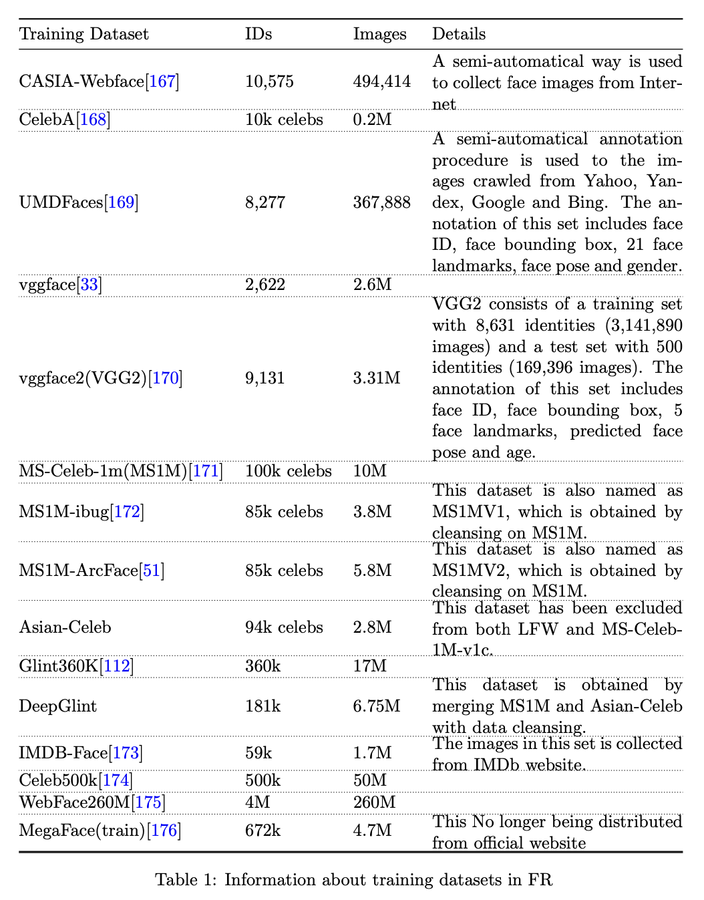
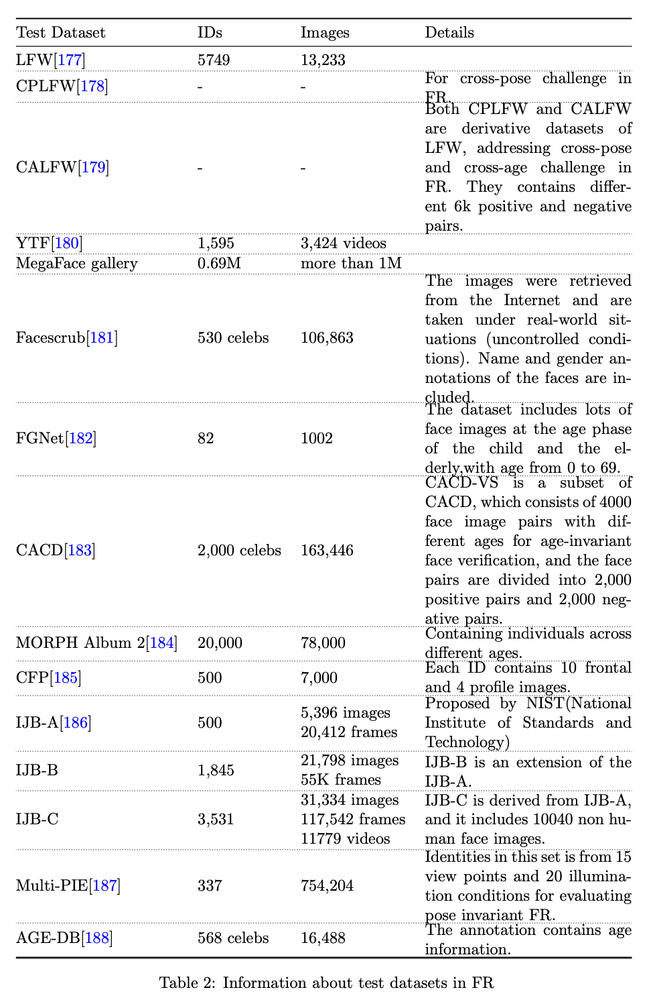
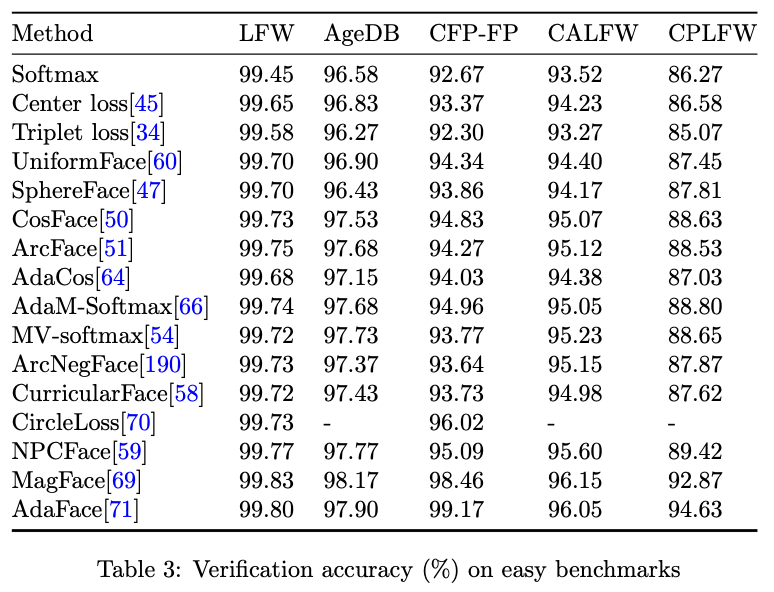
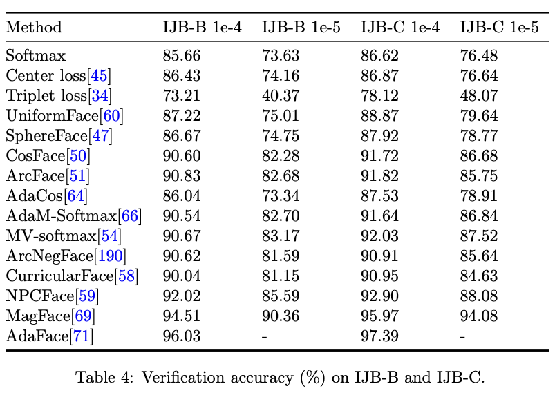

## Abstract

Recent years witnessed the breakthrough of face recognition with deep convolutional neural networks. Dozens of papers in the field of FR are published every year.

- an introduction to face recognition, including its history, pipeline, algorithms based on conventional manually designed features or deep learning, mainstream training, evaluation datasets, and related applications.
- have analyzed and compared state-of-the- art works as many as possible, and also carefully designed a set of experiments to find the effect of backbone size and data distribution.
- a material of the tutorial named The Practical Face Recognition Technology in the Industrial World in the FG2023.

## 1. Introduction

- Chapter 2 : history of face recognition
- Chapter 3 : pipeline in the deep learning framework
- Chapter 4 : details of face recognition algorithms - loss functions, embedding techniques, face recognition with massive IDs, cross-domain, pipeline acceleration, closed-set training, mask face recognition, privacy preserving
- Chapter 5 : experiments fo find the effect of backbone size and data distribution
- Chapter 6 : frequently used training and test datasets and comparison results
- Chapter 7 : application
- Chapter 8 : competitation and open-source programs

## 2. History

Before 2014, FR was processed in non-deep learning ways.

## 3. Pipelines in deep learning framework

In this section, we give the pipelines of ’training’ a FR deep model and ’inference’ to get the ID of a face image.

Pipelinea of training FR model

1. face images preprocessing
2. model training

Getting the FR result by the trained model

1. face images preprocessing
2. model inference to get face embedding
3. recognition by matching features between test image and images with known labels

### 3.1 Preprocessing

1. face detection with face landmark detection
2. face alignment to transform this face patch in a good angle or position

#### 3.1.1 Face detection

#### 3.1.2 Face anti-spoofing

#### 3.1.3 Face alignment

- Face image patches from face detection are often different in shapes due to factors such as pose, perspective, transformation and so on, whcich will lead to a decline on recognition performance.
- Face alignment : transforming face patches into a similar angle and position, which alleviate this issue

### 3.2 Training and testing a FR deep model

Different backbones with similar parameter amount have similar accuracy on FR.

You can use Resnet, ResNext, SEResnet, Inception net, Densenet, etc. to form your FR system.

If you need to design a FR system with limited calculation resource, Mobilemt with its variation will be good options.

Practical tricks which will be utilized in the model training and testing steps.

1. Training image augmentation - adding noise, blurring, modifying colors
2. Flipping face images horizontally

In testing, we can put image $I$ and its flipped mirror image $I'$ into the model, and get their embeddings $f$ and $f'$. Then their mean feature $\frac{f + f'}{2}$ can be used as the embedding of image $I$.

### 3.3 Face recognition by comparing face embeddings

The last part of face inference pipeline is face recognition by comparing face embeddings.

Face recognition

1. face verification
2. face identification

- Building face gallery : face-ID (each ID contains on or several face images)
- All face embeddings from the gallery images will be extracted by a trained model and saved in a database

Face verification Protocal : 1 : 1 problem

1. Giving a face image $I$ and a face ID set S, it outputs the ID related to the face image, or 'not recognized'.
2. We extract the feature of image $I$ and calculate its similatiry (generally cosine similarity) $s(I, ID)$ with the ID's embedding in the database.
3. If $s(I, ID)$ is larger than a threshold $\mu$, we will output 'True' which represents image $I$ belongs to the ID, and vice verse.

Face identification : 1 : N problem

1. Giving a face image $I$ and a face ID set $S$, it outputs the ID related to the face image, or 'not recognized'.
2. We extract the feature of $I$ and calculate its similarity $s(I, ID), ID \in S$ with all IDs' embeddings in the database.
3. We find the maximum of all similarity values.
4. Otherwise, we output 'not recognized', which shows that the person of image $I$ is bot in the database.

## 4. Algorithms

We will introduce FR algorithms in recent years.

Based on different aspects in deep FR modeling, we divided all FR methods into several categories

- designing loss function
- refining embedding
- FR with massive IDs
- FR on uncommon images
- FR pipeline acceleration
- close-set training

### 4.1 Loss Function

#### 4.1.1 Loss based on metric learning

### 4.2 Embedding

Embedding refinement is another way to enhance FR results.

1. set a explicit constraint on face embeddings with a face generator
2. changed the face embedding with auxilary information from training images, such as occlusion and resolution.
3. models FR in a multi-task way
4. age, pose prediction etc

#### 4.2.1 Embedding refinement by face generator

#### 4.2.2 Embedding refinement by extra representation

#### 4.2.3 Multi-task modeling with FR

### 4.3 FR with massive IDs

### 4.4 Cross domain in FR

### 4.5 FR pipeline acceleration

### 4.6 Closed-set Training

### 4.7 Mask face recognition

### 4.8 Privacy-Preserving FR

## 5. Backbone size and data distribution

## 6. Datasets and Comparison Results

Major training datasets list for FR with their details.

Three metrics used by latest FR papers.

1. verification accuracy from unrestricted with labeled outside data protoco
2. testing benchmark of MegaFace dataset.
3. IJB-A testing protocol.

## 7. Applications

- face clustering
- attribute recognition
- face generation

## 8. Competitions and Open Source Programs

Face Recognition Vendor Test (FRVT) : to evaluate FR algorithms of state- of-the-art.

- can only use no more than 1 second of computational resources in a single CPU thread

Four tracks

1. FRVT 1:1 : FNMR(거짓 비매칭율)이 FMR(거짓 매칭율)일 때 알고리즘을 평가한다.
2. **FRVT 1:N** : FR 알고리즘의 식별 성능과 조사 성능을 테스트
3. FRVT MORPH : 얼굴 위조의 성능을 측정하며, 평가 메트릭은 0.1 및 0.01에서의 BPCER에 해당하는 APCER
4. FRVT Quality : 얼굴 품질 평가 알고리즘(QAAs)을 평가

FRVT 1:1

- FMR : 해당 임계값 이상인 비적중 비교의 비율
- FRVT 1:1 : 제약 환경과 비제약 환경이 있는 여러 데이터 세트(장면)에서 알고리즘을 테스트
- 제약 환경에는 비자 사진, 머그샷 사진, 12년 이상 경과된 머그샷 사진, 비자국경 사진 및 국경 사진이 포함됩니다. 비제약 환경에는 어린이 사진과 어린이 실험 사진이 포함됩니다.

**FRVT 1:N**

- 평가 메트릭 : FPIR에서 FNIR과 매칭 정확도
- FNIR은 임계값 이상으로 반환되지 않는 적중 검색의 비율
- 매칭 정확도는 탐색 이미지가 랭크 1의 이미지와 임계값 0에서 일치하는지를 평가합니다.

FRVT 1:N mainly tests the identification performance and investigation performance of FR algorithms. The evaluation metrics are FNIR at FPIR, and matching accuracy. FNIR is the proportion of mated searches failing to return the mate above threshold. FPIR is the proportion of non-mated searches producing one or more candidates above threshold. Matching accuracy evaluates whether the probe image matches rank1’s with a threshold of 0.

FRVT MORPH : 얼굴 위조의 성능을 측정하며, 평가 메트릭은 0.1 및 0.01에서의 BPCER에 해당하는 APCER

- APCER, 즉 변형 누락율은 본인으로 잘못 분류된 변형의 비율
- BPCER, 즉 거짓 감지율은 본인이 잘못 변형으로 분류된 비율
- FRVT MORPH는 저품질 변형, 자동 변형 및 고품질 변형의 세 가지 등급으로 나뉜다.

FRVT Quality는 : 얼굴 품질 평가 알고리즘(QAAs)을 평가

- 얼굴 식별에서는 갤러리에 있는 얼굴 이미지의 품질이 식별 성능에 중요합니다. 따라서 얼굴 식별의 측정은 FRVT 품질 메트릭으로 사용됩니다. 구체적으로, 고품질 및 저품질 얼굴 이미지가 포함된 갤러리 세트가 주어지면, 먼저 FR 시스템의 FNMR(FNMR-1)을 계산합니다. 그런 다음 갤러리에서 품질이 가장 낮은 얼굴 일부를 제외하고 FNMR을 다시 계산합니다(FNMR-2). FNMR-2가 작을수록 품질 모델의 성능이 더 좋음을 나타냅니다. 이론적으로, FNMR-1이 0.01일 때, 가장 낮은 품질의 1% 이미지를 버리면 FNMR-2는 0%가 됩니다. 갤러리에서 가장 낮은 품질의 이미지를 찾기 위해 이 트랙은 품질 스칼라와 품질 벡터라는 두 가지 메트릭을 포함합니다. 품질 스칼라는 입력 이미지의 품질을 스칼라 점수로 직접 평가합니다. 품질 벡터는 초점, 조명, 자세, 선명도 등과 같은 입력 얼굴 이미지의 여러 속성을 점수화합니다. 이 품질 벡터 결과는 이미지 품질에 영향을 미칠 수 있는 특정 속성에 대해 참가자에게 보다 정확한 피드백을 제공할 수 있습니다.

MegaFace 챌린지

MegaFace 경연대회는 두 가지 과제를 포함합니다.

- 과제 1: 참가자들은 모델을 훈련하기 위해 임의의 얼굴 이미지를 사용할 수 있습니다. 평가 시, 최대 100만 개의 방해 요소가 있는 상태에서 얼굴 확인 및 인증 작업이 수행됩니다. 성능은 FaceScrub 및 FGNet의 프루브 및 갤러리 이미지를 사용하여 측정됩니다.
- 과제 2: 참가자들은 672,000개의 정체성으로 구성된 제공된 세트에서 훈련한 후, 100만 개의 방해 요소가 있는 상태에서 인식 및 검증 성능을 테스트해야 합니다. 프루브 및 갤러리 이미지에는 FaceScrub 및 FGNet 데이터셋이 사용됩니다.
- FaceScrub 데이터셋: 유명인 사진에 대한 얼굴 인식을 테스트하는 데 사용됩니다.
- FGNet 데이터셋: 나이 불변성 얼굴 인식을 테스트하는 데 사용됩니다.

MS-Celeb-1M 챌린지

MS-Celeb-1M 챌린지는 2016년에 제안된 경연대회로, 실제 대규모 유명인 데이터셋과 공개 평가 시스템을 기반으로 합니다. 이 챌린지는 참가자들에게 얼굴 이미지를 통해 100만 명의 유명인을 인식하도록 훈련 데이터셋을 제공하였습니다. 이 100만 명의 유명인은 웹 상에서의 출현 빈도(인기)에 따라 Freebase에서 추출되었으며, 따라서 이 데이터셋에는 상당한 잡음이 포함되어 있어 데이터 정리가 필요합니다.

- 평가: 측정 세트는 100만 명의 유명인 중 무작위로 추출된 1000명의 유명인으로 구성되어 있습니다(비공개). 각 유명인에 대해 최대 20개의 이미지가 수동으로 라벨링되어 평가에 사용됩니다.
- 목표: 높은 인식 재현율 및 정밀도를 얻기 위해, 참가자들은 가능한 많은 유명인을 포함하는 인식기를 개발해야 합니다.

## 9. Conclusion

In this paper, we introduce about 100 algorithms in face recognition (FR), including every sides of FR, such as its history, pipeline, algorithms, training and evaluation datasets and related applications.
