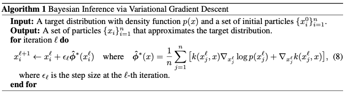

# Abstract

Our method iteratively transports a set of particles to match the target distribution, by applying a form of functional gradient descent that minimizes the KL divergence.

The derivation of our method is based on a new theoretical result that connects the derivative of KL divergence under smooth transforms with Stein’s identity and a recently proposed kernelized Stein discrepancy.

# 1. Introduction

- A new general purpose variational inference algorithmm
- uses a set of particles for approximation, on which a form of functional gradient descent is performed to mininize the KL divergence and drive the particles to fit the true posterior distribution.

Contents

- Section 2 : backgrounds on kernelized Stein discrepancy (KSD)
- Section 3 : connection between KSD and KL divergence

# 3. Variational Inference Using Smooth Transforms

## 3.2 Stein Variational Gradient Descent

{: .align-center}

# 궁금한 점

- 기존의 variational inference algorithm은 어떤 방식일까?
