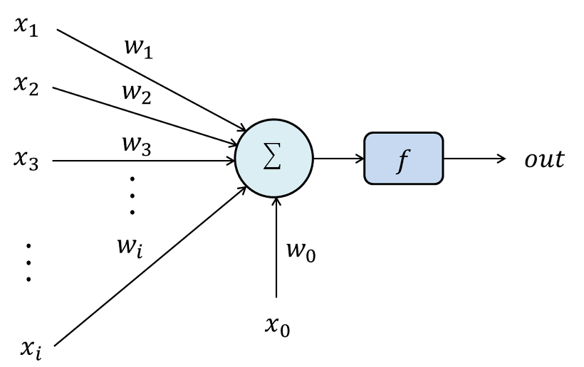
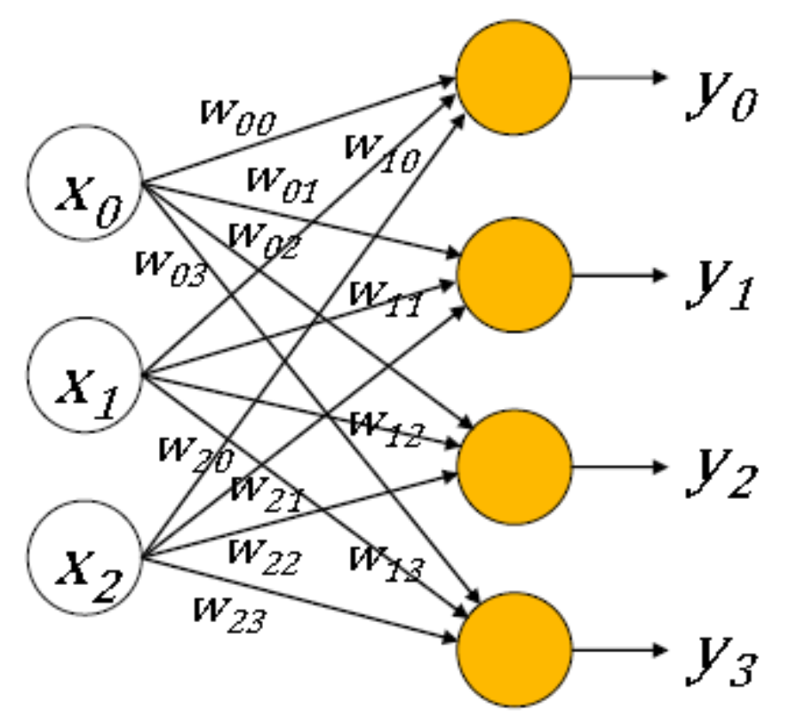
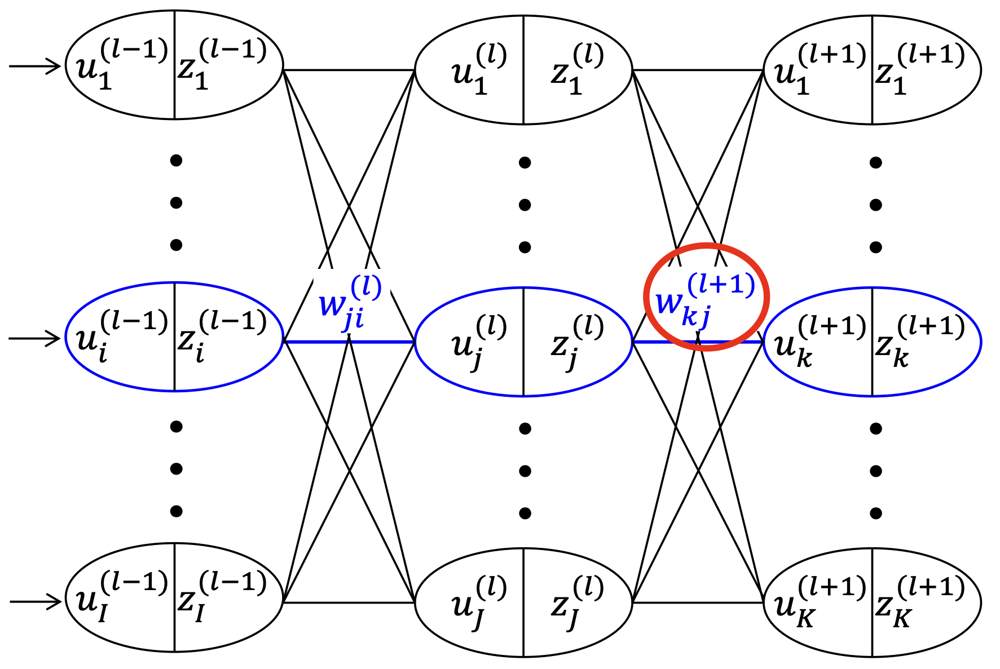
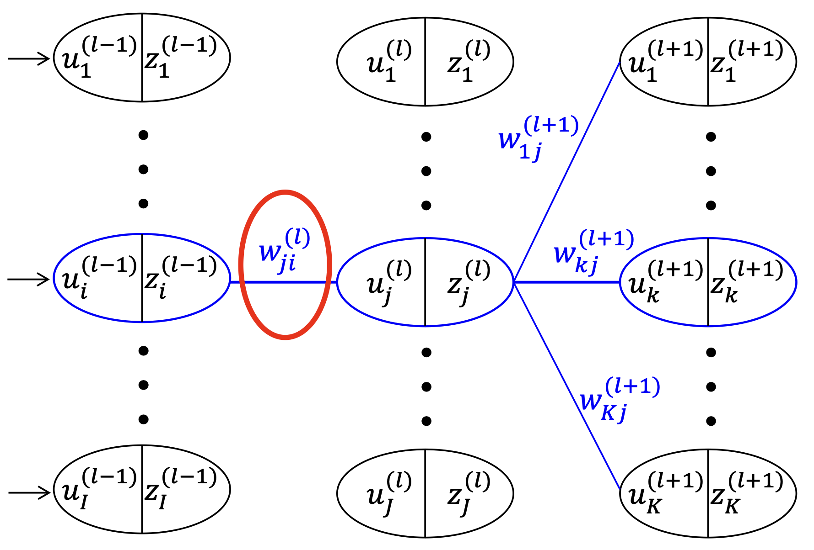

# Single Perceptron

{: .align-center width="300" height="150"}

- $x$ : input
- $w$ : weight (-1 ~ 1)
- $f$ : activation function (differentiable, non-linear)

출력은 다음과 같이 나타낼 수 있다.

$$
f(w_0x_0 + w_1x_1 + w_2x_2 + \dots + w_nx_n ) = f \left(\sum_{i=0}^{n}w_nx_n\right)
$$

# Multiple Percpetron

{: .align-center width="300" height="150"}

각 출력을 다음과 같이 나타낼 수 있다.

$$
\begin{align*}
  y_0 = f(w_{00}x_0 + w_{10}x_1 + w_{20}x_2 + b_0) \\
  y_1 = f(w_{01}x_0 + w_{11}x_1 + w_{21}x_2 + b_1) \\
  y_2 = f(w_{02}x_0 + w_{12}x_2 + w_{22}x_2 + b_2) \\
  y_3 = f(w_{03}x_0 + w_{13}x_3 + w_{23}x_2 + b_3) \\
\end{align*}
$$

**Matrix-Vector Multiplication**을 이용하여 더 단순하게 나타낼 수 있다.

$$
\begin{bmatrix}
  y_0 \\
  y_1 \\
  y_2 \\
  y_3 \\
\end{bmatrix}
= f \left(
\begin{bmatrix}
  w_{00} & w_{10} & w_{20} \\
  w_{01} & w_{11} & w_{21} \\
  w_{02} & w_{12} & w_{22} \\
  w_{03} & w_{13} & w_{23} \\
\end{bmatrix}
\begin{bmatrix}
  x_{0} \\
  x_{1} \\
  x_{2} \\
\end{bmatrix}
+
\begin{bmatrix*}
  b_{0} \\
  b_{1} \\
  b_{2} \\
  b_{3} \\
\end{bmatrix*}
\right)
$$

# Artificial Neaural Netwrok

Cost function : 모든 error의 sqaure

$$
E = \dfrac{1}{2} \sum_{k=1}^{K} (z_k^{l+1} - d_k)^2
$$

## Output Layer Weight Update

{: width="300" height="150"}

$$
\begin{align*}
  u_k^{(l+1)} &= \sum_{j=1}^J w_{kj}^{(l+1)} z_j^{(l)} \\
  z_l^{(l+1)} &= f(u_k^{(l+1)})
\end{align*}
$$

Gradient Descent

$$
w_{kj}^{(l+1)} = w_{kj}^{(l+1)}  - \eta \cdot \dfrac{\partial E}{\partial w_{kj}^{(l + 1)}}
$$

Chain rule을 적용하자.

$$
\begin{align*}
  \dfrac{\partial E}{\partial w_{kj}^{(l + 1)}} &=
  \dfrac{\partial E}{\partial z_k^{(l+1)}} \cdot \dfrac{\partial z_k^{(l+1)}}{\partial w_{kj}^{(l + 1)}} \\
  &= \dfrac{\partial E}{\partial z_k^{(l+1)}} \cdot \dfrac{\partial f(u_k^{l+1})}{\partial u_k^{(l+1)}} \cdot  \dfrac{\partial  u_k^{(l+1)}}{\partial w_{kj}^{(l + 1)}} \\
  &= (z_k^{(l+1)} - d_k) \cdot f'(u_k^{(l+1)}) \cdot z_j^{(l)} \\
  &= \delta_k^{(l+1)} \cdot z_j^{(l)}
\end{align*}
$$

where

$\delta_k^{(l+1)} := (z_k^{(l+1)} - d_k) \cdot f'(u_k^{(l+1)})$

Notation에 주의하자.

## Hidden Layer Weight Update

{: width="300" height="150"}

$$
\begin{align*}
  u_k^{(l)} &= \sum_{j=1}^J w_{kj}^{(l)} z_j^{(l-1)} \\
  z_l^{(l)} &= f(u_k^{(l)})
\end{align*}
$$

Gradient Descent

$$
w_{kj}^{(l)} = w_{kj}^{(l)}  - \eta \cdot \dfrac{\partial E}{\partial w_{kj}^{(l)}}
$$

$$
\begin{align*}
  \dfrac{\partial E}{\partial w_{ji}^{(l)}} &= 
  \dfrac{\partial E}{\partial z_k^{(l+1)}} \cdot \dfrac{\partial z_k^{(l+1)}}{\partial w_{ji}^{(l)}} \\
  &= \dfrac{\partial E}{\partial z_k^{(l+1)}} \cdot \dfrac{\partial f(u_k^{(l+1)})}{\partial u_k^{(l+1)}} \cdot  \dfrac{\partial u_k^{(l+1)}}{\partial z_j^{(l)}} \cdot \dfrac{\partial z_j^{(l)}}{\partial w_{ji}^{(l + 1)}} \\
  &= \dfrac{\partial E}{\partial z_k^{(l+1)}} \cdot \dfrac{\partial f(u_k^{(l+1)})}{\partial u_k^{(l+1)}} \cdot  \dfrac{\partial u_k^{(l+1)}}{\partial z_j^{(l)}} \cdot \dfrac{\partial f(u_j^{(l)})}{\partial w_{ji}^{(l + 1)}} \\
  &= (z_k^{(l+1)} - d_k) \cdot f'(u_k^{(l+1)}) \cdot w_{ji}^{(l)} \cdot \sum_{j=1}^I z_i^{(l-1)}\\
  &= \delta_k^{(l+1)} \cdot w_{ji}^{(l+1)}
\end{align*}
$$

# Question

- weight는 항상 -1~1일까?
- 각 layer의 노드의 개수가 다를 수도 있는가?
