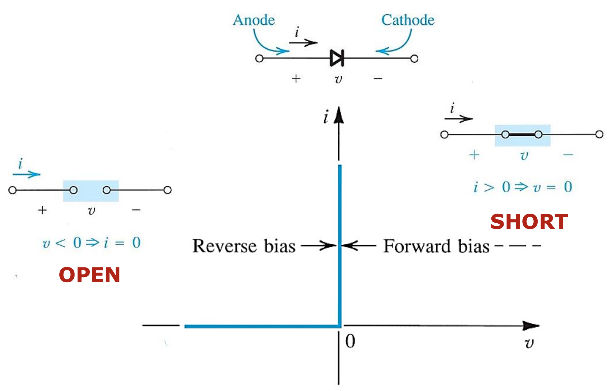
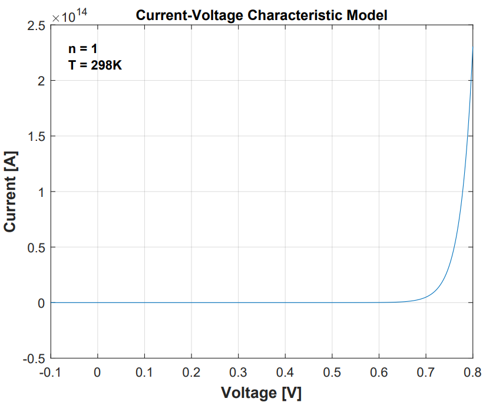
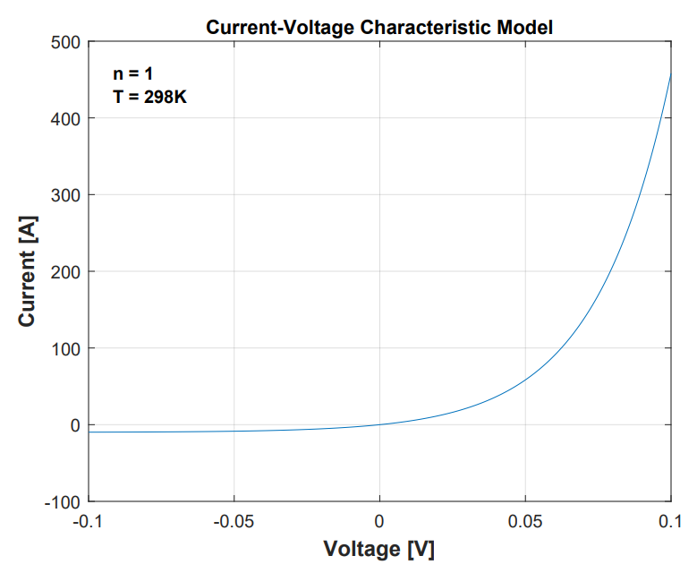

## 1 The Ideal Diode

### 1.1 Current Voltage Characteristic

The ideal diode can be considered the most fundemental nonlinear circuit element.

### 1.2 The Rectifier

- The series connection of a diode and a resister

### 1.3 Limiting and Protection Circuits

## 2 Terminal Characteristics of Junction Diodes (current-voltage characteristic)

The i-v characteristic of a silicon junction diode

The i-v characteristic of a silicon junction diode with some expended and others compressed

The characteristic curve consists of three distinct regions

1. The forward-bias region
2. The inverse-bias region
3. The breakdown region

실제 diode가 이상적인 diode와 다른 점

1. 순방향 전압에서 전류가 많이 흐르는 전압은 0V가 아니라 약 0.7V이다.
2. 이때 diode의 저항은 영이 아니다.
3. 역방향 전압에서도 기본적으로 미세한 전류가 흐른다.
4. 역방향 전압에서도 전류가 많이 흐르는 구간이 존재한다.

### 2.1 The Forward-Bias Region

In the forward region, the i-v relationship is closely approximated by

$$
i = I_s(e^{v/nV_T} - 1)
$$

- Saturation current (or scale current) $I_s$ : a constant for a given diode at a given temperature. $I_s$ doubles in value for every $5^{\circ}$ rise in temperature. 다이오드의 형상에 종속된 고유한 값이며 온도에도 종속적이다. 일반적으로 10~15A의 값을 갖는다.
- Thermal Voltage : $V_T = \dfrac{kT}{q} = 0.0862$T, mV (상온에서 약 26mV(25.6876 mV))
  - $k$ = Boltzmann's constant $= 8.62 \times 10^{-5} \text{eV/k} = 1.38 \times 10^{-23} \text{joules/kelvin}$ (constant)
  - $T$ = the absolute temperature in kelvins = 273 + temperature in $^{\circ}C$
  - $q$ = the magnitude of electronic charge = $1.60 \times 10^{-19}$ coulomb (constant)
- $n$ : 전압과 전류의 관계를 exponential로 modeling하지만 실제 그래프와 차이가 발생한다. 이것을 보완하기 위해 parameter n을 추가한다. 이것은 diode마다 다른 값을 갖는다. 우리는 보통 1로 두고 게산한다.

$$
i = I_s(e^{v/nV_T} - 1) \cong I_s(e^{v/V_T} - 1) \cong I_se^{v/V_T}
\\
v = V_T\ln \left (\dfrac{i}{I_s} \right)
\\
v_2 - v_1 = V_T \ln \left (\dfrac{i_2}{i_1} \right) = 2.3V_T \log \left(\dfrac{i_2}{i_1} \right )
$$

>실생활 이야기 \
>$i_2$의 전류가 10배 커지면 $2.3V_T$ 커진다. 상온에서 약 60mV 증가한다. 반도체의 온도가 1도 상승하면, 반도체에 걸리는 전압이 2mV 감소한다. 넓은 범위에서 선형적으로 나타나는 특성이다. 이 성질은 반도체의 온도를 측정할 때 쓰인다. CPU 팬을 끄고 컴퓨터를 부팅하면 조금 실행되다 꺼진다. CPU가 특정 온도 이상이 되면 cpu를 shut down시키는 장치가 있는 것이다. 즉 CPU의 온도를 측정할 수 있는 것이다. 1mA를 넣어주고 순방향 전압의 감소폭을 모니터링하여 온도를 알아낼 수 있다.

### 2.2 The Reverse-Bias Region

- 실제 Diode에서는 forward bias보다 reverse bias를 더 많이 사용한다.
- Diode는 빛에 굉장히 민감한 특성을 가지고 있다.
- 빛이 들어올 때 미세한 전류가 흐흔다.
- 빛을 전기 신호로 바꾸는 모든 장비에 사용된다. 카메라, 태양광...
- Camera Image Sensor(CIS)에서 reverse bias current를 이용한다.
  - 하나의 픽셀당 세 개의 다이오드가 있다. 각 다이오드 위에는 각각 RGB에 해당하는 광학 필터가 있어 각 다이오드는 하나의 색이 얼마나 들어오고 있는지를 감지한다. 그 양에 비례하는 reverse bias current를 발생시킨다. 그것을 증폭한다.(analog) -> A/D -> Monitor

### 2.3 The Breakdown Region

다이오드의 사양에 breakdown voltage가 표기되어 있다.

## 3 Modeling the Diode

We'll assess the sustainablitiy of these two models in various analysis situations. k

### 3.1 The Exponential Model

### 3.2 Graphical Analysis Using the Exponential Model

- Exponential이 들어간 방정식을 풀 수 없다.
- 간단한 회로에서조차도 전압에 대한 일반화된 식을 얻을 수 없다.
- computer로 반복하면서 error가 특정값 이하로 들어오면 멈추는 방식으로 구한다.
- 회로에서 다이오드를 분석하려면 골치 아프다.

Load line analysis

- 굉장히 중요한 기법
- 회로의 동작을 분석하는 tool
- 실질적인 값을 알려주지는 않는다.
- 저항의 특성과 diode의 특성을 한 그래프에 그린다. 두 그래프의 교점이 우리가 얻고자 하는 점이다.
- 저항이 커진다면 혹은 $V_{DD}$가 작아진다면, 회로에 흐르는 전류는 어떻게 될지 등에 대한 정보를 알려준다.

### 3.3 Iterative Analysis Using the Exponential Model

### 3.4 The Need for Rapid Analysis

### 3.5 The Constant-Voltage-Drop

### 3.6 The Ideal-Diode Model

### 3.7 Operation in the Reverse Breakdown Region

## 4 The Small-Signal Model

## 5 Voltage Regulation

## 6 Rectifier Circuits

### 6.1 The Half-Wave Rectifier

### 6.2 The Full-Wave Rectifier

### 6.3 The Bridge Rectifier

## 7 Other Diode Applications

## 궁금한 점

- 2.1절에서 thermal voltage 개념이 갑자기 왜 나오는 것일까? $\rightarrow$ diode의 i-v characteristic을 exponential function을 이용해 modeling할 때 열전압이 들어가기 때문이다.
- 칩 내부의 온드를 추정할 수 있는 것은 저항 온도 계수 때문이 아닐까? https://www.rohm.co.kr/electronics-basics/resistors/r_what9 / https://blog.naver.com/dibaoi/222579435860
