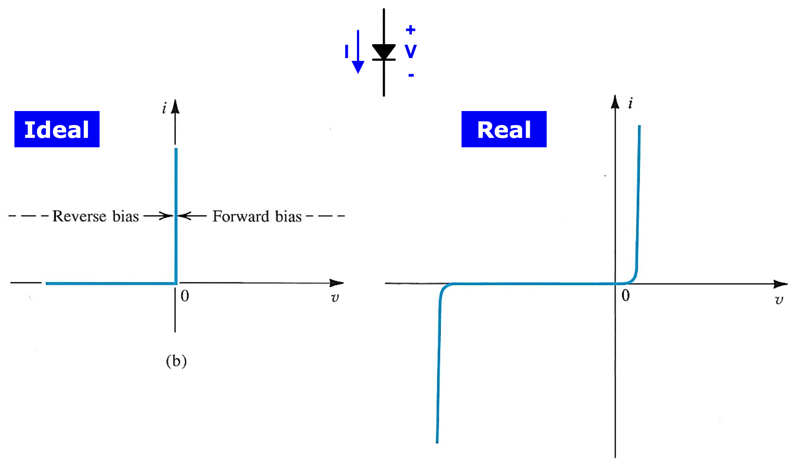
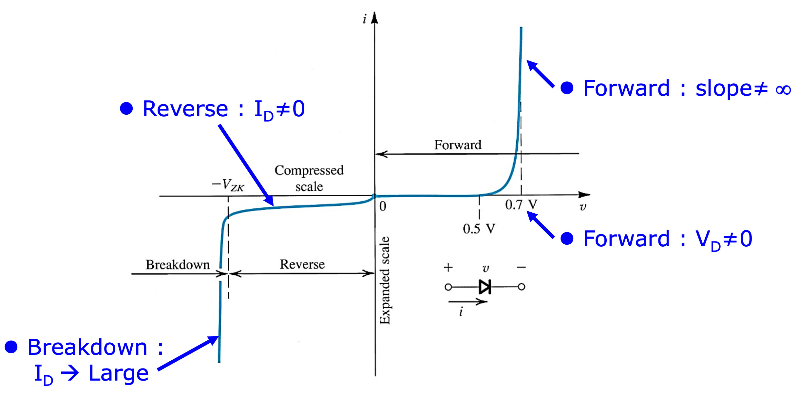

## 1 The Ideal Diode

### 1.1 Current Voltage Characteristic

The ideal diode can be considered the most fundemental nonlinear circuit element.

### 1.2 The Rectifier

- The series connection of a diode and a resister

### 1.3 Limiting and Protection Circuits

## 2 Terminal Characteristics of Junction Diodes

The i-v characteristic of a silicon junction diode

The i-v characteristic of a silicon junction diode with some expended and others compressed

The characteristic curve consists of three distinct regions

1. The forward-bias region
2. The inverse-bias region
3. The breakdown region

### 2.1 The Forward-Bias Region

### 2.2 The Reverse-Bias Region

### 2.3 The Breakdown Region

## 3 Modeling the Diode

We'll assess the sustainablitiy of these two models in various analysis situations. k

### 3.1 The Exponential Model

### 3.2 Iterative Analysis Using the Exponential Model

### 3.3 The Need for Rapid Analysis

### 3.5 The Constant-Voltage-Drop

### 3.6 The Ideal-Diode Model

### 3.7 Operation in the Reverse Breakdown Region

## 4 The Small-Signal Model

## 5 Voltage Regulation

## 6 Rectifier Circuits

### 6.1 The Half-Wave Rectifier

### 6.2 The Full-Wave Rectifier

### 6.3 The Bridge Rectifier

## 7 Other Diode Applications
