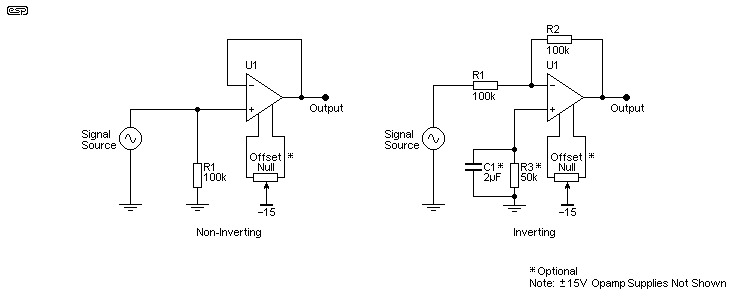
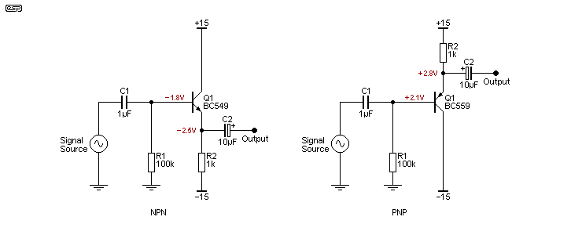
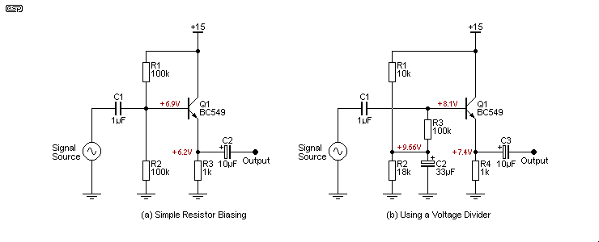
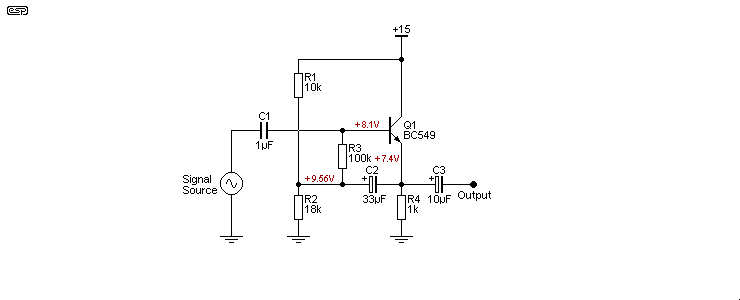
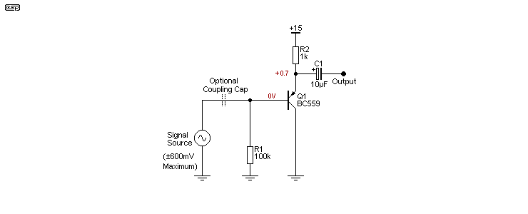

## Op Amp 실무

### 1. Opamp의 특징

- 연산 증폭기 : 두 개의 차동 입력과 한 개의 단일 출력을 갖는 전압 증폭기
- 자체적인 온도 변화나 제조된 부품마다 약간의 동작의 차이를 보이는 특성은 출력되는 신호에 거의 영향을 미치지 않고, opamp가 연결된 외부 수동 소자에 의하여 그 동작이 좌우되기 때문에 회로 설계에서 빈번하게 사용된다.
- Opamp의 입력 임피던스는 거의 무한대이고, 출력 임피던스는 거의 0이다.

### 2. Opamp의 응용 회로의 종류

### 3. Opamp의 특징

- 공급 전압 :
- Gain Bandwidth

Voltage Follower (Voltage Buffer)

입력되는 전압 신호에 맞춰 출력되는 신호도 입력되는 전압 신호가 될 수 있도록 하는 설계 방법

## Voltage Followers And Buffers

### Preamble

||Voltage Follower|Voltage Amplifier|
|---|---|---|
|정의|a current amplifier regardless of the technology used to build it|increase the amplitude of the signal|
|용도|A small available current from the source is usually due to the circuit having a high impedance, so it cannot supply enough current to drive the following circuitry.|These are used when the voltage from the source is too low to be useful.|

Voltage Follower

- increase only current : the current from the load can be increased by a factor of between a few hundred up to many thousands of times, depending on the topology of the circuit.
- do not increase amplifude of the signal : Indeed, most actually reduce the voltage slightly, with outputs varying between around 0.9 to 0.99 of the input voltage. 

초보자에게는 출력 임피던스와 출력 전류가 완전히 다른 개념이며, 하나가 다른 것을 의미하지 않는다는 것을 이해하는 것이 어려울 수 있습니다. 이 기사의 목적은 소스의 출력 전류가 회로에서 필요로 하는 것보다 현저히 적을 때, 중요한 전류 이득을 얻기 위한 다양한 방법을 보여주는 것입니다.

전류 증폭기(사실상 임피던스 변환기)가 필요한 장치의 예로는 커패시터(즉, '콘덴서') 마이크 요소와 피에조 센서(주로 진동 측정용)가 있습니다. 다른 좋은 이유로 전류 증폭기/전압 팔로워를 사용하는 경우도 많습니다. 특히 진공관과 같은 일부 증폭 장치는 높은 임피던스 출력을 가지고 있어 현대의 일반적인 부하에 적합하지 않습니다. 현대의 부하는 일반적으로 100k 이하이며, 많은 경우 10k 이하입니다.

### Introduction

||Invering Configuration|Non-Inverting Configuration|
|---|---|---|
|장점|input impedance is very high (if FET input opamp it can be very close to infinite)  Output current is determined by the opamp you use, as is the DC offset which may be problematical with extremely high input impedance.  Noise is usually fairly low, but with high impedances it will be dominated by the noise voltage from the input resistor unless the source bypasses the noise (as happens with a capacitor (aka 'condenser') microphone for example).|solves the common mode distortion problem, because there is virtually none.|
|단점|The non-inverting connection suffers from (slightly) higher distortion because the common mode voltage is high (i.e. the voltage seen by both inputs at the same time), but with modern opamps this is rarely a problem.  The distortion can be measured with (very) good equipment, but there are now opamps that have such low distortion that it's almost impossible to measure it.  It is very rare indeed for the distortion to be audible, and if so, it usually means something else is wrong with the circuit.|The inverting connection has the disadvantage that its input impedance is limited by the resistor values used.  They can't be too high or noise becomes a major problem for low level signals.|

**An important point to make is that an impedance converter circuit should ideally be able to source and sink current equally well.**  If it can't, the output may be asymmetrical with some loads.  Sourcing current is taken to mean that the circuit is providing current to the load, while sinking current means that it's drawing current from the load.  Any follower should also be able to provide the same peak voltage (positive and negative) to its rated load, and preferably down to the lowest load impedance likely to be encountered (real life is unpredictable).

**Simple emitter followers can't usually provide fully symmetrical operation** unless their operating current is unrealistically high.  In some cases you can offset the output voltage so that there's less voltage across the transistor, and more across the resistor, and that can restore symmetry for a defined load impedance and reduce distortion.  However, creating deliberate asymmetry isn't a cure-all and will only work if you know exactly what you're doing.

**Be very aware that simple circuits such as emitter followers have relatively poor power supply rejection ratios (PSRR), so hum or noise on the supplies will affect the signal to some extent.**  Simple emitter followers as shown in Figure 2 will have a PSRR to the emitter circuit of around -27dB, and about -44dB to the collector circuit, with a 10k source impedance.  These figures depend on the component values and (especially) the source impedance, so are only a guide.

Of the circuits discussed here, very few are suitable for buffering DC voltages.  Because there are DC offsets that can seriously affect the performance of many of the circuits, they are only suitable for AC operation, **meaning that there is a requirement for an output coupling capacitor to block the DC component.  In many cases, an input coupling capacitor will also be used, especially if the source has a DC potential.**

Many single opamps have provision for an offset null potentiometer, so that input transistor DC offsets can be zeroed, allowing the circuit to operate accurately with DC voltages.  This is rarely necessary in audio frequency circuits because the DC is removed by a capacitor, but it's essential for high accuracy circuits that include a DC component that must be preserved.  Note that there are many advanced techniques to obtain very high accuracy for DC (such as chopper stabilised amplifiers), but these are not covered here because they are specialised (and usually expensive) parts and aren't necessary or desirable for normal audio frequencies.

**An 'ideal' (i.e. theoretical) voltage follower has an infinite input impedance and an output impedance of zero ohms.**  Obviously the 'ideal' doesn't exist other than in simulators, but it's still a useful tool during simulation because opamps (in particular) come close enough to the ideal case that any difference is largely academic.  The input impedance of a JFET input opamp is usually in the gigohms range, and the output impedance is a few ohms at most.  The output voltage is limited by the power supply voltages, and the output current is set by the opamp itself.  It's usually about ±25mA or so, but if loaded that heavily the available output voltage is reduced.

### 1. Opamp Voltage Followers

The basic opamp circuits will be covered first, because they set the goal posts for the parameters that we aspire to.  With few exceptions, discrete transistor designs don't even come close to the opamp based followers.  The main parameters we are interested in are input impedance, output impedance, and gain.  While it's accepted that followers in general don't have gain as such, if the internal gain is too low, then there will be a loss of signal.  It's usually less than 1dB even with a valve cathode follower, but it's still a loss of level that will compromise the effectiveness of circuits such as active filters that rely on feedback to get the desired performance.

There is a full discussion about output impedance below, but a word of warning is needed here as well.  While a typical opamp may offer an output impedance (with feedback) of less than 1Ω, there is also a limit to the short-circuit current, and the maximum output swing is dependent on the load impedance (and hence the peak output current).

**This means that if you use a load impedance that's too low, you will not be able to get the maximum output voltage, and distortion is increased - often dramatically.**  Most common opamps are limited to a load impedance of 2k or more, but there are also quite a few that can handle 600Ω loads, and a few that can handle even lower impedances.  If you need to drive a low impedance, you must check datasheets to verify that you can get both the output current and voltage you need, or the circuit may not be acceptable for your purposes.

Figure 1 shows the standard opamp buffers, non-inverting and inverting.  Of these, the non-inverting configuration is the most common, and although it does invoke common-mode distortion (because both inputs are driven to the same voltage), it is one of the most used circuits known.  A great many ESP projects use non-inverting buffers, and they are particularly common with active filter circuits.  The input impedance is set by R1 (100k - although it may be a great deal higher with some opamps), and that's in parallel with the opamp's input impedance.

The offset null connections are optional, and are only necessary if an absolute DC level must be maintained.  Pin numbers and pot value vary, so the datasheet must be consulted to determine the proper connections and value for the opamp being used.  In most cases the offset null isn't necessary, particularly when capacitor coupling is used.

Minimising DC offset is usually not particularly important for audio, especially when the supply voltages are greater than ±5V or so, because there's plenty of 'headroom' and even a few hundred millivolts of offset isn't an issue.  The output capacitor removes the DC component and everyone is happy.  However, if you do need a low offset, that's achieved by keeping the DC resistance from each input to earth/ ground equal.  This is shown above in the inverting circuit, with a bypassed resistor to earth from the non-inverting input.  Its value is equal to the resistance of R1 and R2 in parallel - assuming that the source resistance/ impedance is zero.

The resistor is bypassed by a capacitor so that the resistor's thermal noise is not added to the signal, thereby reducing the signal to noise ratio.  This arrangement used to be very common, but most modern opamps are good enough to let you simply earth the unused input (no series resistance).  It is rarely necessary to ensure input resistance balance, but if you are designing a high gain DC amplifier then it's advisable to keep the resistance at each input the same.

### 1.1 Non-Inverting Configuration

### 1.2 Inverting Configuration

Inverting opamp buffer stages have a couple of major disadvantages.  **The input impedance is set by the input and feedback resistors.  These must both be the same value for a unity gain inverting buffer.  It's inadvisable to make them very high values (> 100k) because noise becomes a serious issue.**  In general, it's not a good idea to use the inverting buffer for high impedance low-level signals due to the circuit noise.  The input impedance is simply the value of the input resistor, and it doesn't need to be measured.

There is also an advantage, in that the input common mode input voltage is close to zero, ensuring minimum common-mode distortion.  While this is rarely a problem for most decent opamps where distortion remains at close to immeasurable levels, it's something to be aware of.  This is one of many trade-offs that are required in all aspects of electronics design - for every disadvantage, there is usually an advantage, but neither may be of any real consequence for most designs.

The inverting configuration also has a noise gain of 2, so the opamp contributes more noise than a non-inverting buffer which has unity noise gain.  As mentioned above, there is a benefit in that distortion is usually lower because there's no common mode voltage, and both opamp inputs sit at close to zero volts regardless of input signal (assuming a dual supply).  However, the reduction of distortion is generally rather small with most opamps, and using that as an excuse for not using a non-inverting buffer would be unwise.

  What is 'noise gain'?  If you examine the configuration of an inverting buffer, you'll see that the feedback and input resistors are just what you'd expect to see in a non-inverting amp with a gain of 2.  When the source impedance is low compared to the input resistor, noise is therefore amplified by 2, but the signal is only amplified by -1.  The noise gain is simply a measure of how much the noise is amplified compared to the signal.  This applies to all inverting opamp stages - the noise gain is equal to the signal gain plus 1.

It's common (or it used to be common) to include a resistor (shown in Figure 1 as 'Optional') in series with the +ve opamp input to ground (R3).  The value depends on whether the input is AC or DC coupled.  If there's a cap in series with the input, R3 will have the same value as the feedback resistance (R2).  With no cap (DC coupled), R3 will be equal to half the value of R1 and R2 - 50k as shown.  If R3 is replaced by a short to ground, the DC offset at the output of the inverting buffer will be around 13mV, vs. well under 1mV when the resistor is used.  Of course, this depends on the opamp used.

**So, while the extra resistor removes much of the input stage DC offset, the resistor must be bypassed with a capacitor to minimise noise.  The bypass cap needs to be large enough to bypass noise down to the lowest frequency of interest.  If you need response to 20Hz, the cap's reactance needs to be equal to the resistance at one tenth of that frequency - 2Hz.  For example, a 50k resistor needs a bypass cap of 1.59µF (use at least 2µF as shown, 10µF is fine).  It's unrealistic to expect the cap to bypass 1/f (aka 'shot') noise, so there may be a small uncertainty when measuring DC.**

With most newer opamp designs the resistor is not necessary, especially if the opamp has offset null terminals.  For audio, it's rarely used because it simply adds more parts for no useful purpose.  The output should always be capacitively coupled unless response to DC is a requirement.

### 2. Simple Discrete Emitter Followers

가장 간단하고 잘 알려진 전압 포로우어는 에미터 포로우어로서, 공통 콜렉터 스테이지로도 알려져 있습니다. 콜렉터는 공급 레일에 연결되어 있기 때문에 AC 그라운드 포텐셜에 있습니다. 이것들은 모든 종류의 오디오 회로에서 매우 흔했지만, 오프앰프와 비교했을 때 거의 모든 면에서 성능이 매우 나쁩니다. 입력 임피던스는 출력에 연결된 부하에 따라 달라지므로 고정된 높은 입력 임피던스를 유지하는 대신, 부하가 추가되거나 변경되거나 제거될 때 변동합니다. 입력에서 출력까지 0.65V의 DC 오프셋이 있으며, 에미터에서 그라운드 또는 공급 레일로의 DC 로드가 필요합니다(트랜지스터가 NPN인지 PNP인지에 따라 레일이 달라집니다). 부하는 대부분 저항이지만, 이로 인해 출력 구동 능력이 비대칭적이 됩니다. 트랜지스터를 통해 합리적인 전류를 공급할 수는 있지만, 그의 전류 침하 능력은 저항 값에 따라 달라집니다.

|Opamp Voltage Follower|Emitter Follower|
|---|---|
|손실이 없다.|All simple follower circuits have a small loss of level, typically providing an output of between 0.99 and 0.999 of the input level, depending on the gain of the transistor(s) used, the topology and the source and load impedances.|
|Opamps avoid this by using very high internal gain and lots of feedback, so while there is still some interdependence it's usually so small that you will be unable to measure the difference.|Unlike opamps, the input and output impedances of emitter followers are interdependent, so changing one also changes the other.|

위의 예에서 두 회로는 1k 에미터 부하를 가지고 있으며, 대규모 출력 전압 스윙이 필요한 경우 외부 부하 임피던스는 10k보다 작아서는 안됩니다. **낮은 부하 임피던스가 예상된다면 R2를 줄여야 하지만, 이는 입력 임피던스를 감소시키고 정적 전류를 증가시킵니다.** ±15V 공급에서 이 단일 트랜지스터 스테이지는 3에서 5개의 오프앰프보다 더 많은 전류를 소비하지만, 성능은 전혀 좋지 않습니다. 두 회로의 성능은 대략적으로 유사하며, 아래에 더 자세히 설명된 것처럼 출력을 캐패시터로 결합하여 보완 에미터 포로우어를 생성하기 위해 두 회로를 함께 사용할 수도 있습니다.

표시된 값으로 보면 트랜지스터의 입력 임피던스(100k 바이어스 저항을 무시한)는 부하가 없을 때 약 500k입니다. 10k 부하가 연결될 때 약 ~450k로 감소합니다. 입력 임피던스는 대략적으로 트랜지스터의 이득(hFE는 시뮬레이션에서 500)으로 곱해진 에미터 저항과 병렬로 연결된 부하 임피던스(입력 바이어스 저항인 R1)의 값입니다. 트랜지스터의 바이어스 전류로 인해 R1에는 1.8V가 드롭됩니다(18µA 베이스 전류) 및 실리콘 트랜지스터의 베이스와 에미터 사이의 전형적인 700mV 이하의 에미터에 약 -2.5V가 있습니다.

여기 표시된 회로 대부분은 이중 공급을 사용하지만, 하나의 공급만 사용 가능한 경우 에미터 포로우어는 에미터가 대략 공급 전압의 절반에 위치하도록 바이어스가 설정되어야 합니다. 가장 일반적인 배치가 다음에 나와 있습니다. 표시된 전압에서 보듯이, Q1의 에미터는 최적의 7.5V가 아닌 약 6V 위에 있습니다. 최적의 바이어스 포인트를 얻으려면 R1을 69k로 줄여야 하지만, 신호 수준이 RMS 몇 볼트를 넘지 않는 한 두 개의 동일한 저항을 사용하는 것은 꽤 괜찮습니다.

(a)에 표시된 두 저항을 사용하면 입력 임피던스가 감소한다는 것을 이해하는 것이 중요합니다. 이제 입력 임피던스는 R1과 R2, 그리고 트랜지스터의 입력 임피던스가 병렬로 연결된 값입니다. 여기에서는 에미터 전압이 원하는 값보다 낮아짐을 보여주기 위해 동일한 값의 저항이 사용되었습니다. 입력 임피던스를 줄이는 것은 더 높은 값의 저항을 사용하거나 바이어스 공급으로써 우회된 전압 분할기를 사용하는 두 번째 바이어스 방식을 사용함으로써 피할 수 있습니다. 두 번째 버전은 장점이 있습니다. 바로 어떠한 전원 공급 잡음도 베이스 회로로 전달되지 않는다는 것입니다. 전압 분할기 (R1과 R2)는 에미터에서 거의 반 공급 전압을 얻기 위해 일부러 불균형으로 조정되었습니다.

바이어스 방식에는 직전 단계의 출력과 에미터 포로우어의 베이스를 직접 결합하는 직결 방식을 포함하여 여러 가지 변형이 있습니다. 또한 에미터 신호가 전압 분할기의 중앙 탭에 피드백되는 부스트래핑이라는 기술이 있습니다. 여기서 C2는 그라운드가 아닌 에미터에 연결됩니다. 이 트릭은 양의 피드백으로 임피던스를 증폭시킵니다. R3의 양 끝에서의 AC 전압이 거의 동일하도록 보장함으로써 R3의 AC에 대한 표면 임피던스가 최소한 한 자릿수 이상 증가하지만 DC 조건에는 영향을 미치지 않습니다.

부스트래핑된 에미터 포로우어의 입력 임피던스는 약 340k입니다. 따라서 AC 입력에 대해서는 R3이 거의 영향을 미치지 않음을 알 수 있습니다. 물론 DC 저항은 여전히 100k이므로 트랜지스터의 베이스 전류에 의한 전압 강하는 변경되지 않습니다. 부스트래핑은 매우 오랜 기간 동안 이 방식으로 사용되어 왔으며, 심지어 밸브 회로에도 적용할 수 있습니다.

그러나 부스트래핑에는 몇 가지 단점이 있습니다. 먼저, 표시된 값으로는 1.5Hz에서 2dB의 이득 증가가 있습니다. 사실, C1, C2 및 관련 저항의 조합에 의해 다소 이상한 8에서 9dB/ 옥타브의 하이패스 필터가 생성되며, 시작하기 전에 피크를 생성하는 예상보다 높은 Q('품질 요소')가 있습니다. 이 필터의 효과(및 Q)는 소스 임피던스에 따라 달라져서 '실제 세계'에서의 응용에서 예측할 수 없을 수 있습니다. 소스 임피던스가 높을수록 이득이 감소하고, 소스 임피던스가 100k일 때(그림 4) 전혀 이득이 없습니다. 소스가 100kΩ인 경우 저주파 응답은 -3dB 이하로 약 1Hz에 이르게 됩니다. 대부분의 문서에서는 이 점을 거의 다루지 않지만, '흥미로운' 저주파수 효과에 대한 잠재적 위험에 대해 알지 못하면 함정이 될 수 있습니다.

둘째, 부스트래핑 회로는 양의 피드백을 사용하므로 입력에서 DC 변경이 발생할 경우 일시적인 불안정성을 일으킵니다. 또 다른 문제는 회로가 상당한 결정 시간을 가질 수 있으므로 전원이 인가된 후에는 DC 조건이 안정화될 때까지 여러 초(또는 구성 요소 값에 따라 더 많은 경우) 기다려야 할 수 있습니다. 이것 또한 양의 피드백의 사용으로 인한 것이며, 이것은 사용된 저항 및 캐패시터 값에 따라 결정되는 저주파수 감쇠된 진동을 유발합니다.

부스트래핑된 입력 회로를 사용하는 것이 최선의 선택인지 결정하기 전에 회로를 구성하고 응용 프로그램과 함께 테스트하는 것이 중요합니다. 양의 피드백 때문에 임피던스는 신호 주파수에 따라 달라지며, 트랜지스터의 밀러 캐패시턴스 및 임의의 캐패시턴스도 높은 주파수에서 입력 임피던스를 제한할 수 있습니다.

단일 공급으로 표시되었지만, 부스트래핑은 이 기사에 표시된 모든 변형에 적용할 수 있습니다(JFET 및 오프앰프 포함). 이중 공급을 사용하는 회로의 경우, 부스트랩 캡을 그들의 접합점에 연결하여 접지에 대한 하나의 저항과 베이스에 대한 하나의 저항(세 개의 저항 대신 두 개의 저항)만 필요합니다. 이렇게 하면 DC 오프셋을 줄이기 위해 입력 저항의 값을 줄일 수 있습니다. 저항은 같은 값이 아니어도 되지만, 주어진 회로에 대한 정확한 동작을 보려면 회로를 구축하고 테스트하거나 적어도 시뮬레이션을 실행해야 합니다(시뮬레이션은 일반적으로 실제와 매우 유사할 것입니다).

위에 표시된 버전은 단순히 빼놓을 수 없을 정도로 흥미로운데요. 많은 제약이 있지만, 그럼에도 불구하고 이 회로는 입력이 그라운드를 포함할 수 있는 몇몇 단일 공급 IC의 입력 단계로 사용됩니다(예: LM358, LM386 등). 이 회로는 일반적으로 에미터 포로우어로 작동하면서도 AC 입력이 그라운드로 참조됩니다. 입력은 별도의 음수 콜렉터 전압 공급이 없는 상태에서 최대 약 ±600mV까지 스윙할 수 있습니다. 이 회로는 트랜지스터가 정상적으로 작동할 수 있도록 콜렉터와 베이스 사이에 충분한 전압 차이를 제공하기 위해 베이스-에미터 접합 전압에 의존합니다.

이 회로는 특별한 경우지만 매우 유용할 수 있습니다. 그것은 그림에 표시된 대로 DC 결합될 수 있거나 다른 회로에서 설명한 것처럼 커패시터로 결합될 수 있습니다. 소스와 입력 사이에 커패시터가 사용될 때(도면에 점선으로 표시됨), 트랜지스터 게인과 에미터 저항에 따라 베이스 전압이 상승합니다. 100k로(그리고 BC559C와 같은 트랜지스터의 hFE가 약 420인 경우), 베이스 전압은 약 2.7V까지 상승하여 약 ±2.6V(1.9V RMS)의 훨씬 더 높은 입력(및 출력) 전압을 허용합니다. 여기에 표시된 다른 대부분의 회로와 마찬가지로 실험을 해야 합니다. 일반적으로 커패시터 결합을 사용하더라도 트랜지스터 매개 변수의 변화가 문제를 일으킬 수 있기 때문에 대략 700mV RMS 이상의 입력 신호로 만족하지 않을 것입니다.

...

## Reference

https://blog.naver.com/ansdbtls4067/221412447707 \
https://sound-au.com/articles/followers.html \
https://cmosedu.com/jbaker/courses/ee420L/s17/students/ferret1/Lab%206/lab6.html

### 기타

intro

일부 사람들은 연산 증폭기가 '나쁘다'고 주장하고, 오직 디스크리트 설계를 사용해야 한다고 주장하지만, 이는 가장 평범한 연산 증폭기에만 해당됩니다. 심지어 저렴한 µA741 연산 증폭기도 많은 디스크리트 설계보다 왜곡 수치가 더 좋습니다(노이즈와 속도는 심각하게 제한되지만). 일부 고급 회로는 일부 연산 증폭기보다 더 나을 수 있지만, 많은 부품과 상당한 PCB 공간이 필요합니다.

모든 회로를 직접 구축하고 측정할 수는 없기 때문에, SIMetrix 시뮬레이터에서 파생된 결과를 사용합니다. 시뮬레이터가 일부 측면에서 낙관적일 수 있지만, 친숙한 트랜지스터와 기본 연산 증폭기를 사용하여 시뮬레이션하기 때문에 결과는 비교 가능합니다. 시뮬레이션을 위해 1.414V RMS(2V 피크)의 신호 전압을 사용했습니다. 이는 많은 일반 회로에서 현실적인 작동 수준입니다.

연산 증폭기 회로는 일반적으로 ±15V의 이중 전원을 사용하여 설명될 것입니다. 디스크리트 팔로워도 일반적으로 이중 전원을 사용하지만, 필요에 따라 단일 전원을 사용할 수 있습니다. DC 오프셋을 제거하는 가장 좋은 방법은 출력 커플링 커패시터를 추가하는 것입니다. 이중 전원을 사용하는 경우에도 일반적으로 필요합니다.