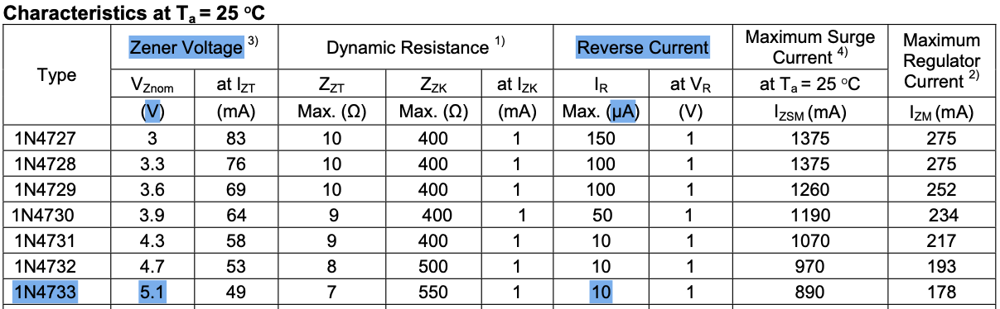
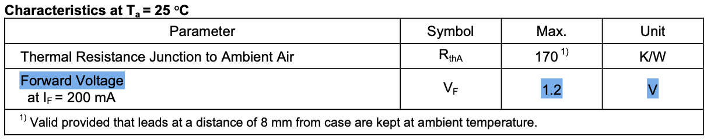

## 1 THEORY

## 2 SIMULATION

### Contents

- PN Junction Diode
  - Typical values of DC blocking voltage, forward voltage drop, and reverse current of 1N4004
  - Current-voltage characteristic of half-wave rectifier circuit with 1N4004
  - ..
- Zener Diode
  - Typical values of Zener voltage, forward voltage drop, and reverse leakage current of 1N4733
  - Current-voltage characteristic of half-wave rectifier circuit with 1N4733
  - ..
  - Simulated value for zener voltage
- Shottky Diode
  - Typical values of DC broking voltage, forward voltage drop, and reverse current of 1N5817
  - Current-voltage characteristic of half-wave rectifier circuit with 1N5817
  - ..

### PN Junction Diode

### Typical Values of DC Blocking Voltage, Forward Voltage Drop, and Reverse Current of 1N4004

(DIODES incorporated - 1N4004 datasheet)

### Current-voltage characteristic of half-wave rectifier circuit with 1N4004

### Zener Diode

### Typical Values of Zener Voltage, Forward Voltage Drop, and Reverse Leakage Current of 1N4733

(Bytesonic electronics co. ltd - 1N4733 datasheet)

### Shottky Diode

### Typical Values of DC Broking Voltage, Forward Voltage Drop, and Reverse Current of 1N5817

(Vishay semiconductors - 1N5817 datasheet)
