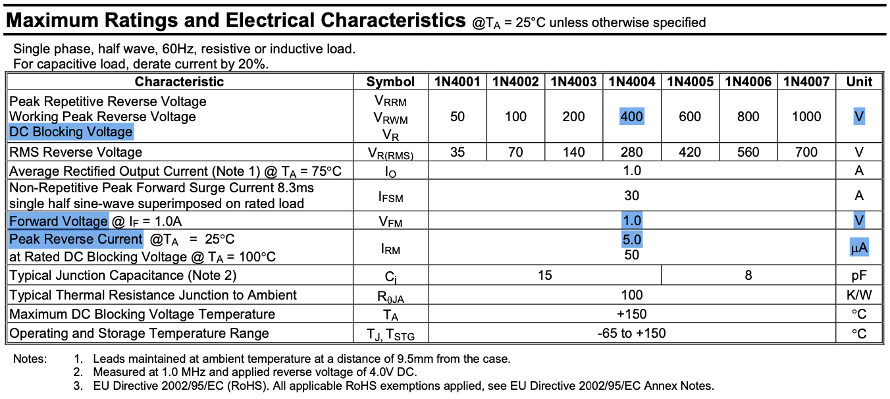
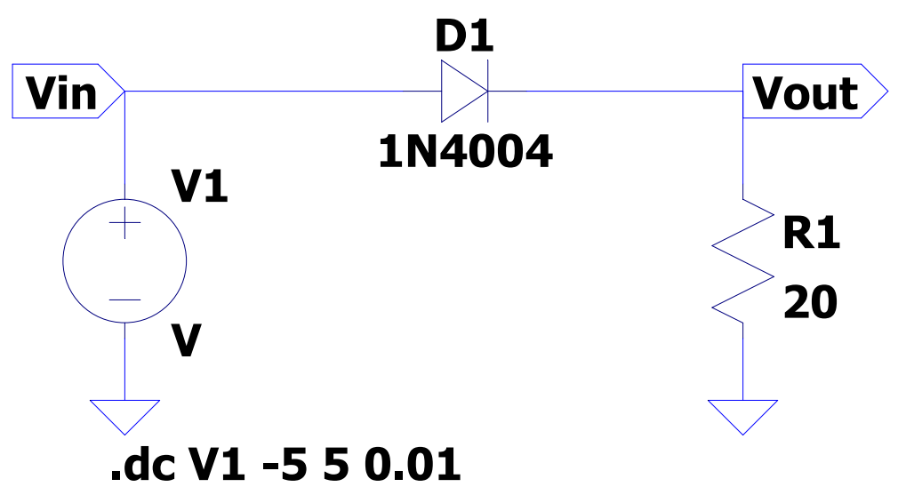
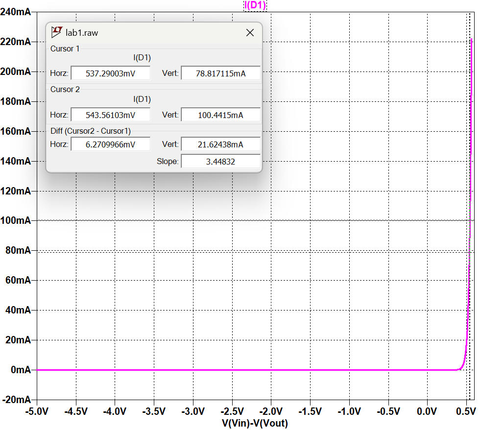
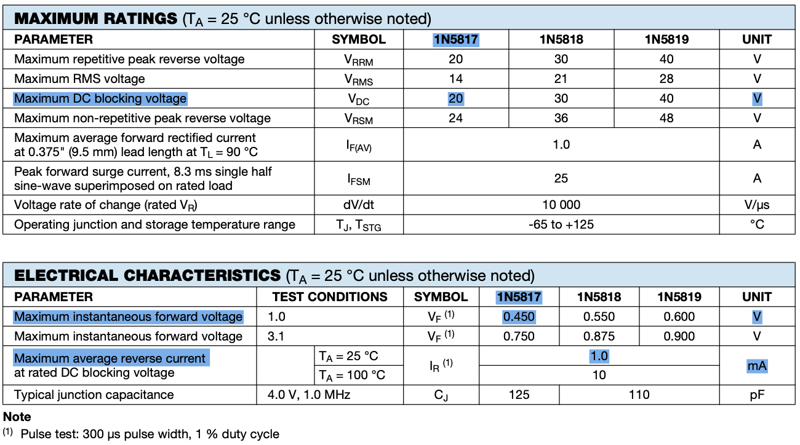

### Contents

1. PN Junction Diode \
  Typical characteristic values of 1N4004 \
  Current-voltage characteristic of half-wave rectifier circuit with 1N4004 \
  ..
2. Zener Diode \
  Typical characteristic values of 1N4733 \
  Current-voltage characteristic of half-wave rectifier circuit with 1N4733 \
  Simulated value for zener voltage \
  ..
3. Shottky Diode \
  Typical characteristic values of 1N5817 \
  Current-voltage characteristic of half-wave rectifier circuit with 1N5817 \
  ..

### 1 PN Junction Diode

### Typical Characteristic Values of 1N4004

(DIODES incorporated - 1N4004 datasheet)

|||
|---|---|
|DC Blocking Voltage|$400$V|
|Forward Voltage Drop|$1.0$V|
|Reverse Current|$5.0\mu$A|

### Current-voltage characteristic of half-wave rectifier circuit with 1N4004

  
  
<figcaption align="center"></figcaption>

### 2 Zener Diode

### Typical Characteristic Values of 1N4733

(Bytesonic electronics co. ltd - 1N4733 datasheet)

|||
|---|---|
|Zener Voltage|$5.1$V|
|Forward Voltage Drop|$1.2$V|
|Reverse Leakage Current|$10\mu$A|

### 3 Shottky Diode

### Typical Characteristic Values of 1N5817

(Vishay semiconductors - 1N5817 datasheet)

|||
|---|---|
|DC Broking Voltage|$20$V|
|Forward Voltage Drop|$0.45$V|
|Reverse Current|$1.0m$A|
