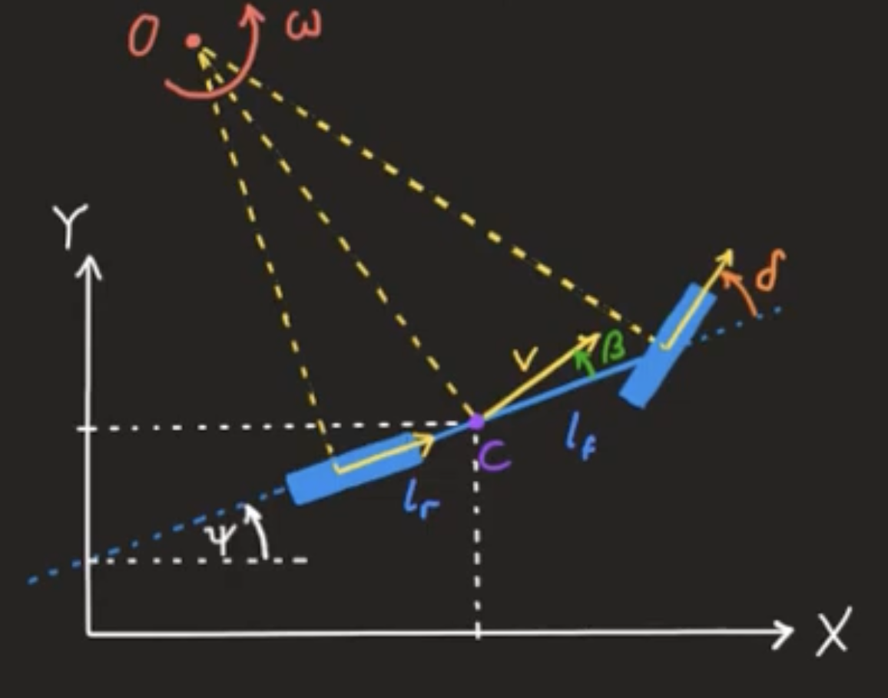

# Notation

- $x$: absolute position x (m)
- $y$: absolute position y (m)
- $\psi$: yaw (deg)
- $v$: velocity (m/s)
- $\delta$: steering angle (deg)
- $\beta:$ side slip angle

State and action

$$
x =
\begin{bmatrix}
  x \\
  y \\
  \psi \\
  v \\
  \delta \\
\end{bmatrix}, \;\;\;
u = \delta
$$

# Kinematic Bycycle Model (Single Track Model)

Kinematic Bicycle Model

{: .align-center}

$$
\begin{align*}
  \dot{x} &= v \cos(\psi + \beta) \\
  \dot{y} &= v \sin(\psi + \beta) \\
  \dot{\psi} &= \dfrac{v}{l_r + l_f} \cos\beta \tan\delta \\
\end{align*}
$$

where

$$
\beta = \arctan{\left(\dfrac{l_r}{l_r +l_f} \tan\delta\right)}
$$

# Pacejka Magic Tire Formula

1. Lookahead point와 현재 위치의 벡터 계산

$$
\vec{p}
=
\begin{bmatrix}
  x_{\text{lookahead}} - x \\
  y_{\text{lookahead}} - y \\
\end{bmatrix}
$$

2. 차량의 좌측 방향 벡터

차량의 전방 방향 벡터는 다음과 같다.

$$
\vec{d}
=
\begin{bmatrix}
  \cos{\psi} \\
  \sin{\psi} \\
\end{bmatrix}
$$

차량의 좌측 방향은 방향 벡터를 90 degree 회전시켜야 한다. 90 degree에 해당하는 회전 행렬을 곱한다.

perpendicular vector는 다음과 같다.

$$
\vec{d}_{\bot} =
\begin{bmatrix}
  0 & -1 \\
  1 & 0 \\
\end{bmatrix}
\begin{bmatrix}
  \cos{\psi} \\
  \sin{\psi} \\
\end{bmatrix}
=
\begin{bmatrix}
  -\sin{\psi} \\
  \cos{\psi} \\
\end{bmatrix}
$$

3. 차량의 측면 각도

lookahead vector를 기준으로 얼마나 벗어났는지를 나타내는 측면 각도를 $\eta$라고 하자.

$$
\sin{\eta} = \dfrac{\vec{p} \cdot \vec{d}_{\bot}}{\vert\vert \vec{p} \vert\vert \cdot \vert\vert \vec{d}_{\bot} \vert\vert}
$$

4. 차량의 횡가속도

lateral acceleration

$$
a_{\text{lateral}} = 2 \dfrac{v_{\text{target}}^2}{L_1} \sin{\eta}
$$

5. steering angle

$$
\delta = f(a_{\text{lateral}}, v_{\text{target}})
$$

where $f$ is a look-up table function. Look-up table function $f$는 pacejka의 magic tire model에서 횡가속도와 조향각 간의 관계를 반영하여 생성되었다.

6. command

$$
\begin{align*}
  v_{\text{next}} &= \max{ \left( v_{\text{target}}, 0 \right)} \\
  \delta_{\text{next}} &= \delta \\
\end{align*}
$$