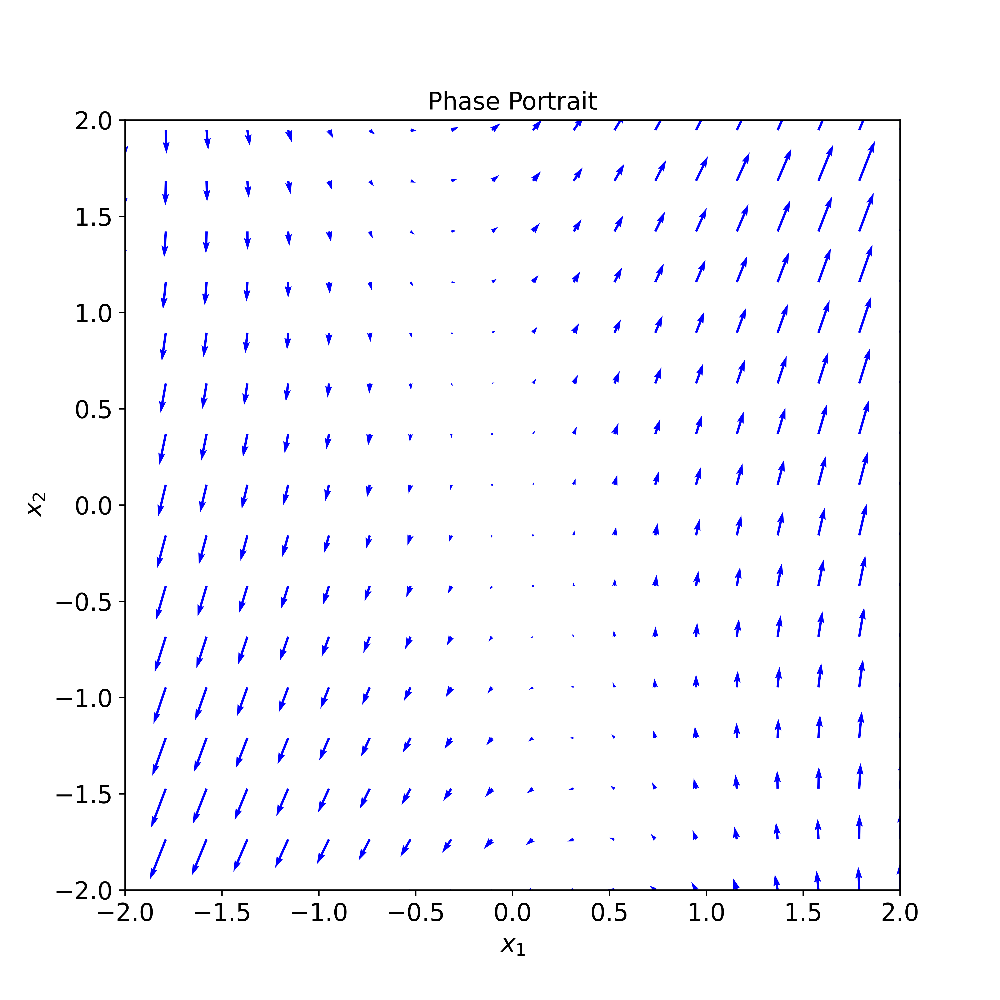
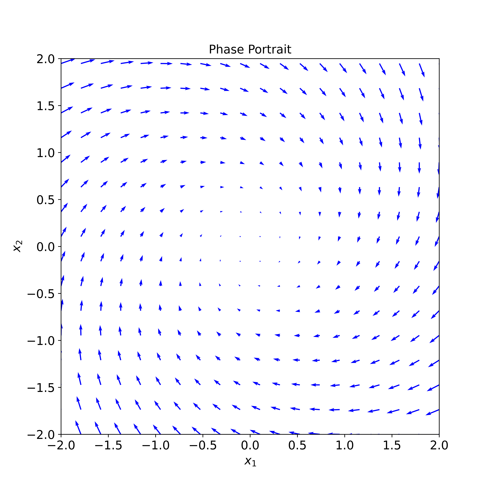
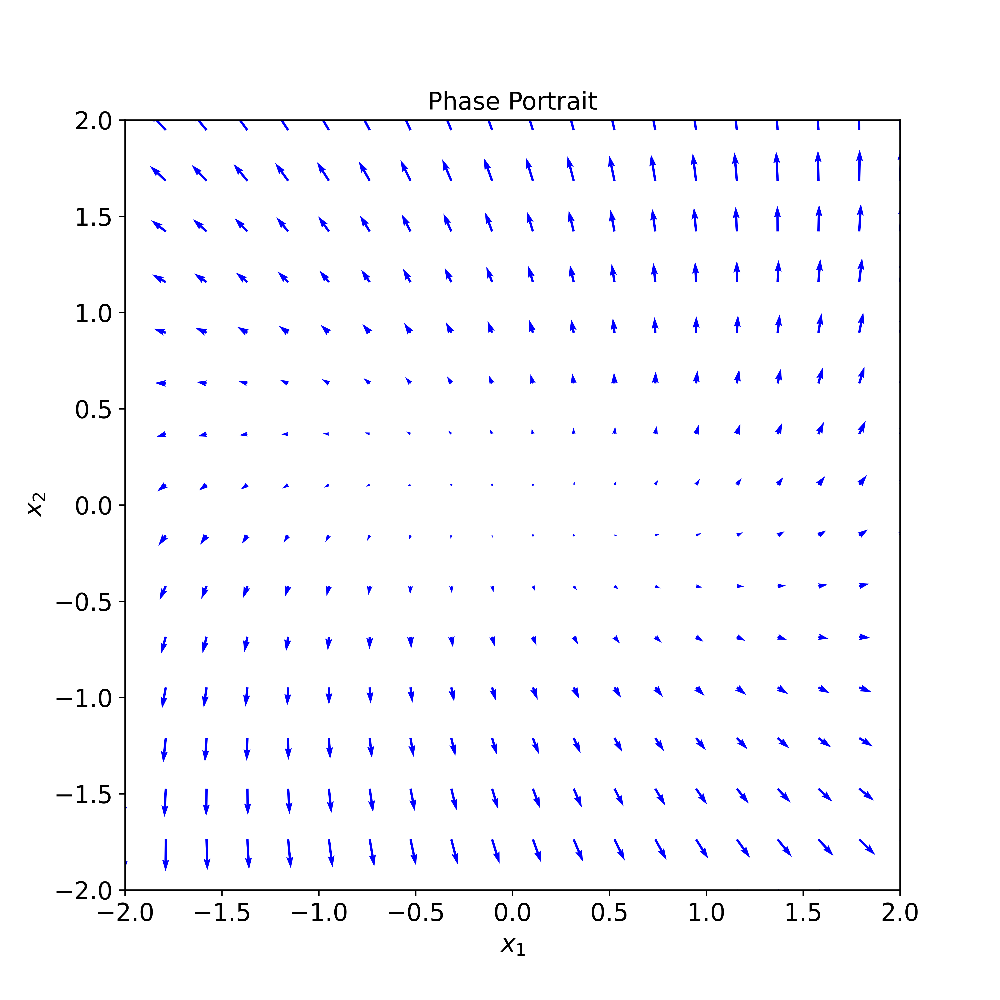

# Two Dimentional Flows

주어진 미분 방정식에 대한 direction feild와 phase portrait을 그릴 수 있다.

Phase portrait을 통해 주어진 미분 방정식의 궤적을 파악할 수 있으며, 미분 방정식의 closed form solution을 모를 때 direction feild를 통해 미분 방정식에 대한 정보를 얻을 수 있다.

우리는 2차원 벡터 $\mathbf{x}$에 대해 다음 꼴의 미분 방정식을 다룬다.

$$
\dot{\mathbf{x}} = A \mathbf{x}
$$

다음 세 가지 2 x 2 matrix $A$에 대해 general solution과 phase portrait, direction field를 그려보자.

$$
A =
\begin{bmatrix}
  1 & 1 \\
  4 & 1 \\
\end{bmatrix}
, \;\;\;
A =
\begin{bmatrix}
  -1/2 & 1 \\
  -1 & -1/2 \\
\end{bmatrix}
, \;\;\;
A =
\begin{bmatrix}
  1 & 1 \\
  1 & -3\\
\end{bmatrix}
$$

## 1

Eigenvalue $\lambda_1 = -1, \lambda_2 = 3$

Eigenvector

$$
v_1 =
\begin{bmatrix}
  1 \\
  -2 \\
\end{bmatrix}, \;\;\;

v_2 =
\begin{bmatrix}
  1 \\
  2 \\
\end{bmatrix}
$$

General Solution is

$$
\begin{align*}
  \mathbf{x} &= C_1 e^{\lambda_1 t} v_1 + C_2 e^{\lambda_2 t} v_2 \\
  &= C_1 e^{-t} \begin{bmatrix} 1\\ -2\\ \end{bmatrix} + C_2 e^{3t}  \begin{bmatrix} 1\\ 2\\ \end{bmatrix}
\end{align*}
$$

Direction field

{: .align-center width="500" height="500"}

## 2

Eigenvalue $\lambda_1 = -\dfrac{1}{2} - i, \lambda_2 = -\dfrac{1}{2} + i$

Eigenvector

$$
v_1 =
\begin{bmatrix}
  1 \\
  -i \\
\end{bmatrix}, \;\;\;

v_2 =
\begin{bmatrix}
  1 \\
  i \\
\end{bmatrix}
$$

General Solution

$$
\begin{align*}
  \mathbf{x}
  &= C_1 e^{\left(-1/2 - i \right)t} \begin{bmatrix} 1\\ -i\\ \end{bmatrix} + C_2 e^{\left(-1/2 + i \right)t}  \begin{bmatrix} 1\\ i\\ \end{bmatrix}
\end{align*}
$$

{: .align-center width="500" height="500"}

## 3

{: .align-center width="500" height="500"}

# High Dimentional Flows

$$
\dot{\mathbf{x}} = A \mathbf{x}
$$

$$
A =
\begin{bmatrix}
  0 & 1 & 1 \\
  1 & 0 & 1 \\
  1 & 1 & 0 \\
\end{bmatrix}
, \;\;\;
\begin{bmatrix}
  0 & 0 & 1 & 0 \\
  0 & 0 & 0 & 1 \\
  -2 & 3/2 & 0 & 0 \\
  4/3 & -3 & 0 & 0 \\
\end{bmatrix}
$$

## 1

Eigenvalue

$$
\lambda_1 = -1, \;\;\;
\lambda_2 = 2
$$

Eigenvector

$$
v_1 = \begin{bmatrix} 1 \\ 1 \\ 1 \\ \end{bmatrix}, \;\;\; v_2 = \begin{bmatrix} -1 \\ -1 \\ 0 \\ \end{bmatrix}, \;\;\; v_3 = \begin{bmatrix} 1 \\ 0 \\ -1 \\ \end{bmatrix}
$$

## 2

Eigenvalue

$$
\lambda_1 = i, \;\;\; \lambda_2 = -i, \;\;\; \lambda_3 = 2i, \;\;\; \lambda_4 = -2i
$$

## Reference

권도현 교수님's applied differential equation - week 4
