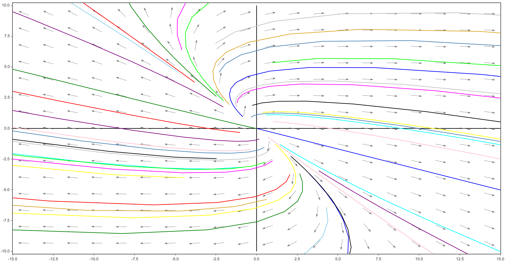
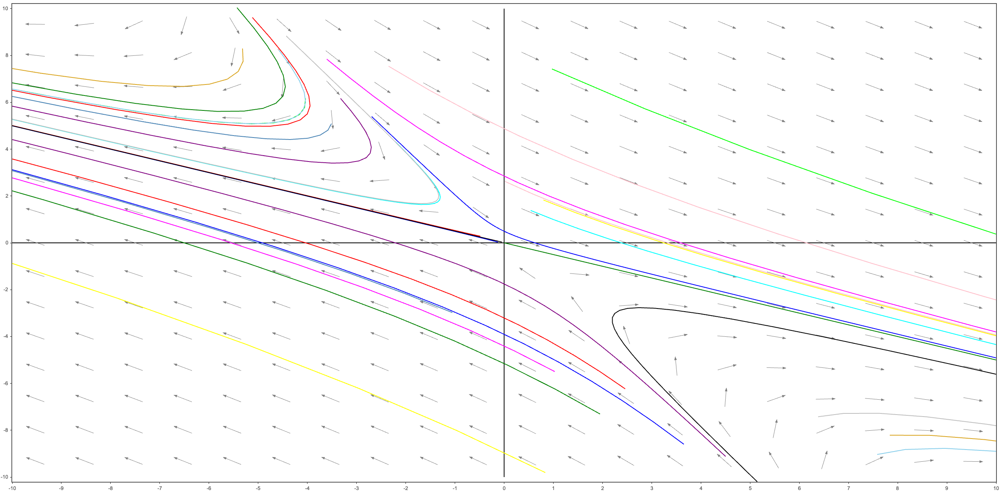
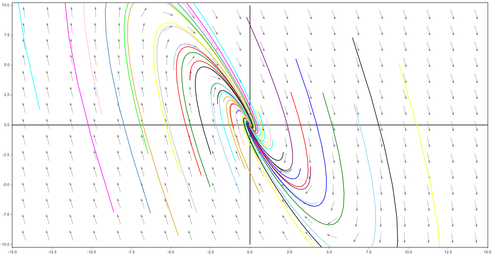

# 1. Phase Plane: Linear System of Equations

많은 미분방정식들이 해석학적인 방법으로는 쉽게 풀리지 않기 때문에 직접 식을 풀지 않고 정성적인 정보를 얻을 수 있는 방법에 대해 알아보자.

다음 미분방정식

$$
\dfrac{d\mathbf{x}}{dt} = \mathbf{A}\mathbf{x}
$$

에 대해 $\mathbf{A}$ (2 by 2) 의 고윳값들이 갖는 특성에 따라 발생할 수 있는 상황을 분류할 수 있다.

1. 같은 부호의 서로 다른 실수 고윳값들
2. 다른 부호의 실수 고윳값들
3. 서로 같은 고윳값
4. 영이 아닌 실수부를 갖는 복소수 고윳값들
5. 순허수 고윳값들

$\det \mathbf{A} \neq 0$인 2차원 연립방정식 $\mathbf{x}' = \mathbf{A}\mathbf{x}$에 대해서만 유효하다. 고차원 연립방정식에서 발생하는 상황들은 본질적으로 2차원 연립방정식에서 발생했던 상황들의 조합이다.

|Eigenvalue|Type of Critical point|Stability|
|---|---|---|
|$r_1 > r_2 > 0$|node|unstable|
|$r_1 < r_2 < 0$|node|asymptotically stable|
|$r_2 < 0 < r_1$|Saddle point|unstable|
|$r_1 = r_2  > 0$|proper or improper node|unstable|
|$r_1 = r_2 < 0$|proper or improper node|asymptotically stable|
|$r_1, r_2 = \lambda \pm i\mu$|||
|$\lambda > 0$|spiral point|unstable|
|$\lambda < 0$|spiral point|asymptotically stable|
|$\lambda = 0$|Center|stable|

## [Case 1] 같은 부호의 서로 다른 실수 고윳값

고윳값이 $r_1, r_2$이고, 이에 대응되는 고유벡터가 $\xi_1, \xi_2$라고 하자.

일반해

$$
\mathbf{x} = c_1 \xi_1 e^{r_1 t} + c_2 \xi_2 e^{r_2 t}
$$

$r_1 < r_2 < 0$이라고 가정하자.

$c_1, c_2$에 관계 없이 $t \rightarrow \infty$이면 $\mathbf{x} \rightarrow 0$. 즉 모든 해들이 원점에서 임계점으로 다가간다.

미분 방정식의 해를 다음과 같이 표현하자.

$$
\begin{align*}
  \mathbf{x} &= c_1 \xi_1 e^{r_1 t} + c_2 \xi_2 e^{r_2 t} \\
  &= e^{r_2 t} (c_1 \xi_1 e^{(r_1 - r_2) t} + c_2 \xi_2) \\
\end{align*}
$$

- 이때 $r_1 - r_2 < 0$이므로 충분히 큰 t에 대해 $c_1 \xi_1 e^{(r_1 - r_2) t}$ 항은 무시해도 될 만큼 작은 크기를 갖게 된다. 따라서 $t \rightarrow \infty$일 때 궤적은 원점으로 다가갈 뿐 아니라 $\xi_2$를 지나는 직선을 향해 갈 것이다.
- 충분히 작은 $t < 0$에 대해 $\xi_1$을 지나는 직선을 향해 갈 것이다.

이때의 원점을 node라고 한다.

{: .align-center width="800" height="800"}

## [Case 2] 다른 부호의 실수 고윳값

고윳값이 $r_1 > 0, r_2 < 0$이고, 이에 대응되는 고유벡터가 $\xi_1, \xi_2$라고 하자.

일반해

$$
\mathbf{x} = c_1 \xi_1 e^{r_1 t} + c_2 \xi_2 e^{r_2 t}
$$

극한

- 해가 $\xi_1$을 지나는 직선 위의 한 초깃점에서 시작한다면 $c_2 = 0$. 따라서 이때의 해는 모든 t에 대하여 $\xi_1$을 지나는 직선 위에 놓이게 되고, $\vert\vert \mathbf{x} \vert\vert \rightarrow 0$
- 해가 $\xi_2$를 지나는 직선 위의 한 초깃점에서 시작한다면 항상 그 직선 위에 높여 있게 되고 $t \rightarrow \infty$ 일 때, $\vert\vert \mathbf{x} \vert\vert \rightarrow 0$
- 다른 점에서 시작하는 해들은 $t$가 클 때, 양의 지수를 포함하는 함수가 일반해의 주요 항이 되므로 양의 고윳값 $r_1$에 대한 고유벡터 $\xi_1$에 의해 결정되는 직선을 향이 한없이 점근한다.
- 원점에서 임계점으로 다가가는 해는 $\xi_2$에 의해 결정되는 직선 위에서 시작하는 해들밖에 없다.

다음 그림은 고윳값들이 모두 실수이고 부호가 반대인 전형적인 경우이다. 이때의 원점을 saddle point라고 한다.

{: .align-center width="800" height="800"}

## [Case 3] 서로 같은 고윳값

$r_1 = r_2 = r < 0$ 인 경우만 살펴보자. 양수인 경우에는 궤적이 움직이는 방향만 반대이고 모양은 동일하다.

중복되는 고윳값이 두 개의 독립적인 고유벡터를 갖는지, 하나의 고유벡터를 갖는지에 따라 두 가지 경우로 세분화된다.

### 두 개의 독립 고유벡터

일반해

$$
\mathbf{x} = c_1 \xi_1 e^{r t} + c_2 \xi_2 e^{r t}
$$

Proper node (or start point)

### 한 개의 독립 고유벡터

일반해

$$
\mathbf{x} = c_1 \xi e^{r t} + c_2 (\xi t e^{r t} + \eta e^{rt})
$$

## [Case 4] 영이 아닌 실수부를 갖는 복소수 고윳값

{: .align-center width="800" height="800"}

## [Case 5] 순허수 고윳값들

## 한편

한편

$$
A =
\begin{bmatrix}
  a_{11} & a_{12} \\
  a_{21} & a_{22} \\
\end{bmatrix}
,\;\;\;
p = a_{11} + a_{22},
\;\;\;
q = a_{11}a_{22} - a_{12}a_{21}
$$

라고 정의하면 행렬 $A$에 대해 발생할 수 있는 상황을 분석하는 데 용의하다.

$$
\begin{align*}
  0 &= \det (A - \lambda I) \\
  &= (a_{11} - \lambda)(a_{22} - \lambda) - a_{12}a_{21} \\
  &= \lambda^2 - (a_{11} + a_{22}) \lambda + a_{11}a_{22} - a_{12}a_{21} \\
  &= \lambda^2 - p\lambda + q
\end{align*}
$$

한편 선형 미분 방정식 계는 (0, 0)을 유일한 critical point로 갖는다.

# 2.Autonomous Systems and Stability

## Stability and Unstability

자율 연립방정식에 대하여

$$
\mathbf{x}' = \mathbf{f}\mathbf{x}
$$

임계점

$\mathbf{f} = 0$인 점

안정적

주어진 임의의 $\epsilon > 0$에 대해서 이것에 대응하는 적당한 $\delta > 0$가 존재하여 $t = 0$에서

$$
\vert\vert \mathbf{x}(0) - \mathbf{x}^{(0)} \vert\vert < \delta
$$

을 만족하는 연립방정식의 모든 해 $\mathbf{x} = \mathbf{x}(t)$가 모든 t에 대해서 존재하고 모든 $t \geq 0$에 대해

$$
\vert\vert \mathbf{x}(t) - \mathbf{x}^{(0)} \vert\vert < \epsilon
$$

을 만족한다면 연립방정식의 임계점 $\mathbf{x}^{(0)}$가 안정적(stable)이라고 한다.

불안정

안정적이지 않은 임계점을 불안정(unstable)하다고 한다.

점근적으로 안정적

임계점 $\mathbf{x}^{(0)}$가 안정적이고 적당한 $\delta_0 (>0)$ 가 존재하여 해 $\mathbf{x} = \mathbf{x}(t)$가

$$
\vert\vert \mathbf{x}(0) - \mathbf{x}^{(0)} \vert\vert < \delta_0
$$

을 만족할 때

$$
\lim_{t\to0} \mathbf{x}(t) = \mathbf{x}^{(0)}
$$

이면 이때의 임계점 $\mathbf{x}^{(0)}$을 점근적으로 안정적(asymptotically stable)이라고 한다.

## 진동하는 진자

점근 안정성, 안정성, 불안정성이라는 개념은 진동하는 진자를 이용하면 쉽게 눈으로 확인할 수 있다.