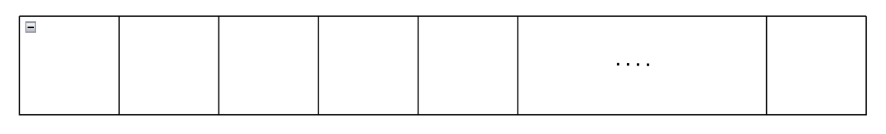

Heat Conduction Equation Problem을 단순화하여 살펴보자.

n개의 방이 있다고 가정한다. 각 방의 온도를 다음과 같이 정의한다.

$$
T_1(t), T_2(t), \dots, T_n(t)
$$

{: .align-center}

각 방간의 열교환을 어떻게 미분방정식으로 표현할 수 있을까? 직관을 발휘해보자.

1) 가장 먼저 할 수 있는 생각은 모든 방의 온도의 합은 보존될 것 같다.

$$
T_1(t) + T_2(t) + \dots + T_n(t) = C
$$

2) 한 방의 온도의 변화는 옆 방과의 온도 차에 의해 발생할 것 같다.

$$
\begin{align*}
  T_1'(t) &= k_1 (T_2(t) - T_1(t)) \\
  T_2'(t) &= k_1 (T_1(t) - T_2(t)) + k_2 (T_3(t) - T_2(t)) \\
  \vdots
\end{align*}
$$

열을 다음과 같아 정의하여 더 정밀하게 표현하자. $(k_j > 0)$

$Q_j$는 j번째 방에서 j+1 번째 방으로 이동하는 열의 흐름으로 정의하자.

$$
Q_j(t) = k_j (T_j(t) - T_{j+1}(t))
$$

열에 대한 정의를 이용하여 각 방의 온도를 다시 표현할 수 있다.

$$
\begin{align*}
  T_1'(t) &= - k_1(T_1(t) - T_2(t)) = - Q_1(t) \\
  T_2'(t) &= - k_2(T_2(t) - T_3(t)) + k_1(T_1(t) - T_2(t)) = - Q_2 + Q_1 \\
  T_3'(t) &= - Q_3 + Q_2 \\
  \vdots \\
  T_n'(t) &= Q_{n-1} \\
\end{align*}
$$

모두 더하면

$$
T_1'(t) + T_2'(t) + \dots + T_n'(t) = 0
$$

이므로 적분하여 1)이 성립함을 알 수 있다.

행렬을 이용하여 미분 방정식을 표현하자.

$$
\begin{bmatrix}
  T_1' \\
  T_2' \\
  \vdots \\
  T_n'
\end{bmatrix}
=
\begin{bmatrix}
  -k_1 & k_1 & 0 & \dots & 0 \\
  k_1 & -k_1-k_2 & k_2 & \dots & 0 \\
  0 & k_2 & -k_2-k_3 & \dots & 0 \\
  \vdots &0 & \ddots & 0  &\vdots \\
  0 & \dots & 0 & k_{n-2}-k_{n-1} & k_1 \\
  0 & \dots & 0 & k_1 & -k_n - 1 \\
\end{bmatrix}
\begin{bmatrix}
  T_1 \\
  T_2 \\
  \vdots \\
  T_n
\end{bmatrix}
$$

다음과 같이 정의한다면

$$
X =
\begin{bmatrix}
  T_1 \\
  T_2 \\
  \vdots \\
  T_n
\end{bmatrix}
, \;\;\;
A =
\begin{bmatrix}
  -k_1 & k_1 & 0 & \dots & 0 \\
  k_1 & -k_1-k_2 & k_2 & \dots & 0 \\
  0 & k_2 & -k_2-k_3 & \dots & 0 \\
  \vdots &0 & \ddots & 0  &\vdots \\
  0 & \dots & 0 & k_{n-2}-k_{n-1} & k_1 \\
  0 & \dots & 0 & k_1 & -k_n - 1 \\
\end{bmatrix}
$$

다음과 같이 나타낼 수 있다.

$$
X'
=
A
X
$$

# General Solution of Heat Conduction Equation

$n = 2$ 일 때

$$
A =
\begin{bmatrix}
  -1 & 1 \\
  1 & -1 \\
\end{bmatrix}
$$

이므로 일반해는

$$
x(t) =
C_1
\begin{bmatrix}
  1 \\
  1 \\
\end{bmatrix}
+
C_2
e^{-2t}
\begin{bmatrix}
  1 \\
  -1 \\
\end{bmatrix}
$$

$n = 3$ 일 때

$$
A =
\begin{bmatrix}
  -1 & 1 & 0 \\
  1 & -2 & 1 \\
  0 & 1 & -1 \\
\end{bmatrix}
$$

이므로 일반해는

$$
x(t) =
C_1
\begin{bmatrix}
  1 \\
  1 \\
  1 \\
\end{bmatrix}
+
C_2
e^{-t}
\begin{bmatrix}
  1 \\
  0 \\
  -1 \\
\end{bmatrix}
+
C_3
e^{-3t}
\begin{bmatrix}
  1 \\
  -2 \\
  1 \\
\end{bmatrix}
$$

$n = 4$ 일 때

$$
A =
\begin{bmatrix}
  -1 & 1 & 0 & 0 \\
  1 & -2 & 1 & 0 \\
  0 & 1 & -2 & 1 \\
  0 & 0 & 1 & -1 \\
\end{bmatrix}
$$

이므로 일반해는

$$
x(t) =
C_1
\begin{bmatrix}
  1 \\
  1 \\
  1 \\
  1 \\
\end{bmatrix}
+
C_2
e^{-2t}
\begin{bmatrix}
  1 \\
  -1 \\
  -1 \\
  1 \\
\end{bmatrix}
+
C_3
e^{(-\sqrt{2} -2)t}
\begin{bmatrix}
  -1 \\
  \sqrt{2} + 1 \\
  -\sqrt{2} - 1 \\
  1 \\
\end{bmatrix}
+
C_4
e^{(\sqrt{2} -2)t}
\begin{bmatrix}
  -1 \\
  -\sqrt{2} + 1 \\
  \sqrt{2} - 1 \\
  1 \\
\end{bmatrix}
$$

$n = n$ 일 때

...

# Derivation of Heat Equation

u에 대한 방정식을 찾아보자.

n개의 방으로 나뉜 위 아래가 단열된 막대기를 다시 살펴보자.

가장 왼쪽 지점을 $x = 0$ 으로 정의하고 가장 오른쪽 지점을 $x = L$ 로 정의하자.

그러면 $x$의 정의역을 다음과 같이 표현할 수 있다.

$$
\Omega = [x : 0 \leq x \leq L] = [0, L]
$$