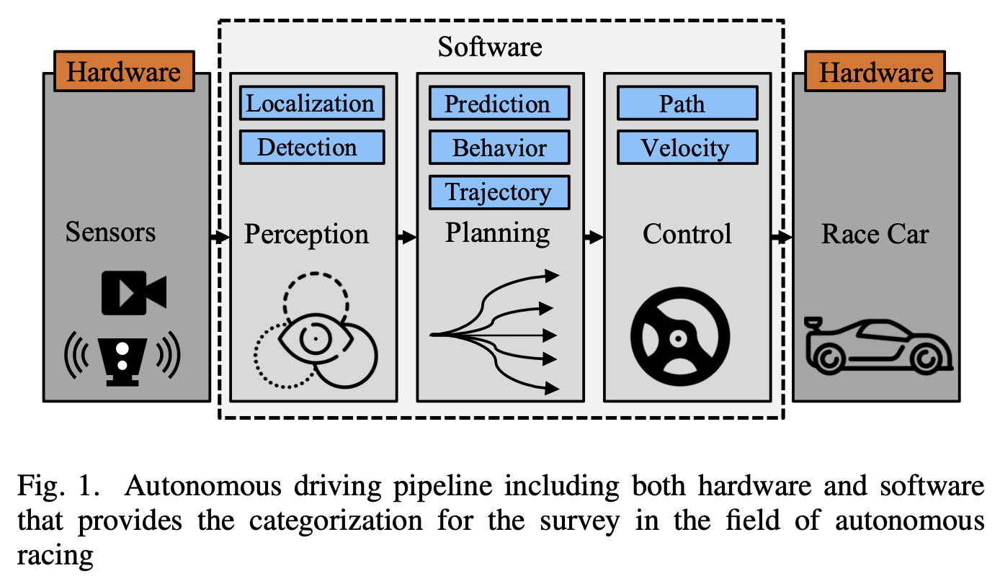
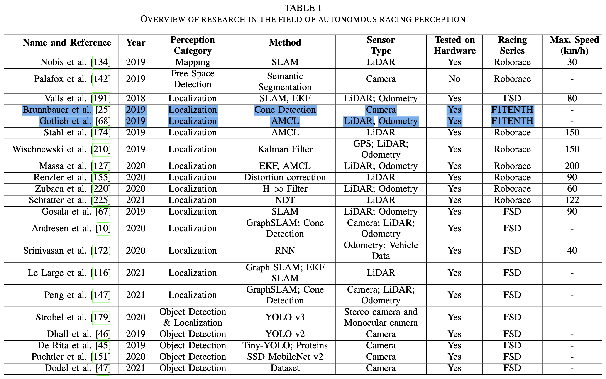
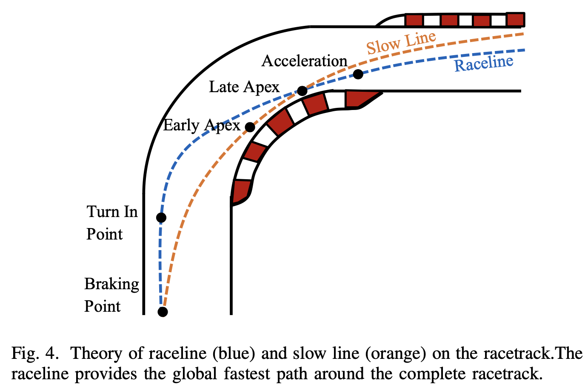
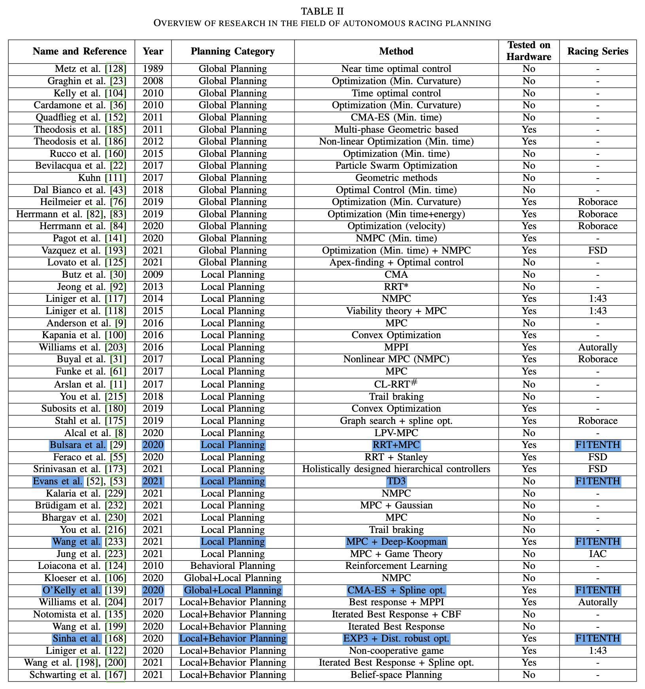

## ABSTRACT

- First holistic survey that covers the research in the field of autonomous racing
- Autonomous racecars / algorithms, methods and approaches that are used in the fields of perception, planning, and control + end-to-end learning
- Comprehensive overview of the current autonomous racing platforms emphasizing both the software-hardware co-evolution
- Summary of open research challenges

## 1 INTRODUCTION

### *A. Contribution*

1. Cover comprehensively the topic of autonomous vehicle racing for both software and hardware developments.
2. Compare the differenct approaches and explain their algorithmic setup in perception, planning, and control. + DNN, RL.
3. Compare the current autonomous racing competitions - hardware, racing enviroment, orgranization.
4. Present a list of open research challenges in the field of autonomous racing.

### *B. Preliminart Remark*

## 2 AUTONOMOUS RACING SOFTWARE

### *A. Perception*

- Perception : detecting object, detecting the free space, mapping the environment, localizing the autonomous vehicle
- Autonomous racing $\rightarrow$ "How fast is too fast?" (Falanga et al.) $\rightarrow$ The maximum latency an autonomous system can tolerate to guarantee safety (not crashing in an object) is related to the **desired speed**, the **agility of the system** (e.g. the maximum acceleration it can produce) and the **perception parameter of the sensors** (e.g. the sensing range).
- Fundemental problems for autonomous racing perception
  - High speed object detection
  - High speed localization and state estimation
  - Localization on wide areas without specific landmarks
  - Percise localization information necessary to chieve high dynamic trajectory planning and control
- The current state of the art in autonomous racing is heavily based on single vehicle races. Therefore the subcategory of object detection algorithms for high speed applications was not given much attension.

### *B. Planning*

|Planner|Role||
|---|---|---|
|Global Planner|providing an optimal path (raceline) around the racetrack|optimizing for the lowest lap time|
|Local Planner (motion planner)|avoiding obstacles while still provide a fast and and reliable path that does not deviate too much from the optimal global reaceline|operate in a certain time horizon|
|Behavior Planner|high-level mission planning of the racecar|the decision making about overtaking maneuvers (overtaking left / overtaking right / stay behind), the energy management strategy, interaction with other vehicles and the reaction to inputs from race control(e.g. flags, speed limits)|

- Fundemental problems for autonomous racing planning
  - Minimum-time optimization for a global optimal raceline
  - Long local planning horizon for recursive feasibility
  - Obstacle avoidance and vehicle reaction at high speeds
  - High replanning frequency for real-time capability
  - Decision making under high uncertainty
  - Interaction planning with non-cooperative agents

#### Global Planning

#### Local Planning

#### Behavior Planning

## 3 AUTONOMOUS RACING HARDWARE: VEHICLES AND COMPETITIONS

## 4 SUMMARY AND CONCLUSIONS
