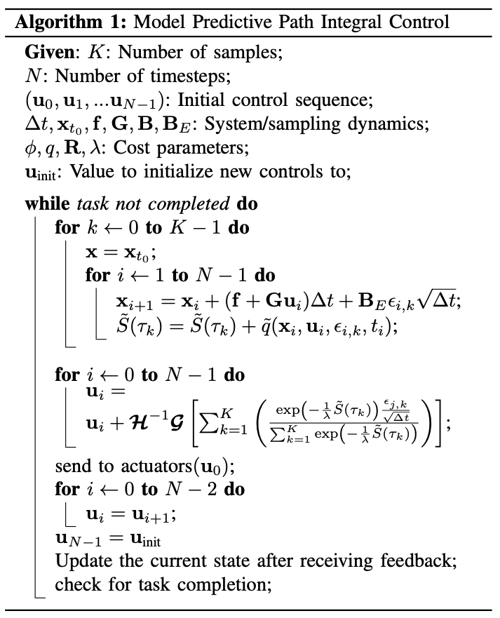

# Abstract

The algorithm is based on a stochastic optimal control framework using a fundamental relationship between the information theoretic notions of gree energy and relative entropy.

# 1. Introduction

The method developed here is able to generate new trajectories in real-time

The method we develop is a model predictive control algorithm based on the path integral control framework

We do not split the problem into a planning and execution phase, which allows for a simple problem formulation and optimal behavior with respect to the system dynamics.

# 2. Stochastic Trajectory Optimization

The key insight which allows for this is the use of a fundamental relationship between the information theoretic notions of free energy and relative entropyy (also know as KL-Divergence).

## A. Problem Formulation

Notation

- state at time $t$: $\mathbf{x_t} \in \mathbb{R}^n$
- control at time $t$: $\mathbf{u}_t \in \mathbb{R}^m$
- function which maps time to control inputs: $\mathbb{u} (\cdot) : [t_0, T] \rightarrow \mathbb{R}^m$
- trajectory of the system: $\tau: [t_0, T] \rightarrow \mathbb{R}^n$

In classical stochastic optimal control setting we seek a control sequence $\mathbf{u} (\cdot)$ such that:

$$
\begin{align}
  \mathbf{u}^*(\cdot) = \underset{\mathbf{u}(\cdot)}{\operatorname{argmin}} \; \mathbb{E} \left[ \phi (\mathbf{x_T}, T) + \int_{t_0}^T \mathcal{L}(\mathbf{x_t, \mathbf{u}_t, t}) \; dt \right]
\end{align}
$$

with respect to

$$
d\mathbf{x} = \mathbf{F}(\mathbf{x}_t, \mathbf{u}_t, t) \; dt + \mathbf{B}(\mathbf{x}_t, t) \; d\mathbf{w}
$$

We constider costs composed of an arbitrary state-dependent term and a quadratic control cost and dynamics which are affine in controls:

$$
\mathcal{L}(\mathbf{x_t, \mathbf{u}_t, t})  = q(\mathbf{x}_t, t) + \dfrac{1}{2}\mathbf{u}^T \mathbf{R}(\mathbf{x}_t, t) \mathbf{u}
\\
\mathbf{F}(\mathbf{x}_t, \mathbf{u}_t, t) = \mathbf{f}(\mathbf{x}_t, t) + \mathbf{G}(\mathbf{x}_t, t) \mathbf{u}_t
$$

An interpretation of path integral control is given in terms of the information theoretic concepts of free energy and relative entropy. (Relative entropy and free energy dualities connections to path integral and kl control) The interpretation is based on the following equality:

$$
\begin{align}
  -\lambda \mathcal{F}(S(\tau)) = \underset{\mathbb{Q}}{\inf} \left[ \mathbb{E} [\mathcal{S} (\tau)] + \lambda \mathbb{D}_{\text{KL}} (\mathbb{Q} \vert\vert \mathbb{P}) \right]
\end{align}
$$

where

$$
\lambda \in \mathbb{R}^+ \\
$$

$\mathcal{S}(\tau)$ is defined as the state-dependent cost-to-go term

$$
\mathcal{S}(\tau) = \phi (\mathbf{x}_T, T) + \int_{t_0}^T q(\mathbf{x}_t, t) dt
$$

the free energy

$$
\log \left( \mathbb{E}_{\mathbb{P}} \left[ \exp \left(-\dfrac{1}{\lambda} \mathcal{S}(\tau) \right) \right] \right)
$$

$\mathbb{P}$ is the probability measure over the space of trajectories induced by the uncontraolled stochastic dynamics

$$
\mathbf{F}(\mathbf{x}_t, \mathbf{u}_t, t) = \mathbf{f}(\mathbf{x}_t, t) + \mathbf{G}(\mathbf{x}_t, t) \mathbf{u}_t
$$

$\mathbb{Q}$ is any probability measure defined over the space of trajectories such that $\mathbb{Q}$ is absolutely continuous with $\mathbb{P}$.

$$
\mathbb{D}_{\text{KL}} (\mathbb{Q} \vert\vert \mathbb{P}) = \mathbb{E}_{\mathbb{Q}} \left[ \log \left( \dfrac{d \mathbb{Q}}{d \mathbb{P}} \right) \right]
$$

The controlled dynamics induce another probability measure on the space of trajectories, which we denote $\mathbb{Q} (\mathbf{u})$. The relative entropy term between the uncontrolled distribution $\mathbb{P}$ and the controlled distribution $\mathbb{Q} (\mathbf{u})$ can be computed by applying Girsanov’s theorem.

$$
\mathbb{D}_{\text{KL}} (\mathbb{Q} (\mathbf{u}) \vert\vert \mathbb{P}) = \dfrac{1}{2} \int_{t_0}^T \mathbf{u}_t^T \mathbf{G} (\mathbb{x}_t, t)^T \Sigma (\mathbf{x}_t, t)^{-1} \mathbf{G}(x_t, t) \mathbf{u}_t dt
$$

where

$$
\Sigma (\mathbb{x}_t, t) = \mathbf{B} (\mathbf{x}_t, t) \mathbf{B} (\mathbf{x}_t, t)^T
$$

If we assume that the control cost matrix takes the form:

$$
\mathbf{R}(\mathbf{x}_t, t) = \lambda \mathbf{G}(\mathbf{x}_t, t)^T \Sigma (\mathbf{x}, t)^{-1} \mathbf{G} (\mathbf{x}_t, t)
$$

we get the following correspondence between the right hand side of (1) and (2):

$$
\mathbb{E}_{\mathbb{Q} (\mathbf{u})} \left[ \mathcal{S} (\tau) \right] + \lambda \mathbb{D}_{\text{KL}} (\mathbb{Q} \vert\vert \mathbb{P}) = \mathbb{E}_{\mathbb{Q}(\mathbf{u})}\left[ \mathcal{S}(\tau) + \dfrac{1}{2} \int_{t_0}^T \mathbf{u}_t^T \mathbf{R} (\mathbf{x}_t, t) \mathbf{u}_t dt \right]
$$

The form of the optimal probability measure $\mathbb{Q}^*$ can be derived in terms of the Radon-Nikodym derivative with respect to the uncontrolled dynamics

$$
\dfrac{d \mathbb{Q}^*}{d \mathbb{P}} = \dfrac{\exp \left( -\dfrac{1}{\lambda} \mathcal{S} (\tau) \right)}{\mathbb{E}_{\mathbb{P}} \left[ \exp \left( -\dfrac{1}{\lambda} \mathcal{S}(\tau) \right) \right]}
$$

Previous works (E. A. Theodorou and E. Todorov, “Relative entropy and free energy dualities: Connections to path integral and kl control,” in Decision and Control (CDC), 2012 IEEE 51st Annual Conference on. IEEE, 2012 / E. A. Theodorou, “Nonlinear stochastic control and information the- oretic dualities: Connections, interdependencies and thermodynamic interpretations,” Entropy, vol. 17, no. 5, p. 3352, 2015.) make these connections between the information theoretic notions of free energy, relative entropy, and classical optimal control theory. However, they do not provide a method for computing a control law independent of the HJB-equation, as we do here.

The main idea in our approach is that since we have the form of the optimal distribution, it is possible to pursue the following optimization scheme: instead of trying to directly solve the optimal control problem by computing the solution to the stochastic HJB equation, we can solve the mini- mization problem defined by (4) by moving the probability distribution induced by the controller, Q(u), as close as possible to the optimal probability measure, $\mathbb{Q}^*$, defined by the Radon-Nikodym derivative $\dfrac{d\mathbb{Q}^*}{d\mathbb{P}}$. We obtain the following optimization problem:

$$
\mathbf{u}^*(\cdot) = \underset{\mathbf{u}}{\argmin} \; \mathbb{D}_{\text{KL}} (\mathbb{Q}^* \vert\vert \mathbb{Q}(\mathbf{u}))
$$

# 3. Model Predictive Control Algorithm

{: .align-center}
