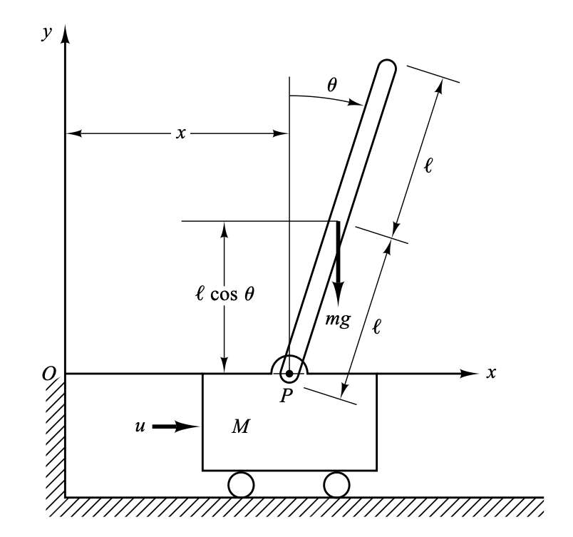
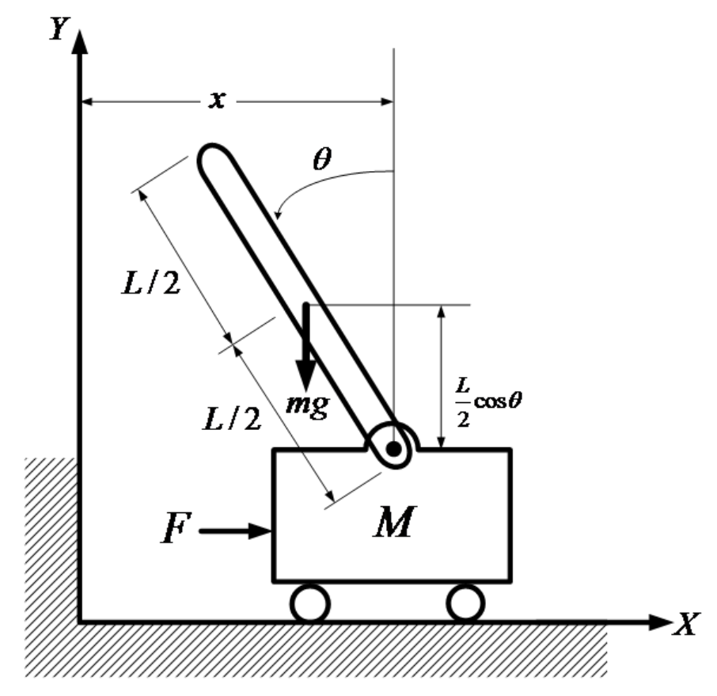
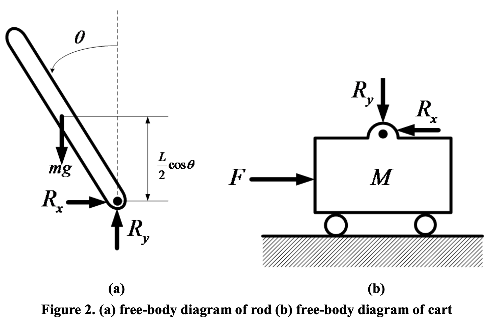
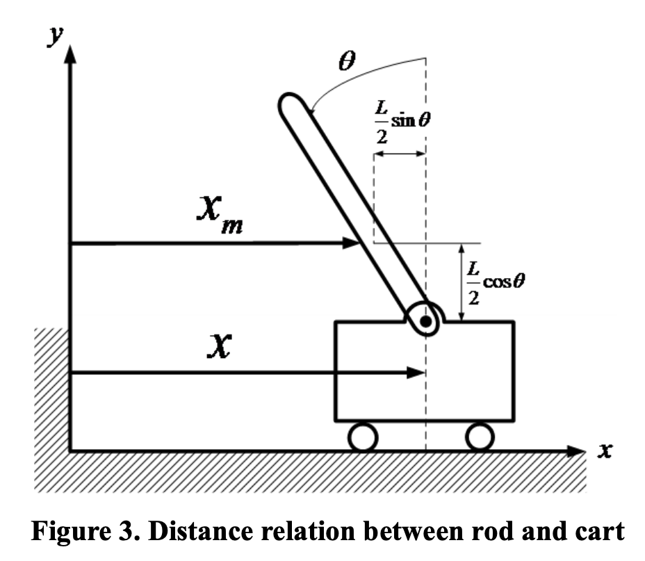

Cart Pole을 수학적으로 모델링하자.

# Assumptions

- 카트와 바닥 간의 마찰은 없다고 가정한다.
- 카트와 막대는 모두 질량 분포가 일정하여 막대의 중력이 막대의 기하학적 중심에 작용한다고 가정한다.

# Dynamic Model

뉴턴 역학을 이용해서 inverted pendulum을 모델링할 수 있다.

{: .align-center width="400" height="200"}

{: .align-center width="400" height="200"}

- $x$ : Distance of cart from initial position [$m$]
- $\theta$ : Tilt angle of rod [$rad$]
- $M$ : Mass of Cart [$kg$]
- $m$ : Mass of rod [$kg$]
- $I$ : Inertia of rod [kg $\cdot m^2$]
- $L$ : Length of rod [$m$]
- $F$ : Force applied at cart [$N$]

{: .align-center width="400" height="200"}

카트와 막대 간의 반력을 $R$라 정의하자.

Cart와 pole을 하나의 계로 잡고 뉴턴 운동 법칙을 적용하자.

  $$
  \begin{align}
    & F = R_x = (M + m) a \\
  \end{align}
  $$

Pole 계에 대해 뉴턴 운동 법칙을 적용하자.

  $$
  \begin{align}
    & \sum F'_x = R_x = m\ddot{x}_m \\
    & \sum F'_y = R_y - mg = m \ddot{y_m} \\
  \end{align}
  $$

Cart 계에 대해 뉴턴 운동 법칙과 돌림힘 법칙을 적용하자.

  $$
  \begin{align}
    & \sum F_x = F - R_x = M\ddot{x} \\
    & R_x \dfrac{L}{2} \cos\theta + R_y \dfrac{L}{2}\sin\theta = I\ddot{\theta} \\
  \end{align}
  $$

{: .align-center width="400" height="200"}

위 그림에서 $x$와 $x_m$ 간의 관계를 얻을 수 있다.

  $$
  \begin{align}
    & x_m = x - \dfrac{L}{2} \sin\theta \\
    & y_m = \dfrac{L}{2} \cos\theta \\
  \end{align}
  $$

6, 7번 식을 미분한다.

  $$
  \begin{align*}
    & \dot{x}_m = \dot{x} - \dfrac{L}{2} \dot{\theta} \cos\theta \\
    & \dot{y}_m = -\dfrac{L}{2} \dot{\theta} \sin\theta \\
    & \ddot{x}_m = \ddot{x} + \dfrac{L}{2} \dot{\theta}^2 \sin\theta - \dfrac{L}{2} \ddot{\theta} \cos\theta \\
    & \ddot{y}_m = -\dfrac{L}{2} \dot{\theta}^2 \cos\theta - \dfrac{L}{2} \ddot{\theta} \sin\theta
  \end{align*}
  $$

이를 2, 3번 식에 대입한다.

  $$
  \begin{align*}
    R_x
    &= m  \left[ \ddot{x} + \dfrac{L}{2} \dot{\theta}^2 \sin\theta - \dfrac{L}{2} \ddot{\theta} \cos\theta \right] \\
    &= m \ddot{x} + m \dfrac{L}{2} \dot{\theta}^2 \sin\theta - m \dfrac{L}{2} \ddot{\theta} \cos\theta \\
    R_y
    &= mg + m \left[ -\dfrac{L}{2} \dot{\theta}^2 \cos\theta - \dfrac{L}{2} \ddot{\theta} \sin\theta \right] \\
    &= mg - m \dfrac{L}{2} \dot{\theta}^2 \cos\theta - m \dfrac{L}{2} \ddot{\theta} \sin\theta
  \end{align*}
  $$

이를 4, 5번 식에 대입한다.

  $$
  \begin{align*}
    & F = (M + m) \ddot{x} + m \dfrac{L}{2} (\dot{\theta}^2 \sin\theta - \ddot{\theta} \cos\theta) \\
    & I \ddot{\theta} = mg\dfrac{L}{2} \sin\theta + m \dfrac{L}{2} \ddot{x} \cos\theta - m \left( \dfrac{L}{2} \right)^2 \ddot{\theta} \\
  \end{align*}
  $$

정리하여 다음 식을 얻는다.

  $$
  \begin{align*}
    \ddot{\theta}
    &= \dfrac{1}{(M+m) \left( I + m (L/2)^2 \right) - m^2 (L/2)^2 \cos^2\theta}  \left[ -m^2 \left(\dfrac{L}{2}\right)^2 \dot{\theta}^2 \sin\theta \cos\theta + (M + m) mg \dfrac{L}{2} \sin\theta + m \dfrac{L}{2} \cos\theta F \right] \\
    \ddot{x}
    &= \dfrac{1}{(M+m) \left( I + m (L/2)^2 \right) - m^2 (L/2)^2 \cos^2\theta} \left[  m^2 \left(\dfrac{L}{2}\right)^2 g \sin\theta \cos\theta - m \left(I + m \left(\dfrac{L}{2}\right)^2 \right) \dfrac{L}{2} \dot{\theta}^2 \sin\theta + \left(I + m \left(\dfrac{L}{2}\right)^2 \right) F \right] \\
  \end{align*}
  $$

  $$
  \begin{align*}
    \ddot{\theta}
    &= \dfrac{-m \dfrac{L}{2} \dot{\theta}^2 \sin\theta \cos\theta + (M + m)g \sin\theta + F\cos\theta}{\dfrac{2}{mL}(M + m) I + \dfrac{L}{2} \left[ M + m \sin^2\theta \right]} \\
    \ddot{x}
    &= \dfrac{mg\sin\theta \cos\theta - \left( \dfrac{2}{L}I + m \dfrac{L}{2} \right)\dot{\theta}^2 \sin\theta + \left( \dfrac{4}{mL^2} I + 1\right) F}{\dfrac{4}{mL^2}(M + m) I + \left[ M + m \sin^2\theta \right]}
  \end{align*}
  $$

# Continuous State Space Model

상태 변수와 입력을 다음과 같이 정의한다.

  $$
  \mathbb{x}(t) =
  \begin{bmatrix}
    x_1(t) \\
    x_2(t) \\
    x_3(t) \\
    x_4(t) \\
  \end{bmatrix} =
  \begin{bmatrix}
    x(t) \\
    \dot{x}(t) \\
    \theta(t) \\
    \dot{\theta}(t) \\
  \end{bmatrix} =
    \begin{bmatrix}
    x(t) \\
    v(t) \\
    \theta(t) \\
    w(t) \\
  \end{bmatrix}
  , \;\;\;
  u(t) = F(t)
  $$

그러면 정리한 식을 $\dot{x} = f(x, u)$ 꼴의 비선형 상태 공간 모델로 나타낼 수 있다.

  $$
  \begin{align*}
    \dot{x_1} &= x_2 \\
    \dot{x_2} &= \dfrac{mg\sin x_3 \cos x_3 - \left( \dfrac{2}{L}I + m \dfrac{L}{2} \right)x_4^2 \sin x_3 + \left( \dfrac{4}{mL^2} I + 1\right) u}{\dfrac{4}{mL^2}(M + m) I + \left[ M + m \sin^2x_3 \right]} \\
    \dot{x_3} &= x_4 \\
    \dot{x_4} &= \dfrac{-m \dfrac{L}{2} x_4^2 \sin x_3 \cos x_3 + (M + m)g \sin x_3 + F\cos x_3}{\dfrac{2}{mL}(M + m) I + \dfrac{L}{2} \left[ M + m \sin^2 x_3 \right]} \\
  \end{align*}
  $$

이를 $\dot{x} = f(x) + g(x) u$ 꼴로 나타내자.

  $$
  \begin{bmatrix}
    \dot{x_1} \\
    \dot{x_2} \\
    \dot{x_3} \\
    \dot{x_4} \\
  \end{bmatrix}
  =
  \begin{bmatrix}
    x_2 \\
    \dfrac{mg\sin x_3 \cos x_3 - \left( \dfrac{2}{L}I + m \dfrac{L}{2} \right)x_4^2 \sin x_3}{\dfrac{4}{mL^2}(M + m) I + \left[ M + m \sin^2x_3 \right]} \\
    x_4 \\
    \dfrac{-m \dfrac{L}{2} x_4^2 \sin x_3 \cos x_3 + (M + m)g \sin x_3}{\dfrac{2}{mL}(M + m) I + \dfrac{L}{2} \left[ M + m \sin^2 x_3 \right]} \\
  \end{bmatrix}
  +
  \begin{bmatrix}
    0 \\
    \dfrac{\dfrac{4}{mL^2} I + 1}{\dfrac{4}{mL^2}(M + m) I + \left[ M + m \sin^2x_3 \right]} \\
    0 \\
    \dfrac{\cos x_3}{\dfrac{2}{mL}(M + m) I + \dfrac{L}{2} \left[ M + m \sin^2 x_3 \right]} \\
  \end{bmatrix}
  u
  $$

# Discrete State Space Model

The above model describes the dynamic behavior in continuous-time. However, the required format for the NMPC controller is a discrete-time model.

To achieve the requiredment, we sample the continuous-time system using Euler's method: this is done at a much faster rate than the control interval to provide better accuracy.

Forward Euler Method를 이용하면 다음과 같이 미분 방정식을 차분 방정식으로 바꿀 수 있다.

샘플링 주기를 $T$라 하자.

  $$
  \dot{x} = f(x, u), \;\;\; x_{k+1} = x_k + T \cdot f(x_k, u_k) \\
  $$

  $$
  \begin{bmatrix}
    x_1^{k+1} \\
    x_2^{k+1} \\
    x_3^{k+1} \\
    x_4^{k+1} \\
  \end{bmatrix}
  =
  \begin{bmatrix}
    x_1^{k} \\
    x_2^{k} \\
    x_3^{k} \\
    x_4^{k} \\
  \end{bmatrix}
  +
  T
  \begin{bmatrix}
    x_2^k \\
    \dfrac{mg\sin x_3^k \cos x_3^k - \left( \dfrac{2}{L}I + m \dfrac{L}{2} \right) {x_4^k}^2 \sin x_3^k}{\dfrac{4}{mL^2}(M + m) I + \left[ M + m \sin^2x_3^k \right]} \\
    x_4^k \\
  \dfrac{-m \dfrac{L}{2} {x_4^k}^2 \sin x_3^k \cos x_3^k + (M + m)g \sin x_3^k}{\dfrac{2}{mL}(M + m) I + \dfrac{L}{2} \left[ M + m \sin^2 x_3^k \right]} \\
  \end{bmatrix}
  +
  T
  \begin{bmatrix}
    0 \\
    \dfrac{\dfrac{4}{mL^2} I + 1}{\dfrac{4}{mL^2}(M + m) I + \left[ M + m \sin^2x_3^k \right]} \\
    0 \\
    \dfrac{\cos x_3^k}{\dfrac{2}{mL}(M + m) I + \dfrac{L}{2} \left[ M + m \sin^2 x_3^k \right]} \\
  \end{bmatrix}
  u
  $$

