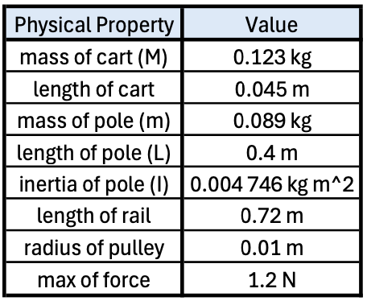
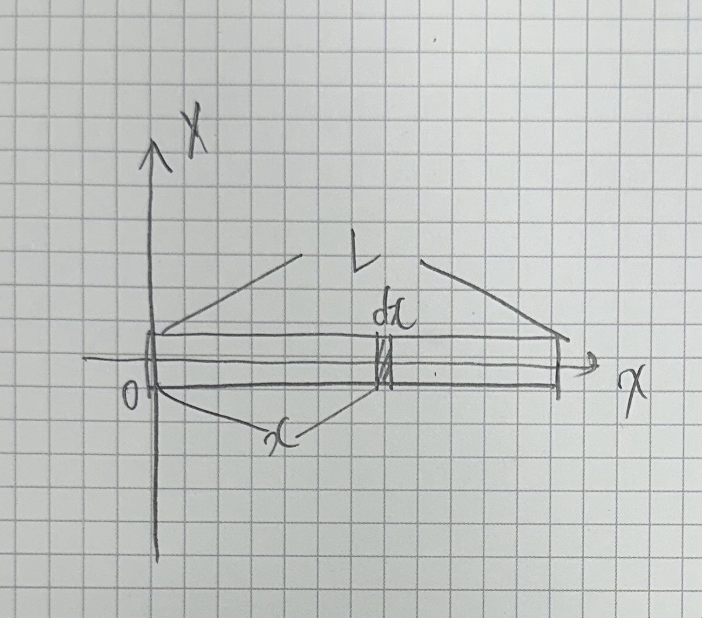

Cart Pole Hardware를 만드는 과정에 대한 이야기이다.

Object

- 더 많은 비용을 지불하더라도 최대한 단순하게 만든다.
- 보수적으로 만든다. 안전하게 만들자. 성공하기 높은 방식으로 만들자.
- 만들기 쉬운 방식으로 만들자.

# Mechanical Design

## 3D Modeling

## Measurement

{: .align-center }

**Inertia**

길이가 L이고 질량이 m인 막대기의 한 쪽 끝을 회전축으로 할 때 관성 모멘트를 구하자.

{: .align-center width="400" height="200"}

미소 질량은 dm이고 그 요소의 길이는 dx이다.

y축에 대한 막대의 관성 모멘트는 다음과 같이 구할 수 있다.

$dm = \lambda dx, \lambda = \dfrac{m}{L}$이므로

$$
\begin{align*}
  I &= \int r^2 dm = \int_0^{L} x^2 (\lambda dx) = \left[ \dfrac{1}{3} x^3 \lambda \right]_0^L = \dfrac{1}{3}\lambda L^3 = \dfrac{1}{3} m L^2
\end{align*}
$$

# Electronics

- Arduino UNO R3, R4
- Unipolar Stepper Motor
- Unipolar Stepper Motor Driver
- Absolute Rotary Encoder
- Photo Interrupt Sensor

## Moter

Stepping Motor : KH42JM2-901

||    Specificatoin    | Description                                                                                         |
|---|:-------------------:|-----------------------------------------------------------------------------------------------------|
|Shaft|    Single Shaft     | 하나의 축만 외부에 노출되어 있다.                                                                                 |
|Drive Method|      Uni-Polar      | 스테핑 모터의 권선 중앙에 중앙 탭이 있는 구조를 사용한다. 구동 시 권선의 중앙 탭을 기준으로 전류가 쿄차하여 흐름으로써 모터를 제어한다.                      |
|Number of Phases|          2          | 2상 모터는 두 개의 전기적 위상으로 구성되어 있으며 이 위상들 간의 전류 교차에 의해 회전한다.                                              |
|Step Angle|    1.8^{$\circ$}    | 모터가 한 스텝 움직일 때 회전하는 각도. 표준치. 한 바퀴 회전 시 200스텝을 필요로 한다.                                               |
|Voltage|        3.42V        |
|Curent|     1.2A/Phase      |
|Holding Torque|   236mN $\cdot$ m   | 전류를 인가받고 있을 때, 정지 상태에서 제공할 수 있는 최대 토크. 이는 모터가 고정된 위치에서 얼마나 강하게 버틸 수 있는지를 나타내며, 위치 고정 어플리케이션에서 중요하다. |
|Detent Torque|  14.7 mN $\cdot$ m  |

{: .align-center }

## Motor Driver

Motor Driver : AM-CS2P

- 라인트레이서용 스테핑 모터 구동 보드
- 스테핑 모터 2개 구동 각 3A
- 소프트웨어적으로 A, /A, B, /B 신호를 인가하여 제어 (1상, 2상, 1-2상 제어 방식으로 제어할 수 있다.)
- 10Pin Cable과 12V 전원 공급 커넥터 연결
- 가변저항을 이용하여 모터에 흐르는 전류량을 조절할 수 있다.
- 외관 크기 : 63.3 x 50.6 mm

{: .align-center width="400" height="200"}

{: .align-center width="400" height="200"}

{: .align-center width="400" height="200"}

{: .align-center width="400" height="200"}

{: .align-center width="400" height="200"}

Stepping motor 제어를 위해서는 arduino uno의 전압 5V보다 높은 전압이 필요한 경우가 대부분이므로 모터 드라이버 칩을 사용한 전용 제어 모듈을 사용하는 것이 일반적이다.

모터 제어를 위해서는 A, /A, B, /B에 해당하는 4개의 제어선 연결을 필요로 한다.

## Encoder

Absolute Rotary Encoder : EN25-Absolute

- 자기장을 이용한 비접촉식 마그네틱 엔코더
- 25mm의 소형 알루미늄 바디, 6mm 스테인리스 샤프트, 듀얼 볼베이링을 적용하여 높은 강성을 구현
- 샤프트 내부에 장착된 자석의 자기장의 방향을 측정하는 방식
- 전원을 껐다 켜더라도 센서의 영점 기준으로 절대 각도값을 출력할 수 있다. (<-> incremental encoder)
- 센서의 측정값은 시리얼 통신으로 출력된다. (절대각도(deg), 누적 회전수(rev), 회전 속도(rpm))
- 주기 : 10ms (100Hz)
- 출력 방식 : RS232 or TTL
- 영점 스위치를 이용해서 영점을 재설정할 수 있음

[출력 예시] $ANG,152.3 ,11.644,110₩r₩n

- 절대 각도 : $152.3 ^\circ$
- 누적 회전수 (전원 on 이후) : 11.644 바퀴
- 회전 속도 : 110 rpm

|Electrical Characteristics & Output Signal||
|---|---|
|입력 전압|DC 5V $\pm$ 5%|
|입력 전류|30mA|
|시리얼 통신 Baud Rate|38400|
|통신 방식|RS232, TTL (5V)|
|업데이트 주기|10ms (100Hz)|

|Serial Output Format & Range||
|---|---|
|절대 각도 (degree)|$0 ^\circ \sim 359.9 ^\circ$|
|누적 회전수 (rev)|$-90,000 \sim 90,000$ % 전원 off 시 초기화|
|RPM|$0 \sim 5,000$ rpm|

|Electrical Wiring|Color||
|---|---|---|
|Power|Red|$5V(+)$|
||Green|$0V(-)$|
|Output|White|RS232|
||Yellow|TTL|

|Mechanical Characteristics||
|---|---|
|축관성모멘트|$1.1g \cdot cm^2$|
|축허용하중|$1kgf$|
|최대허용회전수|$5,000rpm$|
|중량|37g|

{: .align-center width="400" height="200"}

# Reference

https://www.devicemart.co.kr/goods/view?no=15454627
