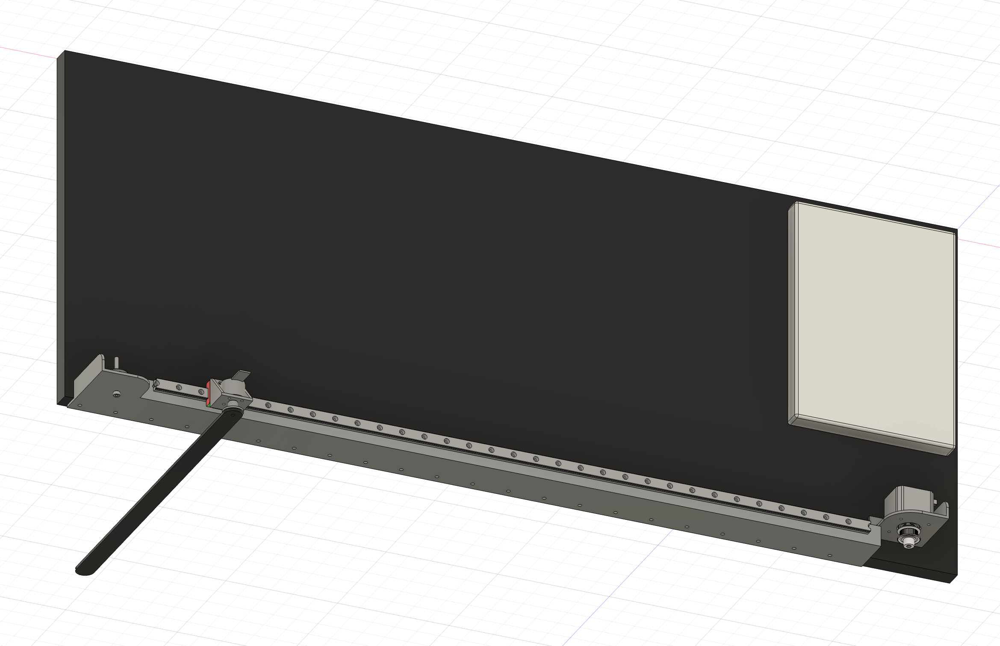
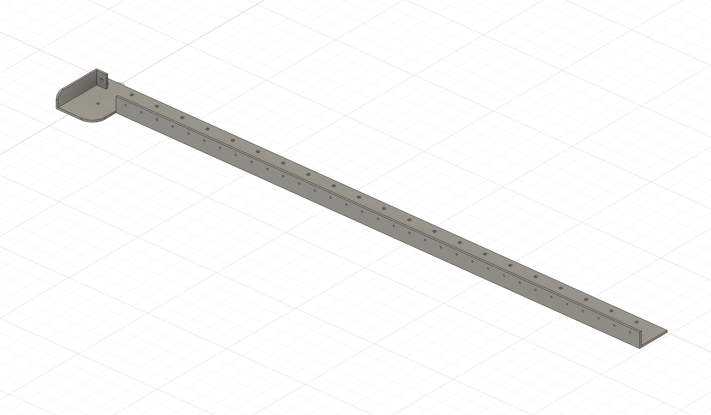
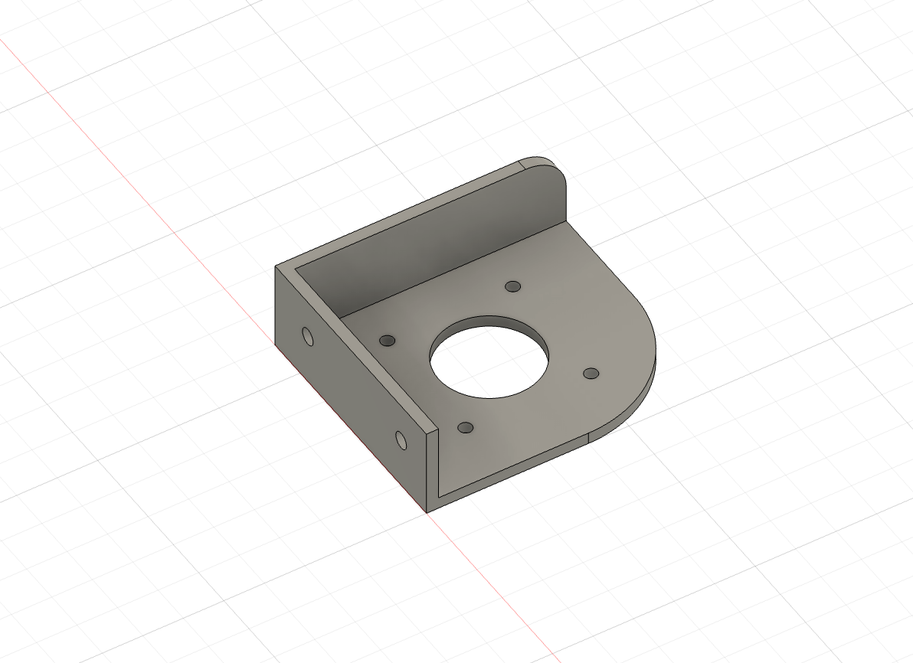

# Object

- 더 많은 비용을 지불하더라도 최대한 단순하게 만든다.
- 보수적으로 만든다. 안전하게 만들자. 성공하기 높은 방식으로 만들자.
- 만들기 쉬운 방식으로 만들자.

# 3D Modeling

{: .align-center width="400" height="200"}

# Materials

# Sheet Metal

Linear Guide Base

{: .align-center width="400" height="200"}

Motor Bracket

{: .align-center width="400" height="200"}

제조 방식

- 밀링 : 통 알류미늄을 파낸다. 비싸다.
- 절곡 : 철을 접는다.
- 용접 : 분리된 조각을 붙인다.

종류

- 쇠(철)
  - 알류미늄보다 강도가 높다.
  - 알류미늄보다 3배 무겁다.
  - 녹이 슬어서 페인트 칠을 해야 하기 때문에 도장 값이 따로 붙는다.
- 알류미늄
  - 원자재 값이 쇠보다 비싸다. 하지만 소량으로 주문할 때는 쇠보다 저렴하다.

# Measurement

Cart

- Mass of cart ($M$) : 122.61g (= 0.123kg)

Rod

- Mass of rod ($m$) : 88.68g (= 0.089kg)
- Length of rod ($L$) : 40cm (= 0.4m)
- Inertia of rod ($I$) : 