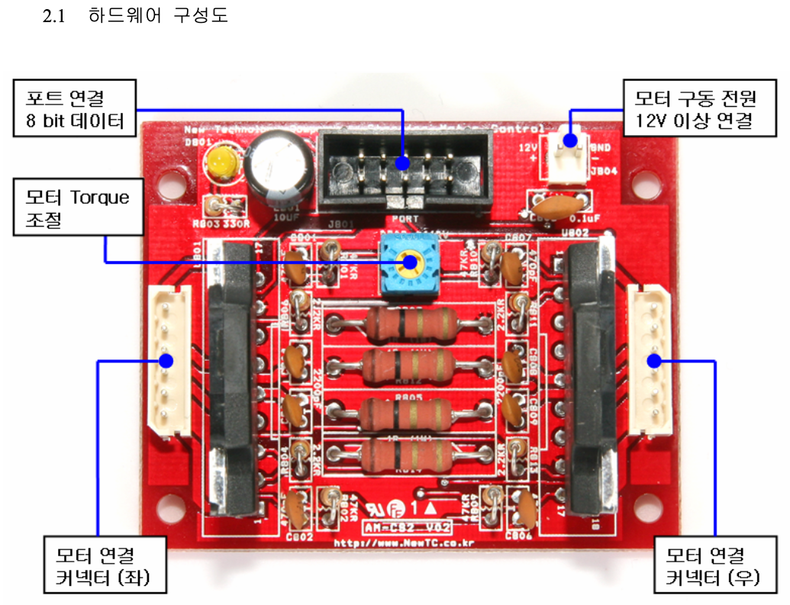
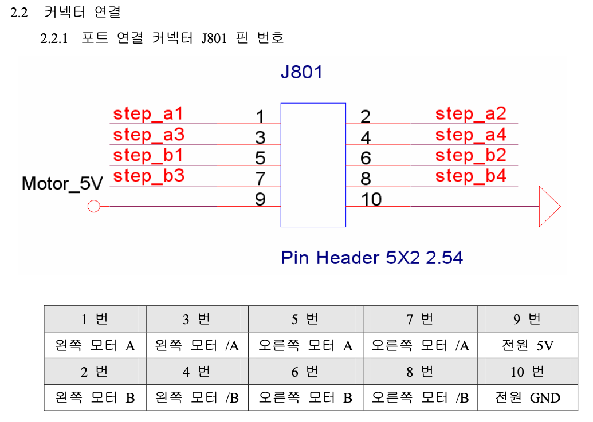
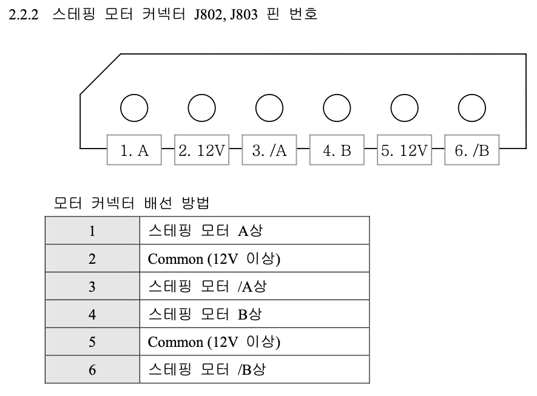
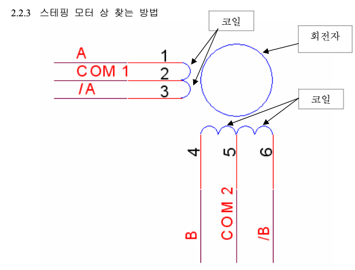
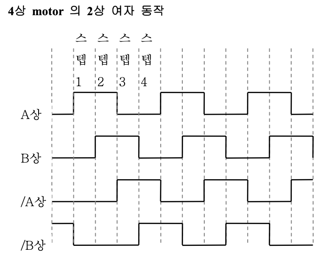
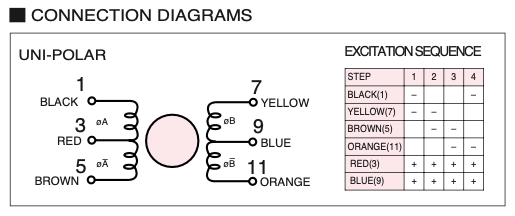
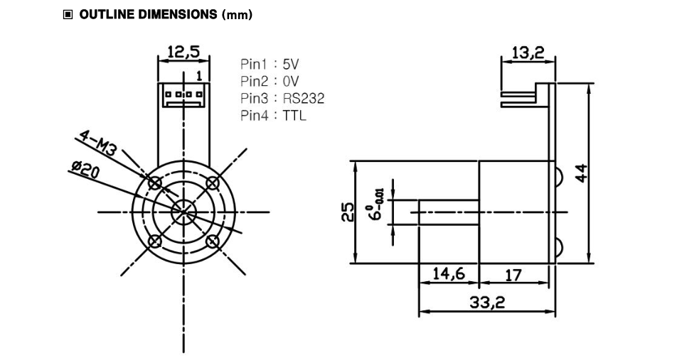
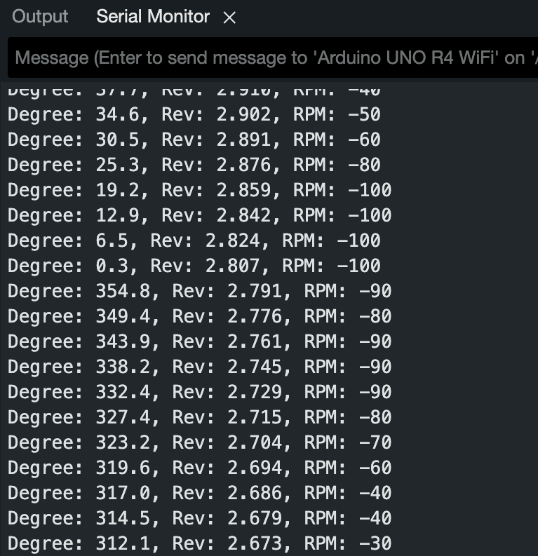

Cart Pole을 위해 구입한 전자 부품들의 용도와 사용법을 정리한다.

# Electronic Material List

|Electronics|Utility|Name|Specification|
|---|---|---|---|
|1|동력 원천|Unipolar Stepping Motor||
|2|Unipolar Stepping Motor Driver|Stepping모터구동모듈 3A(AM-CS2P)|3A|
|3|Pole 회전 각도 측정 센서|Absolute Rotary Encoder EN25-Absolute||
|4|End stop|아두이노 포토 인터럽터 속도 센서 모듈||
|5||Arduino UNO R4 WiFi||
|6|전원 공급|Power Supply|12V, 5A|

소모품

|Electronics|Utility|Name|Specification|
|---|---|---|---|
|7|연선||12AWG|
|8|실리콘 전선||18AWG|
|9|Breadboard|||
|10|만능기판|||
|11|스트리퍼|||
|12|모터 드라이버 케이블|||
|13|점프와이어 수수선|||
|14|점프와이어 암수선|||
|15|점프와이어 암암선|||
|16|Molex|||
|17|용클램프|||
|18|6핀 케이블|||

# Arduino UNO

- 모터 제어
- 엔코더 통신
- 포토 센서 통신

아날로그 핀과 디지털 핀의 차이가 뭘까?

RX와 TX가 뭘까?

# Motor Driver : AM-CS2P

- 라인트레이서용 스테핑 모터 구동 보드
- 스테핑 모터 2개 구동 각 3A
- 소프트웨어적으로 A, /A, B, /B 신호를 인가하여 제어 (1상, 2상, 1-2상 제어 방식으로 제어할 수 있다.)
- 10Pin Cable과 12V 전원 공급 커넥터 연결
- 가변저항을 이용하여 모터에 흐르는 전류량을 조절할 수 있다.
- 외관 크기 : 63.3 x 50.6 mm

{: .align-center width="400" height="200"}

{: .align-center width="400" height="200"}

{: .align-center width="400" height="200"}

{: .align-center width="400" height="200"}

{: .align-center width="400" height="200"}

Stepping motor 제어를 위해서는 arduino uno의 전압 5V보다 높은 전압이 필요한 경우가 대부분이므로 모터 드라이버 칩을 사용한 전용 제어 모듈을 사용하는 것이 일반적이다.

모터 제어를 위해서는 A, /A, B, /B에 해당하는 4개의 제어선 연결을 필요로 한다.

# Moter : KH42JM2-901

||    Specificatoin    | Description                                                                                         |
|---|:-------------------:|-----------------------------------------------------------------------------------------------------|
|Shaft|    Single Shaft     | 하나의 축만 외부에 노출되어 있다.                                                                                 |
|Drive Method|      Uni-Polar      | 스테핑 모터의 권선 중앙에 중앙 탭이 있는 구조를 사용한다. 구동 시 권선의 중앙 탭을 기준으로 전류가 쿄차하여 흐름으로써 모터를 제어한다.                      |
|Number of Phases|          2          | 2상 모터는 두 개의 전기적 위상으로 구성되어 있으며 이 위상들 간의 전류 교차에 의해 회전한다.                                              |
|Step Angle|    1.8^{$\circ$}    | 모터가 한 스텝 움직일 때 회전하는 각도. 표준치. 한 바퀴 회전 시 200스텝을 필요로 한다.                                               |
|Voltage|        3.42V        |
|Curent|     1.2A/Phase      |
|Holding Torque|   236mN $\cdot$ m   | 전류를 인가받고 있을 때, 정지 상태에서 제공할 수 있는 최대 토크. 이는 모터가 고정된 위치에서 얼마나 강하게 버틸 수 있는지를 나타내며, 위치 고정 어플리케이션에서 중요하다. |
|Detent Torque|  14.7 mN $\cdot$ m  |

{: .align-center width="400" height="200"}

# Absolute Rotary Encoder : EN25-Absolute

- 자기장을 이용한 비접촉식 마그네틱 엔코더
- 25mm의 소형 알루미늄 바디, 6mm 스테인리스 샤프트, 듀얼 볼베이링을 적용하여 높은 강성을 구현
- 샤프트 내부에 장착된 자석의 자기장의 방향을 측정하는 방식
- 전원을 껐다 켜더라도 센서의 영점 기준으로 절대 각도값을 출력할 수 있다. (<-> incremental encoder)
- 센서의 측정값은 시리얼 통신으로 출력된다. (절대각도(deg), 누적 회전수(rev), 회전 속도(rpm))
- 주기 : 10ms (100Hz)
- 출력 방식 : RS232 or TTL
- 영점 스위치를 이용해서 영점을 재설정할 수 있음

[출력 예시] <span style="color: #2D3748; background-color:#fff5b1;">$ANG,152.3 ,11.644,110₩r₩n</span>

- 절대 각도 : $152.3 ^\circ$
- 누적 회전수 (전원 on 이후) : 11.644 바퀴
- 회전 속도 : 110 rpm
- ₩r₩n는 개행문자로서 시리얼 모니터에서는 문자로 표시되지 않는다.

|Electrical Characteristics & Output Signal||
|---|---|
|입력 전압|DC 5V $\pm$ 5%|
|입력 전류|30mA|
|시리얼 통신 Baud Rate|38400|
|통신 방식|RS232, TTL (5V)|
|업데이트 주기|10ms (100Hz)|

|Serial Output Format & Range||
|---|---|
|절대 각도 (degree)|$0 ^\circ \sim 359.9 ^\circ$|
|누적 회전수 (rev)|$-90,000 \sim 90,000$ % 전원 off 시 초기화|
|RPM|$0 \sim 5,000$ rpm|

|Electrical Wiring|Color||
|---|---|---|
|Power|Red|$5V(+)$|
||Green|$0V(-)$|
|Output|White|RS232|
||Yellow|TTL|

|Mechanical Characteristics||
|---|---|
|축관성모멘트|$1.1g \cdot cm^2$|
|축허용하중|$1kgf$|
|최대허용회전수|$5,000rpm$|
|중량|37g|

{: .align-center width="400" height="200"}

## Arduino로 PC에서 Encoder 값 출력하기

Arduino UNO는 TTL 방식으로만 통신한다.

Arduino UNO를 사용할 때는 보드와 포트를 정확하게 설정해야 코드를 올릴 수 있다.

Arduino UNO R3와 달리 R4는 Serial1이라는 객체도 사용한다.

```c
// 주의사항
// 전압이 부족하면 센서가 다운되기 때문에 아두이노 전원은 아답터로 연결해야 한다.
// RX핀이 업로드를 방해할 수 있기 때문에 코드 업로드 시 아두이노 RX 핀을 연결하지 않고 업로드 완료 후 RX 핀을 연결해야 한다.

float Degree = 0;
float Rev = 0;
float RPM = 0;

void setup() {
  Serial.begin(38400);   // USB 시리얼 통신 초기화
  Serial1.begin(38400);  // Serial1 통신 초기화
}

void loop() {
  static String inString = "";  // 전체 문자열을 저장할 변수

  // Serial1에서 데이터가 들어오면
  while (Serial1.available()) { 
    char c = Serial1.read();  // 하나의 문자를 읽음
    if (c == '\n') {  // 줄바꿈 문자로 데이터의 끝을 확인
      // 문자열 파싱 및 데이터 출력
      int index1 = inString.indexOf(',');
      int index2 = inString.indexOf(',', index1 + 1);
      int index3 = inString.indexOf(',', index2 + 1);
      int index4 = inString.length();

      // 데이터 파싱 (라벨 제거 후)
      float Degree = inString.substring(index1 + 1, index2).toFloat();
      float Rev = inString.substring(index2 + 1, index3).toFloat();
      int RPM = inString.substring(index3 + 1, index4).toInt();

      // USB 시리얼로 가독성 좋게 출력
      Serial.print("Degree: ");
      Serial.print(Degree, 1);  // 소수점 1자리까지
      Serial.print(", Rev: ");
      Serial.print(Rev, 3);  // 소수점 3자리까지
      Serial.print(", RPM: ");
      Serial.println(RPM);

      // 문자열 초기화
      inString = "";
    } else {
      inString += c;  // 읽어온 문자를 문자열에 추가
    }
  }
}
```

결과

{: .align-center width="400" height="200"}

# Reference

https://www.devicemart.co.kr/goods/view?no=15454627

# 궁금한 점

- Serial Monitor의 결과를 파이썬으로 보낼 수 있을까?
- Arduino UNO R4 WIFI로 2개의 포토센서, 모터, 엔코더를 모두 다룰 수 있을까?
- 절대 위치 추정을 위해 상대 위치를 추정할 때, 모터와 엔코더를 모두 활용할 수 있을까?
- 모터 드라이버는 UNO의 전류를 증폭하는 것일까 아니면 별도의 전원의 전류만을 사용하는 것일까?
