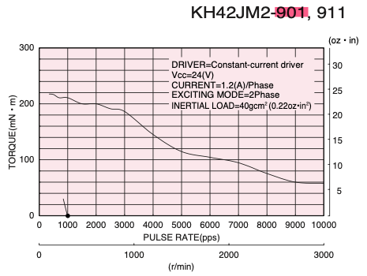

제어 주기를 어떻게 정해야 할까?

1. 여러 하드웨어 스펙의 Hz보다 커야 한다. 제어기를 최적화하거나 라이트하게 만들어서라도 최대한 여기에 맞추려고 노력해야 한다.
2. 제어기의 계산 시간을 고려해야 한다.
3. 관련 논문에서 선정한 값을 참고한다.
4. Rule of thumb

#

{: .align-center width="400" height="200"}

(6000 r/min, 100mN m) = (6.28m/s, 0.1Nm)

# Motor Control

스텝 모터에서 탈조는 심각핟.
