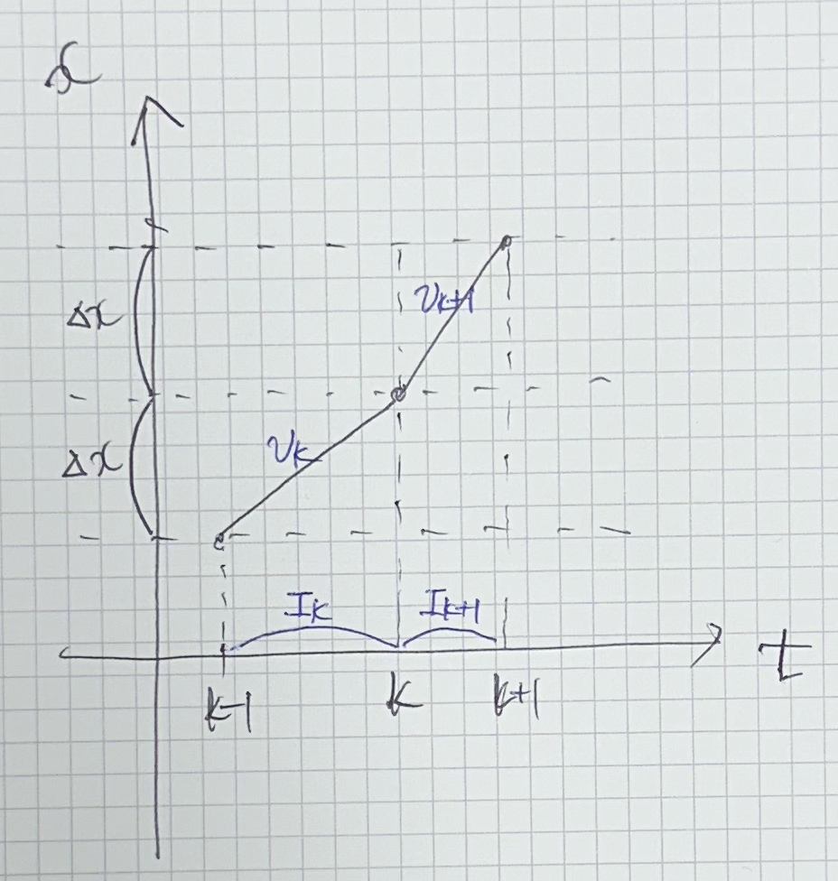

{: .align-center }

설계에 있어 다른 부분은 해야 할 일이 명확히 있는 반면 이 포스트에서 다루는 내용은 설계자에 따라 달라질 수 있다.

전체 시스템을 설계하며 가장 많이 했던 고민 중 하나가 어디까지 python에서 연산할 것이고 어디까지 arduino에서 연산할 것인지에 대한 내용이었다.

Processor

- Arduino UNO R3 : 16M Hz (62.5ns)
- Arduino UNO R4 : 38M Hz

# Stepper Motor Controller

MPC는 50ms마다 최적의 현재 선가속도를 제시한다. 이에 맞게 stepper motor의 상을 잡아줘야 한다.

지배적인 물리 법칙은 다음과 같다.

$$
v = r \omega, \;\;\; a = r \alpha
$$

{: .align-center width="400" height="200"}

MPC controller로부터 현재 시점 $k$에서 최적의 가속도 $a_k$가 주어진다.

스텝 모터의 특성상 매 틱에 이동하는 거리는 일정하다. Stepper motor control의 목적은 다음 틱을 제어하는 시간의 길이 $I_{k+1}$을 결정하는 것이다.

$v_k$와 $I_{k+1}$의 관계를 다음과 같이 구할 수 있다.

$$
v_k = \dfrac{\Delta x}{I_k}, \;\;\; v_{k+1} = \dfrac{\Delta x}{I_{k+1}}
$$

또한 주어진 가속도 $a_k$로부터 $v_{k+1}$를 다음과 같이 근사할 수 있다.

$$
v_{k+1} = v_k + a_k I_k
$$

$I_{k+1}$에 대해 정리하자.

$$
\dfrac{\Delta x}{I_{k+1}} = \dfrac{\Delta x}{I_k} + a_k I_k
\\
I_{k+1} = \dfrac{I_k}{1 + a_k I_k^2 / \Delta x}
$$

이때 단위를 주의해야 한다. MPC controller에서 주어진 가속도는 $m/s^2$이다. 하지만 $I_k$와 $\Delta x$는 다른 단위를 사용하기 때문에 변환해야 한다.

단위를 다음과 같이 정의하자.

- step (거리 단위) : stepper motor가 한 step 움직인 거리이다. $\Delta x$의 단위이다.
- clock (시간 단위) : 내부 timer가 한 clock을 하는 데 걸리는 시간이다. $I_k, I_{k+1}$의 단위이다.

단위 변환 공식은 다음과 같다.

- $m/step = 6,366.198$ from $400step = 2 \pi (0.01 m)$
- $count /s = 250,000$ from (16M/64)
- $m/s^2 = 3.978 873 75 e14 \; step/count^2$

기타

- 섬세한 제어를 하기 위해 12상 여자 방식을 사용하여 제어한다. : 1 rotation = 400 step
- 64 분주 프리스케일러를 사용한다. : 1 clock period = 1/(16M/64) = 0.5us
- timing pulley radius = 0.01 m

## Motor Control Period

motor control period를 몇으로 설정하는 게 적절할까?

MPC Controller의 control sampling period는 50ms (20Hz)이다. 50ms 안에 목표 선속도에 도달할 수 있어야 한다.

# State Observer

$$
\mathbb{x}(k) =
\begin{bmatrix}
  x_1(k) \\
  x_2(k) \\
  x_3(k) \\
  x_4(k) \\
\end{bmatrix} =
\begin{bmatrix}
  x(k) \\
  \theta(k) \\
  v(k) \\
  \omega(k) \\
\end{bmatrix}
$$

- $x$ : Position of Cart
- $\theta$ : Angle of Pole
- $v$ : Velocity of Cart
- $\omega$ : Angular Velocity of Pole

In order to apply the NMPC strategy, we must bave access to the state at time $k$.While the state of cart position $x(k)$ and pole angle $\theta (k)$ are measured directly by stepper motor and encoder sensor respectly, we need to estimate the  cart velocity $v(k)$ and pole angular velocity $w(k)$. We simply approximate the time derivatie via a finite difference approximation.

$$
v(k) = \dfrac{x(k) - x(k-1)}{T}, \;\;\; \omega(k) = \dfrac{\theta (k) - \theta (k-1)}{T}
$$
