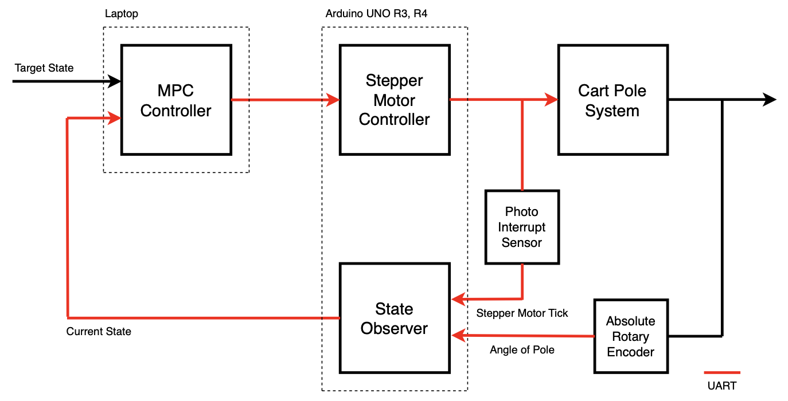

{: .align-center }

설계에 있어 다른 부분은 해야 할 일이 명확히 있는 반면 이 포스트에서 다루는 내용은 설계자에 따라 달라질 수 있다.

전체 시스템을 설계하며 가장 많이 했던 고민 중 하나가 어디까지 python에서 연산할 것이고 어디까지 arduino에서 연산할 것인지에 대한 내용이었다.

Processor

- Arduino UNO R3 : 16M Hz (62.5ns)
- Arduino UNO R4 : 38M Hz

# Stepper Motor Controller

MPC는 50ms마다 최적의 현재 선가속도를 제시한다. 이에 맞게 stepper motor의 상을 잡아줘야 한다.

Stepper motor는 가속도를 이해하지 못하고 속도를 이해한다.

지배적인 물리 법칙은 다음과 같다.

$$
v = r \omega, \;\;\; a = r \alpha
$$

주로 선속도의 언어를 사용하는 이유는 모터를 제어하는 arduino UNO R3에 pole의 각도 혹은 각속도에 대한 정보는 없고, cart의 위치와 속도에 대한 정보만 가지고 있기 때문이다.

python에서 2번의 결과를 arduino에 보내고, 3~7단계는 arduino에서 연산한다.

<span style="color: #2D3748; background-color:#fff5b1;">[1] Current optimal action from MPC controller (N)</span>

<span style="color: #2D3748; background-color:#fff5b1;">[2] Target linear acceleration of cart (m/s^2)</span>

$$
a(K) = a(k) = \dfrac{u(K)}{M + m} = \dfrac{u(K)}{0.21129} = 4.733 u(K) \;\;\; m/s^2
$$

---

<span style="color: #2D3748; background-color:#fff5b1;">[3] Target Naxt linear velocity of pole (m/s)</span>

$$
v (k + 1) = v (k) + T a(k) \;\;\; \text{m/s}
$$

- T : motor control period

<span style="color: #2D3748; background-color:#fff5b1;">[4] Target next angular velocity of pole (rad/s)</span>

$$
\omega (k + 1) = \dfrac{v(k + 1)}{\text{(radius)}} = \dfrac{v (k + 1)}{0.01} = 100 v(k + 1) \;\;\; \text{rad/s}
$$

<span style="color: #2D3748; background-color:#fff5b1;">[5] Target next angular velocity of pole (step/s)</span>

$$
\omega (k + 1) = \dfrac{400}{2\pi} \cdot 100 v (k + 1) =6366.198 v (k + 1) \;\;\; \text{step}/s
$$

<span style="color: #2D3748; background-color:#fff5b1;">[6] Target next step interval period (s/step)</span>

$$
(\text{target step interval period}) = \dfrac{1}{\omega (k + 1)} = \dfrac{0.000157}{v (k + 1)} \;\;\; s/\text{step}
$$

<span style="color: #2D3748; background-color:#fff5b1;">[7] Target next step interval counts of clock (clock/step)</span>

$$
(\text{target step interval counts}) = \dfrac{16M/64}{\omega (k + 1)} = \dfrac{39.27}{v (k + 1)} \;\;\; \text{clock/step}
$$

```cpp
void update_motor_control()
{
  // update target next velocity
  target_next_linear_velocity = current_linear_velocity + MOTOR_COUNTROL_COUNTS * target_current_linear_velocity;

  // calculate target step interval counts
  if (current_count - last_motor_control_count >= MOTOR_COUNTROL_COUNTS) {
    
  }
}
```

- 섬세한 제어를 하기 위해 12상 여자 방식을 사용하여 제어한다. : 1 rotation = 400 step
- 64 분주 프리스케일러를 사용한다. : 1 clock period = 1/(16M/64) = 0.5us
- timing pulley radius = 0.01 m

## Motor Control Period

motor control period를 몇으로 설정하는 게 적절할까?

MPC Controller의 control sampling period는 50ms (20Hz)이다. 50ms 안에 목표 선속도에 도달할 수 있어야 한다.

# State Observer

$$
\mathbb{x}(k) =
\begin{bmatrix}
  x_1(k) \\
  x_2(k) \\
  x_3(k) \\
  x_4(k) \\
\end{bmatrix} =
\begin{bmatrix}
  x(k) \\
  \theta(k) \\
  v(k) \\
  \omega(k) \\
\end{bmatrix}
$$

- $x$ : Position of Cart
- $\theta$ : Angle of Pole
- $v$ : Velocity of Cart
- $\omega$ : Angular Velocity of Pole

In order to apply the NMPC strategy, we must bave access to the state at time $k$.While the state of cart position $x(k)$ and pole angle $\theta (k)$ are measured directly by stepper motor and encoder sensor respectly, we need to estimate the  cart velocity $v(k)$ and pole angular velocity $w(k)$. We simply approximate the time derivatie via a finite difference approximation.

$$
v(k) = \dfrac{x(k) - x(k-1)}{T}, \;\;\; \omega(k) = \dfrac{\theta (k) - \theta (k-1)}{T}
$$
