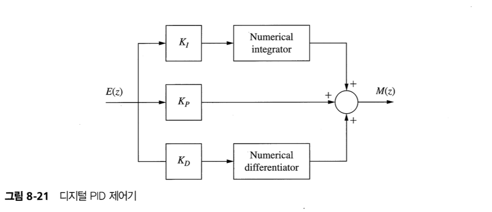

## 1. Introduction

In this chapter we consider the total design problem : How do we design a digital controller transfer function?

- Phase-lag and phase-lead controller
- Proportional-plus-integral-plus-integral(PID) controller

All numerical design procedures are based on an inexact model of the physical system.

Design is generally too complex if the accurate simulation model is used.

## 2. Control System Specifications

### Steady-State Accuracy

### Transient Reponse

### Relative Stability

### Sensitivity

### Disturbance Rejection

### Control Effort

## 3. Compensaion

We will limit the discussion to the design of compensators for single-input, single output systems

- Cascade (or series) compensation
- Feedback (or parallel) compensation

$$
D(w) = a_0 \left[ \dfrac{1 + w/\omega_{w0}}{1 + w/\omega_{wp}} \right]
$$

- If $\omega_{w0} < \omega_{wp}$ : phase-lead compensation
- If $\omega_{w0} > \omega_{wp}$ : phase-lag compensation

## 4. Phase-Lag Compensation

## 5. Phase-Lead Compensation

## 6. Phase-Lead Design Procedure

## 7. Lag-Lead Compensation

## 8. Integration and Differentiation Filters

## 9. PID Controller

- 비례-적분-미분 제어기
- lead-lag compensator의 특수한 형태

- $K_P$ : 경로 적분의 이득
- $K_I$ : 미분 경로의 이득
- $K_D$ : 적분 경로의 이득

## 10. PID Controller Design

## 11. Design by Root Locus
