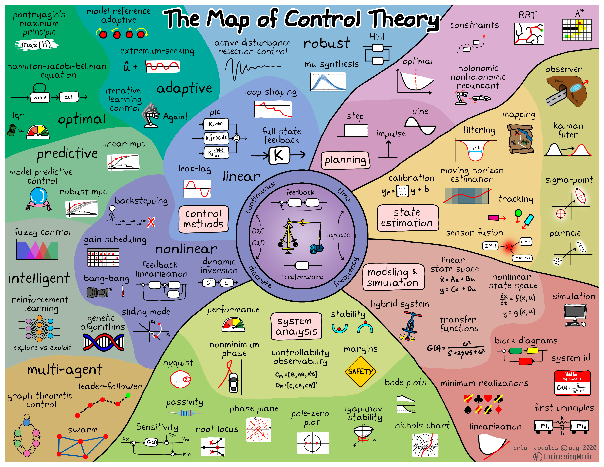
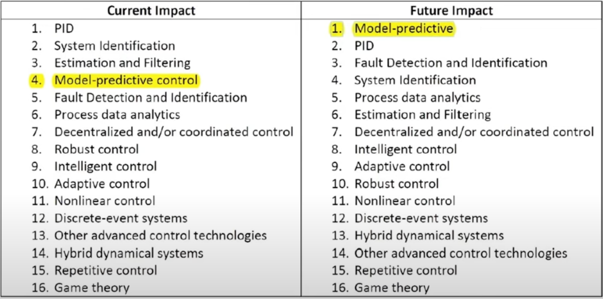

## Control technology

- PID control
- System ddentification
- Estimation and filtering
- Model-predictive control
- Process data analytics
- Fault detection and identification
- Decentralized and/or coordinated control
- Robust control
- Intellifent control
- Discrete-event systems
- Nonlinear control
- Adaptive control
- Repetitive control
- Hybrid dynamical systems
- Other advanced control technoloy
- Game theory

## History of MPC

## My Interest

- Stochastic MPC
- Data-Driven MPC
- Model-Based RL

## Introduction Video

- [[메릭 웨비나] 모델예측제어 기법(Model Predictive Control) 및 응용사례 소개 - 한경석 교수(경북대학교 기계공학부)](https://www.youtube.com/watch?v=3odSAkMh94U&t=9s)
- [MPC from Basics to Learning-based Design](https://www.youtube.com/watch?v=CNwV5GbTEGM&t=43s)
- [Data-driven MPC: From linear to nonlinear systems with guarantees](https://www.youtube.com/watch?v=9GP1dmj58cw)

## Researcher

- MPC의 대가 : [Frank Allgöwer](https://scholar.google.com/citations?user=WQYw3oIAAAAJ&hl=ko)
- Professor of Aerospace Engineering, Univeristy of Michigan [Ilya Kolmanovsky](https://scholar.google.com/citations?user=h_PvHyYAAAAJ&hl=ko)
- Associate Professor of Mechanical Engineering, Kyungpook National University [Kyoungseok Han](https://scholar.google.com/citations?user=CEEipNoAAAAJ&hl=en), [Lab Web Site](https://sites.google.com/view/voice-lab/home)

## 궁금한 점

- MPC는 input과 model을 기반으로 현 시점부터 미래의 특정 시점까지의 control input sequence를 만든다. 그리고 현 시전의 값만을 취하고 나머지는 버린다. 어짜피 버릴 거면, 왜 미래 시점까지의 제어 입력을 만드는 것일까? 미래 목표에 해당하는 현재 목표를 세우기 위함일까?
- 기존의 controller는 MIMO system을 어떻게 다룰까?
- 기존의 controller는 과거만을 바라본다면 MPC는 미래만을 바라본다고 할 수 있을까?
- MPC의 feedback은 일반적인 의미의 feedback과 동일할까?

### 연구 주제

## 후보 1. MPPI

[Model Predictive Optimized Path Integral Strategies - ICRA Video](https://www.youtube.com/watch?v=-7jHJP37Nio)

## 후보 2. Model-Based RL