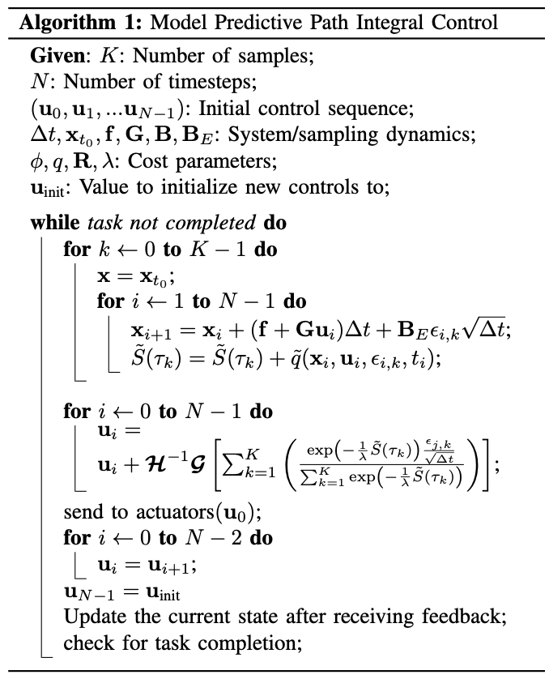

## Abstract

- Model predictive control algorithm designed for optimizing non-linear systems subject to complex cost criteria.
- Based on a stochastic optimal control framework using a fundamental relationship between the information theoretic notions of free energy and relative entropy.
- The optimal controls in this setting take the form of a path integral, which we approximate using an efficient importance sampling scheme.
- Verify the algorithm by implementing it on a GPU and apply it to the problem of controlling a fifth-scale Auto-Rally vehicle in an aggressive driving task.

## I. INTRODUCTION

- Model predictive control algorithm based on the path integral control framework.
- Combination the best of the hierarchical and optimal control paradigms.
- We do not split the problem into a planning and execution phase, which allows for a simple problem formulation and optimal behavior with respect to the system dynamics.
- GPU computing.

## II. STOCHASTIC TRAJECTORY OPTIMIZATION

- Path integral control [10] provides a mathematically sound methodology for developing optimal control algorithms based on stochastic sampling of trajectories.
- no derivatives of either the dynamics or cost. -> flexibility and robustness when estimating the system dynamics and designing cost functions.

The approach used in the path integral control frameworks of

1. The typical derivation of path integral control relies on an exponential transformation of the value function of the optimal control problem.
2. Additionally, it requires that the noise in the system only affects directly actuated states. The exponential transform, along with the noise assumption, transforms the stochastic Hamilton-Jacobi-Bellman equation into a linear partial differential equation which can then be transformed into a path integral using the Feynman-Kac lemma.
3. The ensuing path integral takes the form of an expectation over trajectories under the uncontrolled dynamics of the system, which is then approximated using Monte-Carlo sampling to compute the control for the current state.

Two benefits over the standard path integral approach:

1. It relaxes the condition between the noise and control authority to allow for noise in both indirectly and directly actuated states, and
2. It explicitly provides a formula for the optimal controls over the entire time horizon instead of only the initial time.

The key insight which allows for this is the use of a fundamental relationship [16], [17] between the information theoretic notions of free energy and relative entropy (also know as KL-Divergence). This relationship can be used to derive the form of an optimal probability distribution over trajectories. We can then solve the optimal control problem by directly minimizing the relative entropy between the optimal distribution and the distribution induced by the controller.

- Online

Two crucial concepts in this approach

1. Radon-Nikodym derivative, which relates two probability measures to each other
2. Girsanov’s theorem which provides the form of the Radon-Nikodym derivative for systems subject to Brownian disturbances.

### A. Problem Formulation

주어진 비용함수 -> KL divergence

### B. Relative Entropy Minimization

### C. Special Case: State Independent Control Matrix

### D. Numerical Approximation

## III. MODEL PREDICTIVE CONTROL ALGORITHM

Key aspect of real-time implementation

- Equations (33) and (34) provide an iterative update law which we can apply in a model predictive control setting. In this setting optimization takes place on the fly: the trajectory is optimized, then a single control input is executed before re-optimization occurs. Since the derivation of path integral control provided here gives a formula for optimizing the entire sequence of controls, as opposed to just the current time instance, we can re-use the un-executed portion of the control sequence to warm start the optimization. This is crucial for the performance of the algorithm since, for a complex system operating at a reasonable control frequency, it is typically only possible to perform a small number of iterations every timestep.
- Parallel trajectory sampling using a GPU is an efficient operation, which takes less than 15 millisecond in our implementation, even when sampling thousands of trajectories from complex non-linear dynamics. The simplest approach to running Algorithm 1 on a GPU is to simply parallelize the sampling for-loop using one thread per sample. However, since the vehicle dynamics are fairly complex, we obtained additional speed up by using multiple threads per sample and parallelizing the dynamics predictions as well.
