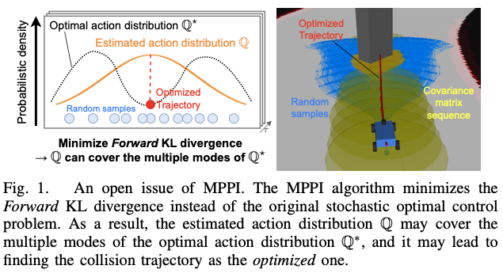



## Abstract

- This paper presents a novel Stochastic Optimal Control (SOC) method based on Model Predictive Path Integral control (MPPI), named Stein Variational Guided MPPI (SVG-MPPI), designed to handle rapidly shifting multimodal optimal action distributions.
- While MPPI can find a Gaussian-approximated optimal action distribution in closed form, i.e., without iterative solution updates, it struggles with the multimodality of the optimal distributions. This is due to the less representative nature of the Gaussian.
- To overcome this limitation, our method aims to identify a target mode of the optimal distribution and guide the solution to converge to fit it. In the proposed method, the target mode is roughly estimated using a modified Stein Variational Gradient Descent (SVGD) method and embedded into the MPPI algorithm to find a closed-form “mode-seeking” solution that covers only the target mode, thus preserving the fast convergence property of MPPI.
- Our simulation and real-world experimental results demonstrate that SVG-MPPI outperforms both the original MPPI and other state-of-the-art sampling-based SOC algorithms in terms of path-tracking and obstacle-avoidance capabilities. [https://github.com/kohonda/proj-svg_mppi](https://github.com/kohonda/proj-svg_mppi)

## 1. INTRODUCTION

Path tracking and obstacle avoidance are essential capabilities required for autonomous mobile robots. These tasks become especially challenging for fast maneuvering vehicles because the optimal action distribution may be multimodal and rapidly shifting. To solve these tasks, sampling based Model Predictive Control (MPC) [1], [2] is a widely adopted approach that can handle the non-linearity and nondifferentiability of the environment, such as system dynamics and cost maps, in contrast to gradient-based methods [3]–[6].

Among various sampling-based MPCs, sampling-based Stochastic Optimal Control (SOC) is a relatively sample efficient approach that approximates the optimal action distribution as the solution, based on a given prior action distribution [7]–[9]. In particular, Model Predictive Path Integral control (MPPI) [9] stands out as a promising framework because it can estimate a Gaussian-approximated optimal action distribution by analytically minimizing the Kullback-Leibler (KL) divergence. That is, it can find the optimal solution in closed form (i.e., without iterative solution updates, similar to gradient descent) when given a sufficient number of samples.

MPPI, however, has limitations in capturing complex optimal distributions due to its less representative of the Gaussian. For instance, as illustrated in Fig. 1, an MPPI-based motion planner may produce a collision trajectory as its optimized trajectory because the Gaussian-approximated action distribution encompasses the multimodal optimal distribution (see Section III-B for details). To address these shortcomings, several studies have proposed advanced techniques that capture the multimodality using more representative prior distributions [10]–[14] or find mode-seeking solutions by leveraging the asymmetry of the KL divergence [15]. However, unlike MPPI, these methods cannot find the so lution in closed form. In other words, they require iterative solution updates with sampling and evaluation to converge the solution. The iterative updates degrade the convergence of the solution compared to MPPI because the solution is suboptimal and the sequential iteration process restricts the parallelism and the number of samples per iteration.

In this paper, we propose Stein Variational Guided MPPI (SVG-MPPI), a sampling-based SOC method based on MPPI to address rapidly shifting multimodal optimal action distributions. Contrary to the existing methods that capture the complex multimodal distribution, our approach aims to narrow down a single target mode within the multimodal distribution and approximate it with a Gaussian distribution by the MPPI algorithm. As a result, our method can obtain a mode-seeking action distribution in closed form, i.e., pre- serving the fast solution convergence property of MPPI.

1. Specifically, our proposed method first roughly identifies the target mode by utilizing a small set of samples (hereafter referred to as guide particles) and a modified Stein Variational Gradient Descent (SVGD) method [16].
2. The SVGD method transports the guide particles to near the peak of the target mode within the optimal distribution using its surrogate gradients.
3. Based on the insight that the transport trajectory leading to the peak represents a part of the shape of the target mode, we estimate the rough variance of the target mode using the Gaussian fitting method.
4. Our method then incorporates the peak and variance of the target mode into the MPPI algorithm to converge the solution to cover only the target mode.

In summary, the main contribution of this work is as follows.

- We propose an MPPI-based SOC method capable of efficiently capturing a single mode of the optimal action distribution. The mode-seeking solution is achieved in closed form by guiding it using a modified SVGD algorithm.
- Our method has been validated through simulation and real- world experiments, focusing on path tracking and obstacle avoidance tasks for a 1/10th scale vehicle1.
- Empirical results demonstrate that SVG-MPPI outperforms standard MPPI [9] and other state-of-the-art SOC algorithms [10], [15] regarding the path-tracking and obstacle-avoidance performances.

## 2. RELATED WORK

To address the rapidly shifting complex optimal action distribution in the sampling-based SOC framework, existing approaches can be broadly categorized into the following three types:

1 Increasing Effective Samples:

- One strategy for improving the MPPI algorithm involves increasing the number of low-state-cost and feasible samples to find better solutions. Besides learning task-specific prior distributions offline [17], [18], the practical approach involves the online adaptation of random samples from a fixed prior distribution, e.g., using auxiliary controllers [19]–[21], gradient descent techniques [22], [23], or adaptive importance sampling [24]. However, most methods are limited to differentiable optimal control problems.
- In contrast, SV-MPC [10] can transport samples online even in non-differentiable cases by using surrogate gradients. This method, though, leads to a significant increase in computational cost per sample, which limits the number of samples. Instead of transporting all samples, our approach updates a small number of samples (guide particles) and incorporates them into the MPPI algorithm. This approach allows for the exploration of good solutions while suppressing the increase in computational cost. Note that our method is also applicable to non-differentiable problems.

2 Approximating Multimodal Distribution:

The second approach is to approximate the complex optimal action distribution with a more representative model, such as Gaussian mixture models, through variational inference methods [10]– [14]. Although these approaches excel at capturing multi-modality, they cannot find the solution in closed form and necessitate iterative solution updates, unlike MPPI. Moreover, practical control problems require a deterministic solution for the system input rather than a probabilistic multimodal solution. Extracting a smoothly shifting single deterministic solution from the obtained multimodal solution is far from trivial. Therefore, a mode-seeking solution is necessary for practical application to control problems.

3 Finding a Mode-Seeking Solution:

- The third approach aims to identify one of the modes of the optimal distribution as the target for convergence, leveraging the asymmetry of the KL divergence [15]. The KL divergence exhibits an asymmetric property when its arguments are reversed. This approach can obtain a mode-seeking solution by directly minimizing KL divergence reversed from the ones used in the original MPPI. However, minimizing the reverse KL divergence cannot be solved in closed form.Our approach can obtain a mode-seeking solution without sacrificing the closed-form optimality inherent in MPPI by guiding the solution with the reverse KL divergence.

## 3. REVIEW OF MPPI

Our aim is to find a mode-seeking action distribution by improving the MPPI algorithm because MPPI struggles with multimodal optimal distributions due to its inherent nature. In this section, we first review the MPPI theory described in the original literature [9] and then derive the open issue of MPPI to be addressed in this work. Finally, we provide a key property of the KL divergence to address this issue.

A. Review of the MPPI Theory

1) Problem Formulation:

2) Analytical PDF of the Optimal Action Distribution:

3) Forward KL Divergence Mimimization:

B. An Open Issue of MPPI

The MPPI algorithm can estimate the Gaussian approximated optimal distribution by analytically minimizing the FKL divergence in closed form. However, the Gaussian approximation causes an open issue that the estimated action distribution may cover the multiple modes of the optimal distribution, as illustrated in Fig. 3. In the context of an obstacle avoidance task, this issue may lead MPPI to identify the collision trajectory as the optimal solution, as shown in Fig.1. This occurs because the two branching paths for avoiding obstacles correspond to the peaks of the two modes, and the estimated action distribution covers both modes. To solve this problem, we need to find a mode- seeking action distribution that covers a single target mode of the multimodal distribution.

## 4. STEIN VARIATIONAL GUIDED MPPI

A. Transport Guide Particles by the Modified SVGD method

B. FKL divergence Minimization with the Nominal Sequence and Adaptive Covariance Matrix Sequence

1) Picking a Target Mode:

2) Estimation of the Adaptive Covariance Matrix Se- quence:

## 5. EXPERIMENTS

## 6. CONCLUSION AND POTENTIAL LIMITATION

- This paper presents a novel MPPI-based SOC method to address rapidly shifting multimodal optimal action distributions. Our method is capable of finding a mode-seeking solution in closed form by guiding the convergence target of the MPPI solution using the SVGD method.
- While our experiments do not show any performance degradation of the proposed method, a potential limitation of our method arises in cases where the gradients of the optimal distribution are zero outside the peaks of the modes. This limitation is due to the fact that the SVGD method primarily tracks gradients, and the solution may become trapped at such terrace-like places within the optimal distribution.
- Furthermore, since the proposed method is not theoretically tailored for path tracking and obstacle avoidance, it is expected to be applicable to a wider range of robotic challenges.

## 궁금한 점

- MPPI는 장애물 회피를 어떻게 constraint로 고려할까?
- 중앙선을 따라가야 하는 것 자체가 최적 경로를 생성하는 데 방해가 된다.

## 개선할 수 있을 것 같은 점

- 중앙선으로 다시 복귀하려는 성질을 제거할 수 없을까?

## Stein Variational Gradient Descent

https://www.edwith.org/bayesiandeeplearning/lecture/25286?isDesc=false

- Bayesian Inference와 고차원 확률분포 샘플링에서 사용되는 강력한 최적화 알고리즘
- 확률분포의 샘플링 문제를 변분 추론과 최적화 문제로 변환하여 해결한다.
- 주어진 복잡한 목표 분포를 잘 근사하는 인련의 입자를 생성하여 그 분포에서의 샘플링을 수행한다.
