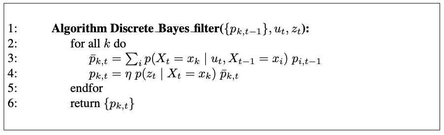

# 1. The Histogram Filter

Histogram filters decompose the state space into finitely many regions and represent the cumulative posterior for each region by a single probability value.

- Discrete Bayes filter : when applied to finite spaces
- Histogram filter : when applied to continuous spaces

## 1.1 The Discrete Bayes Filter Algorithm

{: .align-center}

Discrete Bayes filters apply to problems with finite state spaces, where the random variable $X_t$ can take on finitely many values.

The discrete Bayes filter is derived from the general Bayes filter by replacing the integration with a finite sum.

- $x_i, x_t$ : individual states, of which there may only be finitely many.
- $p_{k, t}$ : discrete probaility distribution

Input

- discrete probaility distribution $p_{k, t}$
- the most recent control $u_t$
- measurement $z_t$

Output

- the belief at time $t$, represented by $\mu_t$ and $\Sigma_t$, $p_{k, t}$

Prediction Step (Linea 3)

calculates the prediciton, the belief for the new state based on the control alone

Measurement Update (Linea 4)

incorporate the measurement

# 3. The Particle Filter

## 3.1 Basic Algorithm
