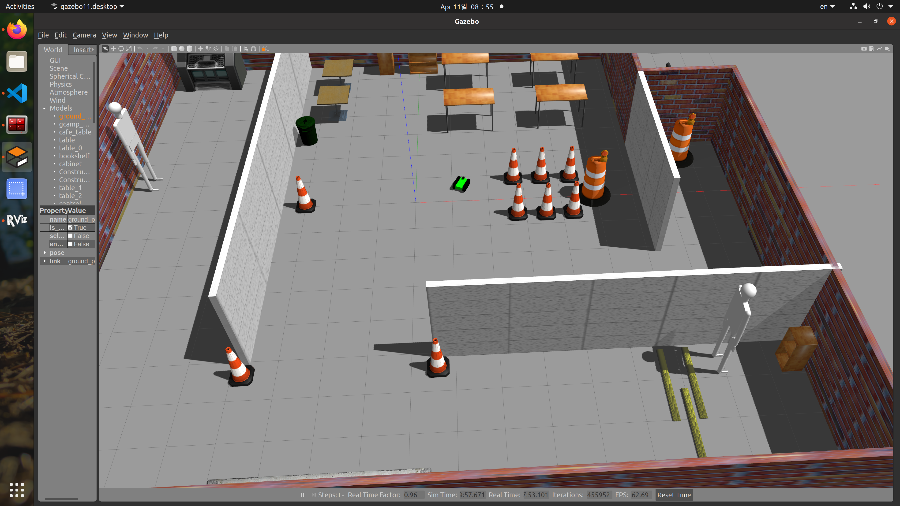
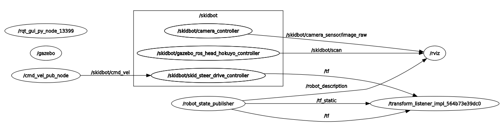

## gazebo 상의 로봇을 5초간 회전한 후 멈추도록 하는 예제



```bash
# Terminal 1
$ ros2 launch gcamp_gazebo gcamp_world.launch.py

# Terminal 2
$ ros2 run py_topic_pkg cmd_vel_pub_node 
[INFO] [1624889609.708600174] [cmd_vel_pub_node]: DriveForward node Started, move forward during 5 seconds 

[INFO] [1624889610.195565654] [cmd_vel_pub_node]: 1 seconds passed
[INFO] [1624889610.695526857] [cmd_vel_pub_node]: 1 seconds passed
[INFO] [1624889611.195481779] [cmd_vel_pub_node]: 2 seconds passed
[INFO] [1624889611.695450639] [cmd_vel_pub_node]: 2 seconds passed
[INFO] [1624889612.195593873] [cmd_vel_pub_node]: 3 seconds passed
[INFO] [1624889612.695474598] [cmd_vel_pub_node]: 3 seconds passed
[INFO] [1624889613.196404202] [cmd_vel_pub_node]: 4 seconds passed
[INFO] [1624889613.695493502] [cmd_vel_pub_node]: 4 seconds passed
[INFO] [1624889614.195716743] [cmd_vel_pub_node]: 5 seconds passed
[INFO] [1624889614.196065373] [cmd_vel_pub_node]: 
==== Stop Publishing ====
```



- Publisher (메시지(데이터)를 보내는 주체) : cmd_vel_pub_node
- Subscriber (메시지를 받는 주체) : skidbot/skid_steer_drive_controller
- Topic (메시지가 오가는 길) : skidbot/cmd_vel

## geometry_msgs/msg/Twist 형식의 message

## cmd_vel_pub_node는 message type을 사용했을까?

```bash
$ rosfoxy
$ ros2 node list
/cmd_vel_pub_node

$ ros2 node info /cmd_vel_pub_node
/cmd_vel_pub_node
  Subscribers:

  Publishers:
    /parameter_events: rcl_interfaces/msg/ParameterEvent
    /rosout: rcl_interfaces/msg/Log
    /skidbot/cmd_vel: geometry_msgs/msg/Twist
  Service Servers:
    /cmd_vel_pub_node/describe_parameters: rcl_interfaces/srv/DescribeParameters
    /cmd_vel_pub_node/get_parameter_types: rcl_interfaces/srv/GetParameterTypes
    /cmd_vel_pub_node/get_parameters: rcl_interfaces/srv/GetParameters
    /cmd_vel_pub_node/list_parameters: rcl_interfaces/srv/ListParameters
    /cmd_vel_pub_node/set_parameters: rcl_interfaces/srv/SetParameters
    /cmd_vel_pub_node/set_parameters_atomically: rcl_interfaces/srv/SetParametersAtomically
  Service Clients:

  Action Servers:

  Action Clients:
```

geometry_msgs/msg/Twist 형식으로 pusblish하는 것을 확인할 수 있다.

## Topic Command

```bash
$ ros2 topic list
/parameter_events
/rosout
/skidbot/cmd_vel

$ ros2 topic info /skidbot/cmd_vel
Type: geometry_msgs/msg/Twist
Publisher count: 1
Subscription count: 0
```

## Message 구성을 알기 위한 명령어

```bash
$ ros2 interface show geometry_msgs/msg/Twist
Vector3  linear
Vector3  angular
```

## Command를 이옹해 pusblish하기

```bash
$ ros2 topic pub --rate 1 /skidbot/cmd_vel geometry_msgs/msg/Twist "{linear: {x: 0.5, y: 0.0, z: 0.0}, angular: {x: 0.0, y: 0.0, z: 1.0}}"
$ ros2 topic pub --once  /skidbot/cmd_vel geometry_msgs/msg/Twist "{linear: {x: 0.0, y: 0.0, z: 0.0}, angular: {x: 0.0, y: 0.0, z: 0.0}}"
```

## pusbish 상태를 확인하고 싶을 때 사용하면 명령어

```bash
$ ros2 topic echo /skidbot/cmd_vel
linear:
  x: 0.5
  y: 0.0
  z: 0.0
angular:
  x: 0.0
  y: 0.0
  z: 1.0
```

- 쌓아놓는 것을 publisher에서 쌓을까? 누구의 큐일까?
- spin이 publish, subscribe에서 각각 어떻게 사용되는가?
- main()이 두 개여서 생기는 문제?
- Node를 만들기 위한 환경 세팅을 어떻게 해야 할까?
- node class를 node n개로 만들 수 있을까?
- 클래스 앞의 public은 어떤 의미일까?
- 틸다 : 소멸될 때의 이야기 : 메모리를 놔주는 역할
- 생성자와 소멸자()..
- talker : 생성자
- ~talker : 소멸자

## Reference

김수영 대표 강의 - 7강