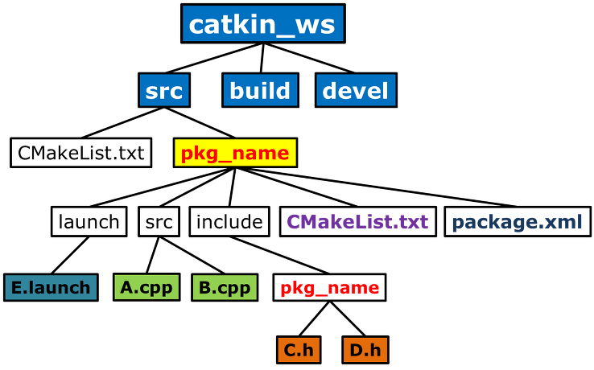

## Workspace



```
my_ros2_workspace/
├── build/
│   └── (build artifacts)
├── install/
│   └── (installed files)
├── log/
│   └── (log files)
└── src/
    ├── my_package_1/
    │   ├── CMakeLists.txt
    │   ├── package.xml
    │   └── src/
    │       └── (source files)
    └── my_package_2/
        ├── CMakeLists.txt
        ├── package.xml
        └── src/
            └── (source files)
```

- [workspace_name]/src : package들이 들어간다.

ROS2에서는 패키지가 워크스페이스 내의 src 디렉토리 하위에 여러 계층의 디렉토리 구조를 가질 수 있습니다. colcon 빌드 도구는 하위 디렉토리 내에 있는 패키지를 모두 탐색하여 빌드할 수 있습니다. 따라서 workspace_name/src/repository/pathplanning/pid_planning와 같은 경로에 패키지가 위치해도 문제 없습니다.

중요한 점은 package.xml과 CMakeLists.txt 파일이 패키지의 루트 디렉토리에 있어야 한다는 것입니다. pid_planning 디렉토리 안에 이 두 파일이 있어야 합니다.

## Packages

- 관련된 코드, 데이터, 라이브러리, 설정 파일 등을 하나의 단위로 묶은 것
- 패키지는 기능적으로 관련된 코드를 모듈화하고, 쉽게 재사용하고 배포할 수 있도록 한다.

구조

- src/ : source code directory
- launch/ : launch file directory
- msg/ : message file directory
- srv/ : service file directory
- CMakeLists.txt, package.xml : build와 dependency 관리를 위한 파일

## Node

## Launch File

- ROS에서 시스템의 여러 노드를 한꺼번에 실행하고 관리하기 위해 사용되는 XML 형식의 설정 파일
